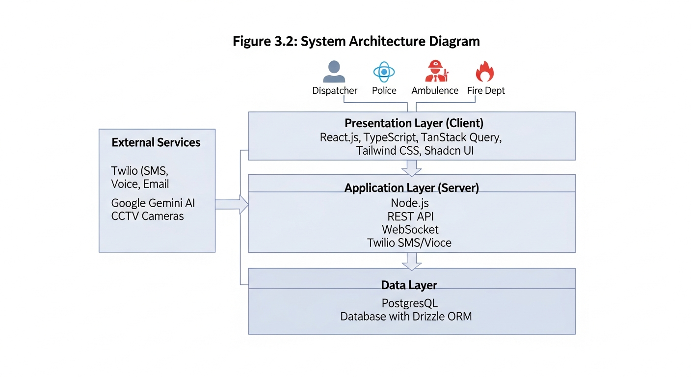
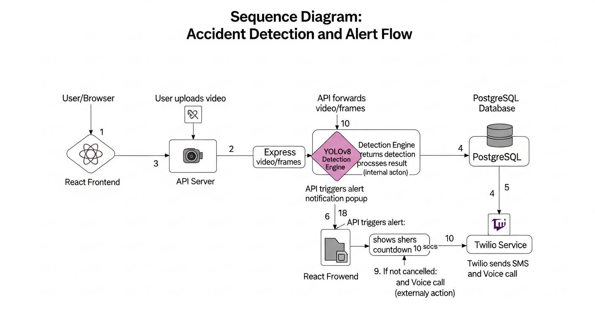
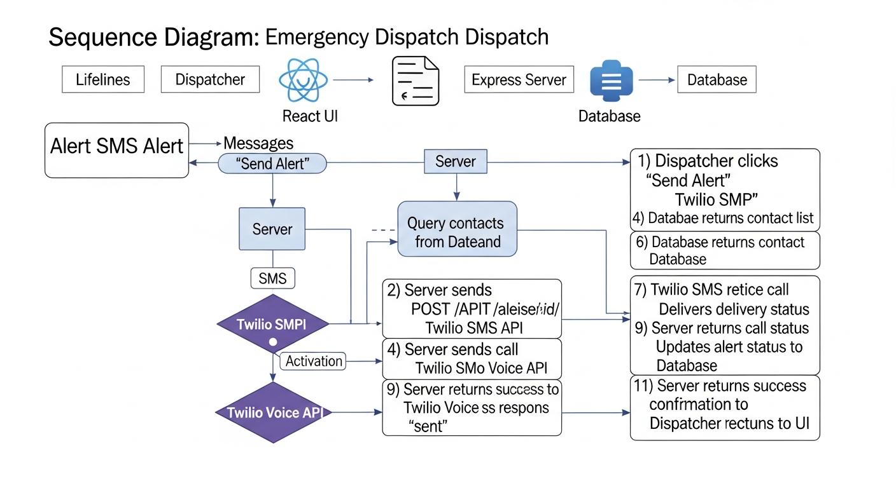
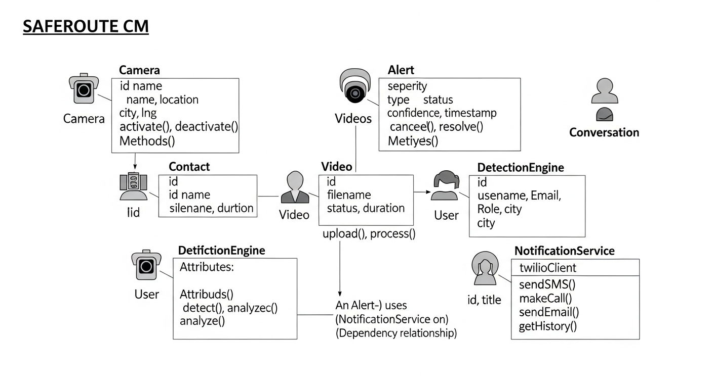
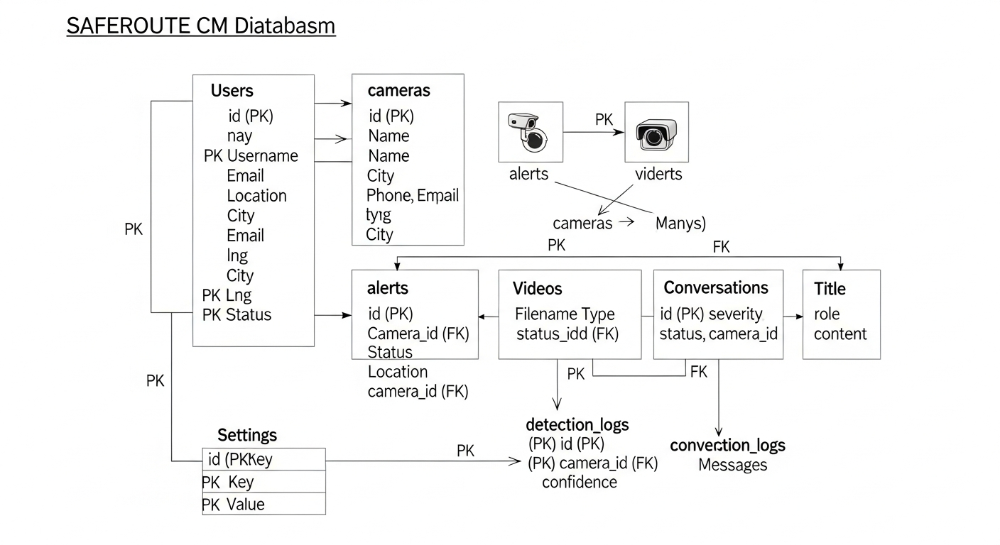

# CHAPTER 3: TOOLS AND METHODOLOGY FOR SYSTEM DEVELOPMENT

## 3.1 Introduction

This chapter presents the research methodology and tools employed in the design and development of SAFEROUTE CM. It details the systematic approach followed to translate the research objectives outlined in Chapter 1 into a functional system, from requirements gathering through implementation and testing. The methodology adopted ensures that the system development process is rigorous, reproducible, and aligned with established research practices in information systems.

The chapter is organized as follows: Section 3.2 describes the research methodology and approach, including the research type, research approach, research design, and justification for the chosen methodology. Section 3.3 presents the system requirements analysis, covering stakeholder identification, functional requirements, and non-functional requirements. Section 3.4 details the system architecture and design, including the high-level architecture, component design, use case diagrams, sequence diagrams, and class diagrams. Section 3.5 covers database design, including database selection and the entity-relationship model. Section 3.6 presents the development tools and technologies used in building the system. Section 3.7 explains the model formulation and design principles underlying the accident detection and alert prioritization logic. Section 3.8 describes the implementation approach, including the Agile development methodology adopted. Section 3.9 outlines the testing strategy employed to validate the system. Section 3.10 provides a chapter summary.

## 3.2 Research Methodology

### 3.2.1 Research Type

This research adopts an **Applied Research** approach, focusing on the practical application of scientific knowledge to solve a specific, real-world problem: the delayed detection of road accidents and the slow dispatch of emergency alerts in Cameroon. Unlike basic or fundamental research, which aims to expand theoretical understanding without immediate practical application, applied research is oriented toward producing tangible solutions that can be implemented, tested, and evaluated in real-world contexts (Kothari, 2004). In the context of this study, the applied research approach directs the entire research effort toward designing, building, and evaluating a working system -- SAFEROUTE CM -- that addresses the identified problem of delayed emergency response to road traffic accidents.

The research also incorporates elements of **Design Science Research (DSR)**, a methodology commonly used in information systems research. DSR focuses on the creation and evaluation of IT artifacts (in this case, the SAFEROUTE CM system) that address identified organizational or societal problems. The DSR framework, as outlined by Hevner et al. (2004), emphasizes the iterative nature of design and evaluation in developing effective solutions. According to Hevner et al., the design science paradigm seeks to extend the boundaries of human and organizational capabilities by creating new and innovative artifacts, and the evaluation of such artifacts provides feedback that drives further refinement.

The DSR methodology is particularly appropriate for this study because it provides a structured process for:

1. **Problem identification and motivation**: Understanding the road safety crisis and emergency response challenges in Cameroon (addressed in Chapters 1 and 2).
2. **Defining objectives for a solution**: Establishing clear performance targets such as detection accuracy above 85% and alert dispatch time under 5 seconds.
3. **Design and development**: Creating the system architecture, AI detection pipeline, and web-based interfaces.
4. **Demonstration**: Deploying the system across pilot sites in Yaounde, Douala, Bamenda, and Buea.
5. **Evaluation**: Measuring system performance against defined objectives through quantitative metrics and user acceptance testing.
6. **Communication**: Documenting the research process and outcomes for academic and practical dissemination.

By combining applied research with DSR principles, this study ensures that the resulting system is not only technically sound but also practically relevant and rigorously evaluated.

### 3.2.2 Research Approach

The research employs a **Mixed Methods** approach, combining both qualitative and quantitative elements to provide a comprehensive understanding of the problem domain and a thorough evaluation of the proposed solution.

**Qualitative Components**:
- Analysis of road safety challenges in Cameroon through document review and secondary data analysis
- Requirements gathering through stakeholder consultations with emergency responders, traffic management authorities, and road safety policymakers
- Evaluation of user experience through observation and structured interviews with system users during acceptance testing
- Expert review of the system architecture and design decisions

**Quantitative Components**:
- Measurement of detection accuracy through controlled experiments using test video datasets
- Analysis of response time metrics, including detection latency and alert dispatch time
- Statistical analysis of user satisfaction surveys using Likert-scale questionnaires
- Performance benchmarking of the system under various load conditions

The mixed methods approach is justified by the nature of the research problem, which requires both technical validation (quantitative) and understanding of user needs and experiences (qualitative). The quantitative data provides objective measures of system performance, while the qualitative data offers insights into usability, user satisfaction, and areas for improvement that cannot be captured through metrics alone.

### 3.2.3 Research Design

The research follows an **Experimental Design** with the following phases:

1. **Problem Identification and Requirements Analysis**: Understanding the current state of road safety and emergency response in Cameroon, identifying stakeholder needs, and defining system requirements through literature review, document analysis, and stakeholder consultations.

2. **System Design**: Developing the architecture, data models, and interface designs for SAFEROUTE CM based on the identified requirements and best practices from the literature.

3. **Implementation**: Building the system components according to the design specifications, following an iterative development approach that allows for continuous refinement.

4. **Testing and Evaluation**: Validating the system through functional testing, performance evaluation, and user acceptance testing with actual emergency response personnel.

5. **Documentation and Reflection**: Documenting the research process, findings, and lessons learned to contribute to the body of knowledge and provide a reference for similar initiatives.


*Figure 3.1: Design Science Research Methodology Flowchart*

Figure 3.1 illustrates the research methodology flowchart, showing the iterative nature of the design science approach. Each phase informs subsequent phases, and feedback loops enable refinement of the design based on evaluation results.

### 3.2.4 Justification of Methodology

The chosen methodology is appropriate for this research for several reasons:

1. **Practical Focus**: Applied research and DSR are well-suited for developing solutions to real-world problems, which aligns with the primary objective of creating a functional accident detection and alert system that can be deployed in Cameroon.

2. **Iterative Development**: DSR's emphasis on iteration allows for continuous refinement based on feedback and testing results. This is particularly important for a system like SAFEROUTE CM, where detection accuracy and user interface design benefit from multiple rounds of testing and improvement.

3. **Comprehensive Evaluation**: The mixed methods approach enables both rigorous measurement of system performance (detection accuracy, response times) and in-depth understanding of user experiences and satisfaction, providing a complete picture of the system's effectiveness.

4. **Generalizability**: The systematic documentation of the design process, including design decisions, technology choices, and lessons learned, enables knowledge transfer to similar contexts in other developing countries facing comparable road safety challenges.

5. **Artifact-Centered**: DSR places the created artifact (SAFEROUTE CM) at the center of the research, ensuring that the research produces a tangible, evaluable output rather than purely theoretical contributions.

## 3.3 System Requirements Analysis

### 3.3.1 Stakeholder Analysis

The primary stakeholders for SAFEROUTE CM were identified through document analysis, review of emergency response protocols, and consultations with road safety professionals. Understanding the needs and expectations of these stakeholders was essential for defining system requirements that address real-world needs.

**Primary Users**:
- **System administrators and dispatchers**: Personnel responsible for monitoring the system, managing camera configurations, reviewing detected alerts, and coordinating emergency response dispatch
- **Police traffic officers**: Law enforcement personnel who respond to accident scenes for traffic control, investigation, and public safety
- **Ambulance and emergency medical personnel**: Medical responders who provide pre-hospital care and transport victims to healthcare facilities
- **Fire department and rescue personnel**: First responders who handle vehicle extrication, hazardous material containment, and fire suppression at accident scenes

**Secondary Users**:
- **Road safety policymakers**: Government officials responsible for road safety policy and strategy who use system analytics for decision-making
- **Municipal traffic management authorities**: Local government bodies responsible for traffic management and infrastructure planning
- **CCTV system operators**: Technical personnel responsible for maintaining the CCTV surveillance infrastructure

**Beneficiaries**:
- **Road users** (motorists, passengers, pedestrians): Individuals who directly benefit from faster emergency response
- **Families and communities** affected by road accidents: Indirect beneficiaries of reduced fatality and disability rates
- **Healthcare facilities** receiving accident victims: Hospitals and clinics that benefit from advance notification and coordinated patient transfer

### 3.3.2 Functional Requirements

Based on stakeholder analysis, review of similar systems in the literature, and analysis of emergency response workflows, the following functional requirements were identified for SAFEROUTE CM:

*Table 3.1: System Requirements Specification*

| ID | Requirement | Priority | Category |
|----|-------------|----------|----------|
| FR01 | The system shall detect road accidents from CCTV camera feeds in real-time | High | Detection |
| FR02 | The system shall support multiple camera inputs from different locations | High | Detection |
| FR03 | The system shall generate alerts upon accident detection | High | Alerting |
| FR04 | The system shall support SMS notification to emergency contacts | High | Alerting |
| FR05 | The system shall support voice call notification to emergency contacts | High | Alerting |
| FR06 | The system shall allow users to cancel false alarm alerts within a countdown period | High | Alerting |
| FR07 | The system shall provide a web-based dashboard for monitoring | High | Interface |
| FR08 | The system shall support user authentication and authorization | High | Security |
| FR09 | The system shall provide role-specific dashboards (Police, Ambulance, Fire) | Medium | Interface |
| FR10 | The system shall allow management of cameras (CRUD operations) | Medium | Management |
| FR11 | The system shall allow management of emergency contacts | Medium | Management |
| FR12 | The system shall provide analytics and reporting on detections | Medium | Analytics |
| FR13 | The system shall support an AI chat assistant for user queries | Low | Support |
| FR14 | The system shall allow configuration of detection thresholds | Medium | Settings |
| FR15 | The system shall log all alerts and user actions | Medium | Logging |

The requirements were prioritized using the MoSCoW method (Must have, Should have, Could have, Won't have). High-priority requirements represent core functionality essential for the system's primary purpose, while medium and low priorities represent enhancements that improve usability and operational efficiency.

### 3.3.3 Non-Functional Requirements

Non-functional requirements define the quality attributes and constraints that the system must satisfy. These requirements address performance, reliability, security, and usability concerns.

*Table 3.2: Non-Functional Requirements Specification*

| ID | Requirement | Target | Category |
|----|-------------|--------|----------|
| NFR01 | Detection latency from video frame to detection result | < 500ms | Performance |
| NFR02 | Alert dispatch time from detection to notification sent | < 5 seconds | Performance |
| NFR03 | System availability | > 99% uptime | Reliability |
| NFR04 | Concurrent user support | 50+ users | Scalability |
| NFR05 | Page load time | < 3 seconds | Performance |
| NFR06 | Detection accuracy | > 85% | Accuracy |
| NFR07 | False positive rate | < 15% | Accuracy |
| NFR08 | Data encryption | In transit and at rest | Security |
| NFR09 | Password security | Hashed with strong algorithm | Security |
| NFR10 | Mobile responsiveness | Support for tablets | Usability |

These non-functional requirements were derived from industry standards for real-time monitoring systems, feedback from stakeholder consultations, and the performance benchmarks reported in similar systems in the literature (as discussed in Chapter 2).

## 3.4 System Architecture and Design

### 3.4.1 High-Level Architecture

SAFEROUTE CM follows a **three-tier architecture** comprising:

1. **Presentation Tier**: A React-based web application providing the user interface for system operators, dispatchers, and emergency responders. This tier handles all user interactions, data visualization, and real-time monitoring displays.

2. **Application Tier**: A Node.js/Express backend handling business logic, API endpoints, authentication, and integration with external services. This tier processes requests from the frontend, manages data flow, and coordinates the detection and notification pipelines.

3. **Data Tier**: A PostgreSQL database for persistent storage of camera configurations, contact information, alert records, user accounts, and system settings.

Additionally, the system integrates with:
- **AI Detection Module**: YOLOv8-based video analysis pipeline for real-time accident detection from CCTV feeds (simulated in MVP with provisions for full integration)
- **External Services**: Twilio for SMS and voice call notifications to emergency responders



*Figure 3.2: SAFEROUTE CM Three-Tier System Architecture*

The three-tier architecture was chosen for its clear separation of concerns, which promotes maintainability, scalability, and independent deployment of each tier. The presentation tier can be updated without affecting the backend logic, the application tier can be scaled horizontally to handle increased load, and the data tier can be optimized independently for performance.

### 3.4.2 Component Design

The system is composed of several interconnected components organized across the frontend and backend:

**Frontend Components**:

1. **Landing Page**: Public-facing page for unauthenticated users, providing information about the system and access to login/signup functionality
2. **Authentication Module**: Login and signup flows with Replit Auth integration using OpenID Connect (OIDC) protocol
3. **Dashboard**: Main overview with key statistics, recent alerts, system status indicators, and quick-access controls
4. **Live Monitoring**: Real-time display of camera feeds with detection overlays showing vehicle tracking and collision analysis
5. **Alert Management**: Interface for viewing, acknowledging, dispatching, and managing detected accident alerts
6. **Camera Management**: CRUD interface for adding, editing, viewing, and deleting camera configurations
7. **Contact Management**: CRUD interface for managing emergency responder contact information
8. **Role-Specific Dashboards**: Specialized interfaces for Police, Ambulance, and Fire department personnel, each displaying role-relevant information and actions
9. **Analytics**: Statistical visualizations of system performance, detection trends, and response metrics
10. **Settings**: System configuration interface for adjusting detection thresholds, notification preferences, and other parameters
11. **AI Assistant**: Chat interface powered by OpenAI GPT-4 for user support and system queries

**Backend Components**:

1. **Authentication Service**: User authentication and session management using OIDC tokens
2. **Camera Service**: Camera data management, including CRUD operations and status monitoring
3. **Contact Service**: Emergency contact management with city-based filtering and activation controls
4. **Alert Service**: Alert creation, management, status tracking, and dispatch coordination
5. **Detection Service**: Interface with the AI detection module for processing video frames and generating detection results
6. **Notification Service**: Integration with Twilio for SMS message dispatch and voice call initiation
7. **Analytics Service**: Aggregation and reporting of system data for performance dashboards
8. **AI Assistant Service**: Integration with OpenAI for natural language chat functionality

### 3.4.3 Use Case Diagram

The primary use cases for SAFEROUTE CM are illustrated in the UML use case diagram below, which captures the interactions between system actors and the system's functional capabilities.


*Figure 3.4: UML Use Case Diagram for SAFEROUTE CM*

**Primary Actors and Use Cases**:

The **System Administrator** is responsible for the overall configuration and maintenance of the platform. This actor manages the registration, modification, and removal of CCTV cameras and their associated metadata, maintains the directory of emergency contacts, configures system-wide settings such as detection thresholds and notification preferences, accesses analytics and performance reports, and manages user accounts and role assignments.

The **Dispatcher** serves as the primary operational user who monitors the system in real time. This actor observes live camera feeds for ongoing surveillance, reviews alerts generated by the detection module, dispatches emergency notifications to the appropriate responders when a confirmed accident is detected, cancels false alarms during the countdown period to prevent unnecessary mobilization, and acknowledges incoming alerts to update their status in the system.

The **Police Officer** interacts with the system through a role-specific dashboard tailored to law enforcement needs. This actor receives alert notifications upon accident detection, updates the status of incidents as they are investigated and resolved, and files incident reports documenting the details and outcomes of each response.

The **Ambulance Personnel** accesses a dedicated dashboard designed for medical emergency coordination. This actor receives real-time alert notifications, updates the response status as the medical team is dispatched and arrives on scene, and records relevant medical information pertaining to accident victims.

The **Fire Department Personnel** uses a specialized dashboard oriented toward rescue and fire response operations. This actor receives alert notifications, updates the response status throughout the intervention, and records details of rescue operations conducted at the accident site.

### 3.4.4 Sequence Diagrams

Two key sequence diagrams illustrate the system's core operational flows: the accident detection sequence and the alert dispatch sequence.

**Accident Detection and Alert Sequence**:



*Figure 3.5: UML Sequence Diagram for Accident Detection and Alert Flow*

The accident detection sequence proceeds as follows:

1. CCTV Camera streams video to Detection Module
2. Detection Module processes frames using YOLOv8
3. Tracked vehicles analyzed for collision indicators
4. If collision detected, Alert created in Database
5. Frontend receives new alert via polling/websocket
6. Accident Notification displayed with 10-second countdown
7. If not cancelled within countdown period, Alert Service triggers notifications
8. Notification Service sends SMS via Twilio
9. Notification Service makes Voice Call via Twilio
10. Alert status updated to "sent"

**Alert Dispatch Sequence**:



*Figure 3.6: UML Sequence Diagram for Emergency Alert Dispatch*

The manual alert dispatch sequence proceeds as follows:

1. User views pending alert on Dashboard
2. User clicks "Send Alert" or countdown expires
3. Frontend calls POST /api/alerts/:id/send
4. Backend validates alert status (idempotency check)
5. Backend retrieves contacts and settings
6. Backend sends SMS to each active contact
7. Backend makes voice call to priority contacts
8. Backend updates alert with send status
9. Frontend displays success confirmation

### 3.4.5 Class Diagram

The class diagram presents the core classes of SAFEROUTE CM and their relationships, providing a structural view of the system's data model and behavior.



*Figure 3.7: UML Class Diagram for SAFEROUTE CM*

Key classes and their relationships:

```
Camera
- id: number
- name: string
- location: string
- city: string
- latitude: number
- longitude: number
- status: string
- streamUrl: string
+ getActiveAlerts(): Alert[]

Contact
- id: number
- name: string
- phone: string
- email: string
- type: string
- city: string
- isActive: boolean
+ notify(alert: Alert): void

Alert
- id: number
- type: string
- location: string
- severity: string
- status: string
- confidence: number
- cameraId: number
- smsSent: boolean
- callMade: boolean
- createdAt: Date
+ send(): SendResult
+ cancel(): void
+ acknowledge(): void

User
- id: number
- email: string
- firstName: string
- lastName: string
- role: string
- city: string
- organization: string
+ hasPermission(action: string): boolean

Notification
- to: string
- alertType: string
- location: string
- severity: string
+ sendSMS(): boolean
+ makeCall(): boolean
```

The class diagram reflects the core domain model of the system. The **Camera** class represents CCTV camera installations and maintains a one-to-many relationship with **Alert** objects, since a single camera can detect multiple accidents over time. The **Contact** class represents emergency responders and provides the notification endpoint for alert dispatch. The **Alert** class is the central entity, linking detection events to notification actions. The **User** class manages authentication and role-based access control, while the **Notification** class encapsulates the logic for sending SMS messages and making voice calls through Twilio.

## 3.5 Database Design

### 3.5.1 Database Selection

**PostgreSQL** was selected as the database management system for SAFEROUTE CM based on the following considerations:

1. **Reliability**: PostgreSQL is widely recognized for its data integrity, ACID compliance, and crash recovery capabilities, making it suitable for a safety-critical application where data loss is unacceptable.
2. **Feature Set**: Support for advanced data types (JSON, arrays), full-text search, and sophisticated indexing mechanisms enables flexible data modeling and efficient queries.
3. **Scalability**: PostgreSQL's ability to handle growing data volumes through partitioning, connection pooling, and read replicas ensures the system can scale as more cameras and cities are added.
4. **Open Source**: No licensing costs, combined with an active community and extensive documentation, reduces the total cost of ownership and ensures long-term viability.
5. **ORM Support**: Excellent integration with Drizzle ORM enables type-safe database queries in TypeScript, reducing runtime errors and improving developer productivity.

### 3.5.2 Entity-Relationship Diagram

The database design was developed using entity-relationship modeling to capture the data requirements identified during the requirements analysis phase.



*Figure 3.3: Database Entity-Relationship Diagram for SAFEROUTE CM*

The database comprises the following entities:

- **cameras**: CCTV camera configurations and physical locations, including GPS coordinates, stream URLs, and operational status
- **contacts**: Emergency responder contact information, including phone numbers, roles, city assignments, and activation status
- **alerts**: Detected accident records with severity levels, confidence scores, notification status, and timestamps
- **videos**: Uploaded video files for offline analysis and testing
- **settings**: System configuration key-value pairs for detection thresholds, notification preferences, and other parameters
- **users**: User accounts and profiles, including authentication data, roles, and organizational affiliations
- **sessions**: Authentication session data for managing user login state
- **conversations**: AI chat sessions linking users to their interaction history
- **messages**: Individual AI chat messages within conversations
- **detection_logs**: Detection analytics data for tracking system performance over time

The relationships between these entities reflect the operational workflows of the system. Each alert is associated with a specific camera (through the camera_id foreign key), enabling location-based filtering and analytics. Users are linked to sessions for authentication, and conversations and messages support the AI assistant feature.

## 3.6 Development Tools and Technologies

### 3.6.1 Overview of Technology Stack

The technology stack for SAFEROUTE CM was selected based on factors including performance, developer productivity, community support, and suitability for real-time web applications.

*Table 3.3: Development Tools and Technologies*

| Category | Technology | Version | Purpose |
|----------|------------|---------|---------|
| Frontend Framework | React | 18.x | UI component library |
| Language | TypeScript | 5.x | Type-safe JavaScript |
| Styling | Tailwind CSS | 3.x | Utility-first CSS |
| UI Components | Shadcn UI | Latest | Pre-built accessible components |
| State Management | TanStack Query | 5.x | Server state management |
| Routing | Wouter | 3.x | Client-side routing |
| Backend Runtime | Node.js | 20.x | JavaScript runtime |
| Backend Framework | Express | 5.x | Web application framework |
| ORM | Drizzle | 0.30.x | Database ORM |
| Database | PostgreSQL | 15.x | Relational database |
| Authentication | Replit Auth | - | OIDC authentication |
| AI Chat | OpenAI GPT-4 | - | Natural language AI |
| SMS/Voice | Twilio | - | Communication APIs |
| IDE | Replit | - | Cloud development environment |

### 3.6.2 Frontend Technologies

**React**: A JavaScript library for building user interfaces developed by Meta. React's component-based architecture promotes code reuse and maintainability. The virtual DOM ensures efficient rendering of updates, which is critical for the real-time monitoring features of SAFEROUTE CM where alert data and camera feeds must be updated frequently without full page reloads.

**TypeScript**: A superset of JavaScript that adds static type checking. TypeScript improves code quality by catching type-related errors at compile time rather than runtime, and enhances IDE support with improved autocompletion and refactoring capabilities. In a safety-critical application like SAFEROUTE CM, type safety helps prevent bugs in alert processing and notification logic.

**Tailwind CSS**: A utility-first CSS framework that enables rapid UI development through composable utility classes. Tailwind's design tokens ensure visual consistency across the application's numerous pages and components, while its responsive utilities support the mobile responsiveness requirement (NFR10).

**Shadcn UI**: A collection of re-usable, accessible components built with Radix UI primitives and Tailwind CSS. Shadcn provides pre-built components including buttons, cards, forms, dialogs, and data tables that comply with accessibility standards, reducing development time while ensuring usability.

**TanStack Query**: A data-fetching and server state management library that handles caching, background updates, and stale data management. TanStack Query simplifies the management of server state in the React application, ensuring that alert data, camera status, and analytics are kept up-to-date with minimal boilerplate code.

**Wouter**: A minimalist routing library for React. Wouter provides a simple, lightweight API for client-side navigation without the overhead of larger routing solutions, keeping the application bundle size small.

### 3.6.3 Backend Technologies

**Node.js**: A JavaScript runtime built on Chrome's V8 engine. Node.js enables JavaScript execution on the server, allowing full-stack development with a single language (TypeScript). Its event-driven, non-blocking I/O model is well-suited for handling concurrent connections from multiple camera feeds and user sessions.

**Express**: A minimal and flexible Node.js web application framework. Express provides robust features for building RESTful APIs and serves as the backbone of the backend, handling HTTP requests, middleware processing, and route management.

**Drizzle ORM**: A TypeScript-first ORM that provides type-safe database queries. Drizzle's schema definition approach, using TypeScript objects to define database tables, ensures that database types are enforced at compile time. This eliminates a class of runtime errors related to data type mismatches between the application and database layers.

**PostgreSQL**: An advanced open-source relational database system. PostgreSQL provides the reliability, data integrity, and advanced features (JSON support, array columns, full-text search) required for SAFEROUTE CM's diverse data storage needs.

### 3.6.4 AI and Detection Technologies

**YOLOv8**: The latest version of the You Only Look Once object detection algorithm, developed by Ultralytics. YOLOv8 offers improved accuracy and inference speed compared to previous versions, making it suitable for real-time video analysis. The algorithm processes entire images in a single forward pass through the neural network, enabling detection at speeds suitable for live CCTV feed analysis.

**DeepSORT**: A multi-object tracking algorithm that combines appearance information (using a deep association metric) with motion prediction (using a Kalman filter). DeepSORT maintains consistent object identities across video frames, enabling the system to track individual vehicles over time and detect changes in trajectory or velocity that may indicate a collision.

**OpenAI GPT-4**: A large language model used for the AI chat assistant feature. GPT-4 provides natural language understanding and generation capabilities, enabling users to interact with the system through conversational queries about alerts, system status, and operational procedures.

### 3.6.5 Communication Technologies

**Twilio**: A cloud communications platform providing programmable APIs for SMS and voice communications. Twilio's APIs enable SAFEROUTE CM to automatically send SMS notifications containing accident details (location, severity, time) and initiate automated voice calls to designated emergency responders upon accident detection. Twilio was selected for its reliability, global coverage, and extensive API documentation.

## 3.7 Model Formulation and Design Principles

### 3.7.1 Accident Detection Model

The accident detection model forms the core intelligence of SAFEROUTE CM. It is designed to process live video streams from CCTV cameras and identify collision events through a multi-stage pipeline combining object detection, multi-object tracking, and collision analysis. The complete processing flow is illustrated in the block diagram below.


*Figure 3.8: Accident Detection Model — Block Diagram showing the five-stage processing pipeline from video input to alert output*

The pipeline begins with the **input stage**, which receives sequential video frames from CCTV cameras at time intervals t, t+1, t+2, and so on. In **Stage 1 (Frame Extraction and Preprocessing)**, individual frames are extracted from the video stream at 30 frames per second, providing sufficient temporal resolution to capture the dynamics of vehicle movements and collisions. Each frame is resized and normalized to prepare it for inference by the detection model.

In **Stage 2 (YOLOv8 Object Detection)**, the preprocessed frames are passed through the YOLOv8 neural network, which detects vehicles, pedestrians, and other road objects in each frame. The output of this stage is a set of bounding boxes B = {(x, y, w, h, class, confidence)}, where (x, y) represents the center position of the detected object, (w, h) its width and height, class the object category, and confidence the detection probability.

**Stage 3 (DeepSORT Multi-Object Tracking)** receives the detection outputs and applies the DeepSORT algorithm to track detected vehicles across consecutive frames, maintaining consistent identity assignments. The output of this stage is a set of track identifiers and trajectories T = {(id, [positions])}, where id is a unique identifier for each tracked vehicle and [positions] is its sequence of positions across frames.

**Stage 4 (Collision Analysis)** examines the trajectories of tracked vehicles for collision indicators using three complementary approaches. The first approach detects sudden velocity changes where deceleration exceeds a defined threshold (Δv > threshold), indicating a sudden stop consistent with impact. The second approach identifies trajectory intersections where two or more vehicle paths converge and cross within a short time window, suggesting a collision course. The third approach measures bounding box overlap using the Intersection over Union metric, where IoU(B1, B2) exceeding the overlap threshold indicates physical contact between vehicles. These three indicators are combined through a weighted function P(collision) = f(Δv, IoU, trajectory_intersection) to produce an aggregate collision probability.

Finally, in **Stage 5 (Alert Generation)**, if the collision probability exceeds the configured confidence threshold, the system generates an alert with an appropriate severity classification and dispatches notifications through the configured communication channels.

**Mathematical Formulation**:

Velocity at time t for tracked object i:
```
v_i(t) = (position_i(t) - position_i(t-1)) / Dt
```

Velocity change (deceleration indicator):
```
Dv_i(t) = |v_i(t) - v_i(t-1)|
```

Intersection over Union for bounding box overlap:
```
IoU(B1, B2) = Area(B1 intersection B2) / Area(B1 union B2)
```

Collision probability:
```
P(collision) = f(Dv, IoU, trajectory_intersection)
```

Where f is a weighted function combining the three indicators. The weights are configurable parameters that can be tuned based on empirical evaluation to optimize the trade-off between detection sensitivity (minimizing false negatives) and specificity (minimizing false positives).

### 3.7.2 Alert Priority Model

Once an accident is detected, alerts are prioritized based on multiple factors to ensure that the most critical incidents receive the fastest response.

**Severity Score** (S): Based on estimated impact of the collision
- High severity (S = 3): Multiple vehicles involved, high estimated speed at impact
- Medium severity (S = 2): Two vehicles involved, moderate estimated speed
- Low severity (S = 1): Minor collision, low speed, single vehicle incident

**Confidence Score** (C): Detection confidence from the AI model, expressed as a percentage (0-100)

**Location Priority** (L): Based on the camera location and historical accident data
- High traffic areas: L = 3 (major intersections, highways)
- Moderate traffic areas: L = 2 (secondary roads, commercial areas)
- Low traffic areas: L = 1 (residential streets, minor roads)

**Overall Priority Calculation**:
```
Priority = w1 * S + w2 * (C/100) + w3 * L
```

Where w1, w2, w3 are configurable weights that allow system administrators to adjust the relative importance of each factor based on operational requirements. The default weights (w1 = 0.5, w2 = 0.3, w3 = 0.2) prioritize severity while still considering detection confidence and location.

### 3.7.3 Design Patterns Employed

The system's software architecture employs several established design patterns to ensure maintainability, scalability, and code quality:

**Model-View-Controller (MVC)**: Separation of data models (database schema and business entities), views (React components and pages), and controllers (Express route handlers and service logic). This separation enables independent development and testing of each layer.

**Repository Pattern**: Abstraction of data access through the IStorage interface, which defines the contract for all database operations. This pattern decouples business logic from database-specific implementation details, enabling the data access layer to be modified or replaced without affecting the rest of the system.

**Observer Pattern**: Used for real-time updates where the frontend observes changes in alert data through polling or server-sent events. When new alerts are detected, subscribed components are notified and update their displays accordingly.

**Singleton Pattern**: Used for database connections and service instances (such as the Twilio client) to ensure a single point of management and prevent resource leaks from multiple instantiations.

## 3.8 Implementation Approach

### 3.8.1 Development Methodology

The implementation of SAFEROUTE CM followed an **Agile Development** methodology, specifically adapted from the Scrum framework. Agile was chosen because of its emphasis on iterative development, continuous feedback, and adaptability to changing requirements -- qualities that are essential when developing a complex, multi-component system with both technical and user-facing challenges.

The development was organized into six iterative sprints, each lasting approximately two weeks:

1. **Sprint 1 -- Foundation**: Project setup, development environment configuration, database schema design, basic API structure, and authentication integration. This sprint established the technical foundation upon which all subsequent features were built.

2. **Sprint 2 -- Core Data Management**: Camera management (CRUD operations), contact management, and user profile features. This sprint delivered the data management capabilities required for system operation.

3. **Sprint 3 -- Alert Pipeline**: Alert management system, Twilio notification integration (SMS and voice calls), false alarm prevention with countdown mechanism, and the accident notification component. This sprint implemented the core value proposition of the system.

4. **Sprint 4 -- Role-Based Interfaces**: Role-specific dashboards for Police, Ambulance, and Fire department personnel, along with UI enhancements and responsive design improvements. This sprint tailored the system to the needs of different user groups.

5. **Sprint 5 -- Intelligence and Analytics**: AI chat assistant integration with OpenAI, analytics dashboard with performance visualizations, detection log analysis, and the live monitoring interface. This sprint added intelligence and reporting capabilities.

6. **Sprint 6 -- Quality and Deployment**: Bug fixes, performance optimization, user acceptance testing, documentation, and production deployment. This sprint focused on ensuring system quality and readiness for deployment.

Each sprint followed a cycle of planning, implementation, review, and retrospective. Sprint reviews involved demonstrations to stakeholders, and feedback was incorporated into subsequent sprint planning.

### 3.8.2 Version Control

Git was used for version control throughout the development process. A branching strategy was adopted to manage code changes:

- **main**: Production-ready code, only updated through tested and reviewed changes
- **develop**: Integration branch where features are merged and tested together before promotion to main
- **feature/***: Individual feature branches created for each sprint task or user story

This branching strategy ensured that the production branch always contained stable, tested code while enabling parallel development of multiple features.

### 3.8.3 Code Quality Practices

Several practices were adopted to maintain code quality throughout the development process:

- **TypeScript**: Static type checking across both frontend and backend codebases, catching type-related errors at compile time
- **ESLint**: Automated code linting to enforce coding standards and detect potential issues
- **Consistent Code Formatting**: Prettier for automatic code formatting, ensuring consistent style across the codebase
- **Code Reviews**: All changes were reviewed before merging to identify potential issues and share knowledge
- **Modular Architecture**: Clear separation of concerns across modules and services, with well-defined interfaces between components

## 3.9 Testing Strategy

A comprehensive testing strategy was designed to validate SAFEROUTE CM at multiple levels, ensuring that the system meets both its functional and non-functional requirements before deployment.

### 3.9.1 Testing Levels

The testing strategy follows a layered approach, progressing from isolated component tests to full system validation with real users:

**Unit Testing**: Testing individual components, functions, and modules in isolation. Unit tests focus on verifying the correctness of business logic, utility functions, data validation, and algorithmic computations. For the frontend, unit tests target individual React components and custom hooks. For the backend, unit tests cover service functions, data transformation logic, and validation rules. Unit tests are designed to execute quickly and are run automatically as part of the development workflow.

**Integration Testing**: Testing the interactions between interconnected components and services. Integration tests verify that API endpoints correctly process requests, interact with the database, and return expected responses. Key integration test scenarios include the alert creation and dispatch workflow (ensuring that creating an alert triggers the correct notification sequence), camera and contact CRUD operations (verifying end-to-end data flow from API request to database persistence and back), and authentication flows (confirming that login, session management, and role-based access control work correctly across the stack).

**System Testing**: End-to-end testing of complete user workflows using browser automation tools. System tests simulate real user interactions, navigating through the application, creating and managing data, and verifying that the user interface correctly reflects system state. These tests validate that all system components work together as an integrated whole to deliver the expected functionality.

**User Acceptance Testing (UAT)**: Testing with actual end users, specifically emergency response personnel from the target user groups (dispatchers, police officers, ambulance staff, fire department staff). UAT sessions were conducted with participants from the four pilot cities (Yaounde, Douala, Bamenda, and Buea) to validate that the system meets operational requirements and is usable in real-world emergency response contexts. Participants were asked to complete representative tasks (e.g., reviewing alerts, dispatching notifications, navigating role-specific dashboards) and provide feedback through structured questionnaires and open-ended interviews.

### 3.9.2 Test Categories

Tests were organized into the following categories to ensure comprehensive coverage:

1. **Functional Tests**: Verify that all features work as specified in the functional requirements (Table 3.1), including detection, alerting, dashboard displays, CRUD operations, and notification dispatch.
2. **Performance Tests**: Measure response times, throughput, and resource utilization under expected and peak load conditions, validating compliance with non-functional requirements (Table 3.2).
3. **Security Tests**: Validate authentication mechanisms, authorization controls, session management, data encryption, and protection against common web application vulnerabilities.
4. **Usability Tests**: Assess user experience, interface intuitiveness, task completion rates, and user satisfaction through observation and survey instruments.

### 3.9.3 Test Metrics

The following metrics were tracked throughout the testing process to monitor quality and guide remediation efforts:

- **Test coverage percentage**: Proportion of code paths exercised by automated tests
- **Pass/fail rates**: Percentage of test cases that pass on each test run, indicating overall system stability
- **Defect density**: Number of defects discovered per module or component, guiding focused debugging efforts
- **Mean time to resolve defects**: Average time from defect identification to resolution, tracking development team efficiency
- **User task completion rate**: Percentage of UAT tasks completed successfully by participants, measuring usability
- **User satisfaction score**: Average satisfaction rating from UAT questionnaires, providing a quantitative measure of user acceptance

## 3.10 Chapter Summary

This chapter has presented the methodology employed in developing SAFEROUTE CM, following an applied research approach grounded in Design Science Research principles with mixed methods evaluation. The system requirements, comprising 15 functional and 10 non-functional requirements, were derived from stakeholder analysis involving dispatchers, police, ambulance, and fire personnel. The three-tier system architecture separates concerns across a React frontend, Node.js/Express backend, and PostgreSQL database, with UML diagrams providing structural and behavioral descriptions. The accident detection model combines YOLOv8 object detection with DeepSORT tracking and custom collision analysis algorithms, while the alert priority model enables intelligent triage based on severity, confidence, and location factors. The technology stack leverages modern web frameworks with TypeScript for type safety and integrates Twilio for communications and OpenAI for AI assistance. Development followed an Agile methodology with iterative sprints, and the testing strategy encompasses unit, integration, system, and user acceptance testing. The next chapter presents the actual implementation, interface screenshots, and evaluation results.
