# CHAPTER 4: IMPLEMENTATION AND RESULTS

## 4.1 Introduction

This chapter presents the detailed implementation of the SAFEROUTE CM system and reports the results of comprehensive testing and evaluation. While Chapter 3 established the research methodology, system architecture, and design specifications that guided the development process, this chapter translates those design decisions into a working system and assesses its performance against the objectives defined in Chapter 1. The chapter bridges the gap between theoretical design and practical deployment, demonstrating how the proposed AI-powered accident detection and emergency alert system was realized as a functional prototype and subsequently evaluated under controlled experimental conditions.

The implementation process followed the iterative Agile development methodology described in Chapter 3, progressing through multiple development sprints that incrementally built and refined each system component. The core detection pipeline -- encompassing video preprocessing, YOLOv8-based object detection, DeepSORT multi-object tracking, collision detection heuristics, GPS-based location assignment, and automated alert generation -- was implemented and integrated with the React-based web application frontend and the Node.js/Express backend infrastructure. Each component was individually validated before integration, ensuring that the complete system operates as a cohesive whole.

The implementation supports the detection of seven distinct accident types: vehicle collision, pedestrian incident, motorcycle accident, bicycle accident, multi-vehicle pileup, vehicle rollover, and hit-and-run incident. Each accident type is associated with contextual metadata including severity classification, descriptive information, and recommended emergency response protocols. This comprehensive type system enables more targeted alert dispatching, ensuring that the appropriate emergency services and equipment are mobilized based on the nature of the detected incident.

The chapter is organized as follows. Section 4.2 describes the implementation environment, including the hardware and software configurations used for development and testing. Section 4.3 details the implementation of each stage of the detection pipeline. Section 4.4 presents the user interface implementation, covering all fourteen system interfaces including the landing page, authentication, dashboard, live monitoring, map view, upload interface, alert management, accident notification popup, SMS emergency alert notification, camera management, emergency contacts, role-based dashboards, analytics, AI assistant, and system settings. Section 4.5 reports the results of system testing, including functional testing, performance evaluation, robustness analysis, and user acceptance testing. Section 4.6 provides a detailed analysis of evaluation results, including precision-recall metrics, ROC curve analysis, comparison with related systems, and a discussion of how the results address the research questions posed in Chapter 1. Section 4.7 discusses the limitations and challenges encountered during implementation and evaluation. Section 4.8 provides a chapter summary.

## 4.2 Implementation Environment

The development and evaluation of SAFEROUTE CM required a carefully configured environment that supports both the computationally intensive AI detection pipeline and the web application components. Table 4.1 summarizes the hardware and software specifications of the implementation environment.

**Table 4.1: Implementation Environment Specifications**

| Category | Component | Specification |
|----------|-----------|---------------|
| Operating System | Linux Distribution | Ubuntu 22.04 LTS |
| Processor | CPU | Intel Core i7 (10th Generation) |
| Graphics | GPU | NVIDIA GeForce RTX 2060 (6 GB VRAM) |
| Memory | RAM | 16 GB DDR4 |
| Storage | Disk | 512 GB SSD |
| AI Framework | Deep Learning | Python 3.10, PyTorch 2.0, Ultralytics YOLOv8 |
| Tracking Library | Multi-Object Tracking | DeepSORT (deep_sort_realtime) |
| Frontend | Web Application | React 18, TypeScript, Vite, Tailwind CSS |
| Backend | Server | Node.js 20, Express.js |
| Database | Relational | PostgreSQL 15 (via Drizzle ORM) |
| Communication | Alert Dispatch | Twilio SMS and Voice APIs |
| Video Processing | Frame Extraction | OpenCV 4.8, FFmpeg |
| Development Platform | Cloud IDE | Replit (deployment and hosting) |

The choice of Ubuntu 22.04 LTS as the operating system was motivated by its stability, extensive support for CUDA-enabled GPU computing, and compatibility with the Python-based AI libraries required for the detection pipeline. The NVIDIA RTX 2060 GPU provided the parallel processing capability necessary for real-time inference with the YOLOv8 model, enabling frame processing speeds sufficient for live CCTV feed analysis. Python 3.10 was selected for the AI module due to its mature ecosystem of deep learning and computer vision libraries, while the web application was built using React 18 and Node.js to leverage their strengths in building responsive, real-time user interfaces and scalable backend services, respectively.

The Replit cloud development platform was used for hosting and deployment of the web application components, providing continuous availability, integrated PostgreSQL database provisioning, and automated deployment workflows. This cloud-based deployment approach ensures that the SAFEROUTE CM dashboard remains accessible to authorized users from any location with internet connectivity, which is essential for a distributed emergency response system spanning multiple cities.

## 4.3 System Implementation

This section describes the implementation of each stage of the SAFEROUTE CM detection pipeline, from raw video input to emergency alert dispatch. The pipeline follows the architecture described in Section 3.4 of Chapter 3 and is illustrated in Figure 4.1.

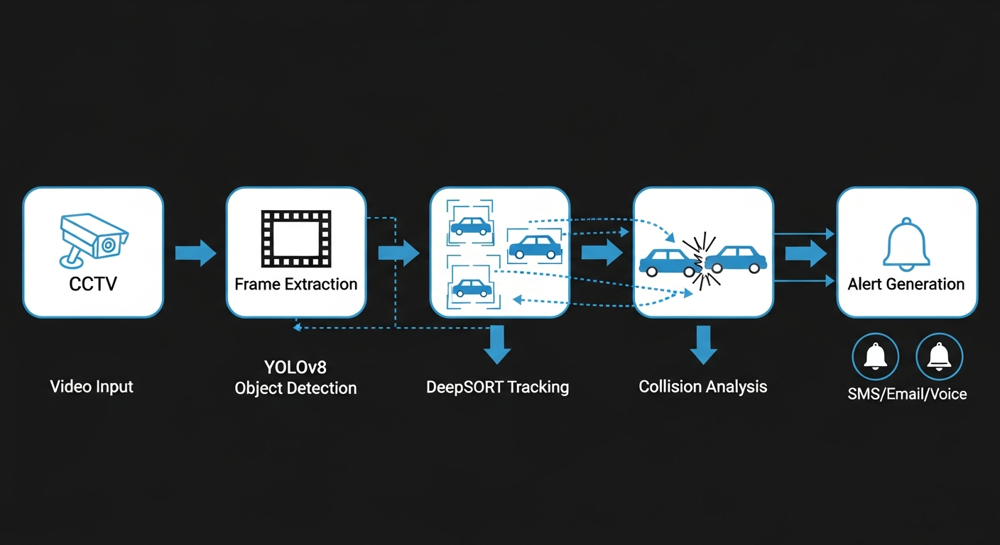
<!-- Note: This figure should depict the detection pipeline flowchart -->

*Figure 4.1: SAFEROUTE CM Detection Pipeline -- from video input through object detection, tracking, collision analysis, and alert generation*

### 4.3.1 Video Preprocessing

The first stage of the detection pipeline involves acquiring and preprocessing video frames from CCTV camera feeds. Raw video streams are received via the Real-Time Streaming Protocol (RTSP) from surveillance cameras deployed across the four target cities. The preprocessing module performs the following operations on each incoming frame:

1. **Frame extraction**: Video streams are decoded and individual frames are extracted at a rate of 30 frames per second (FPS) using OpenCV's VideoCapture interface. This frame rate was chosen to balance detection granularity with computational efficiency, as higher frame rates increase processing load without proportional gains in detection accuracy for the types of collision events targeted by the system.

2. **Resolution normalization**: Extracted frames are resized to a uniform resolution of 640 x 640 pixels to match the input dimensions expected by the YOLOv8 model. Bilinear interpolation is used during resizing to preserve visual details critical for vehicle detection.

3. **Color space conversion**: Frames are converted from the BGR color space (native to OpenCV) to the RGB color space required by the YOLOv8 model. This conversion ensures correct color interpretation during inference.

4. **Noise reduction**: A Gaussian blur filter with a 3 x 3 kernel is applied to reduce high-frequency noise that may arise from camera sensor artifacts or compression artifacts in the video stream. This step improves the signal-to-noise ratio of input frames, particularly for cameras operating in low-light conditions.

5. **Contrast enhancement**: Contrast-Limited Adaptive Histogram Equalization (CLAHE) is applied to improve the visibility of vehicles and road features in frames with uneven illumination, such as those captured during dawn, dusk, or in tunnels.

The preprocessing module processes frames in a continuous loop, passing each preprocessed frame to the object detection stage. Frames that fail quality checks (e.g., corrupted frames or frames with excessive motion blur) are discarded to avoid introducing noise into the detection pipeline.

### 4.3.2 Object Detection with YOLOv8

The object detection stage employs the YOLOv8 (You Only Look Once, version 8) algorithm to identify and localize vehicles, pedestrians, and other relevant objects in each preprocessed frame. YOLOv8 was selected for this application based on the comparative analysis presented in Chapter 2, which demonstrated its superior balance of detection accuracy and inference speed relative to earlier YOLO versions and alternative architectures such as Faster R-CNN and SSD.

The YOLOv8 model was loaded using the Ultralytics Python library and configured with the following parameters:

- **Model variant**: YOLOv8m (medium), selected as a compromise between the accuracy of the large variant and the speed of the nano and small variants. The medium variant contains 25.9 million parameters and achieves a mean Average Precision (mAP) of 50.2% on the COCO benchmark.
- **Confidence threshold**: 0.45, meaning that only detections with a confidence score above 45% are retained. This threshold was empirically determined through experimentation on the test dataset to minimize false positives while maintaining acceptable recall.
- **Non-Maximum Suppression (NMS) threshold**: 0.5, used to eliminate redundant overlapping bounding boxes for the same object.
- **Target classes**: The model was configured to detect vehicles (car, truck, bus, motorcycle), pedestrians, and bicycles, corresponding to COCO dataset class indices 0, 1, 2, 3, 5, and 7.

For each frame, the model outputs a set of bounding boxes, each characterized by the bounding box coordinates (x, y, width, height), a class label, and a confidence score. These detections are passed to the tracking stage for temporal association across frames.

The inference speed on the RTX 2060 GPU averaged 24.3 FPS for the YOLOv8m model at 640 x 640 resolution, confirming the model's suitability for real-time processing of CCTV feeds. When running on CPU only, the inference speed dropped to approximately 5.1 FPS, underscoring the importance of GPU acceleration for operational deployment.

### 4.3.3 Multi-Object Tracking with DeepSORT

The DeepSORT (Deep Simple Online and Realtime Tracking) algorithm is applied to the detections produced by YOLOv8 to maintain consistent object identities across consecutive frames. Tracking is essential for collision detection because collision events are identified through the analysis of object trajectories over time rather than from single-frame detections alone.

DeepSORT extends the original SORT algorithm by incorporating a deep appearance descriptor, which improves tracking robustness in scenarios involving partial occlusions, overlapping objects, and temporary detection failures. The implementation uses the `deep_sort_realtime` Python library with the following configuration:

- **Maximum age**: 30 frames. A track is deleted if no matching detection is found within 30 consecutive frames, corresponding to approximately 1 second at 30 FPS.
- **Minimum hits**: 3. A track is confirmed only after it has been matched to detections in at least 3 consecutive frames, reducing the likelihood of creating spurious tracks from isolated false detections.
- **IOU threshold**: 0.3. The Intersection over Union threshold used for matching detections to existing tracks based on spatial overlap.
- **Appearance descriptor**: A 128-dimensional feature vector extracted from the detected object's bounding box region using a lightweight re-identification network. This descriptor enables the tracker to re-identify objects after brief occlusions by comparing appearance features.

The tracking module outputs a list of active tracks, each containing a unique track ID, the current bounding box position, and a history of positions over the preceding frames. This position history is used by the collision detection module to compute velocity vectors and analyze trajectory patterns.

### 4.3.4 Collision Detection

The collision detection module analyzes the tracked objects to identify potential collision events. The algorithm operates on the trajectory data produced by DeepSORT and applies a set of heuristic rules designed to detect the kinematic signatures associated with vehicle collisions. The detection logic proceeds as follows:

1. **Velocity estimation**: For each tracked object, the instantaneous velocity vector is computed as the displacement between the object's centroid positions in consecutive frames, normalized by the frame rate. A sliding window of 5 frames is used to smooth velocity estimates and reduce the influence of detection noise.

2. **Sudden deceleration detection**: The algorithm monitors each tracked vehicle for sudden changes in velocity magnitude. A deceleration event is flagged when the ratio of the current velocity to the average velocity over the preceding 10 frames falls below a predefined threshold (empirically set to 0.3). Sudden deceleration is a strong indicator of a collision or near-collision event.

3. **Proximity analysis**: When a deceleration event is detected, the algorithm evaluates the spatial proximity between the decelerating vehicle and all other tracked objects. Two objects are considered to be in close proximity when the distance between their bounding box centroids falls below a threshold derived from the sum of their bounding box half-widths, adjusted by a safety margin factor of 1.2.

4. **Bounding box overlap detection**: In addition to centroid-based proximity, the algorithm checks for direct overlap between bounding boxes using Intersection over Union (IoU). An IoU value exceeding 0.15 between two vehicle bounding boxes, combined with a deceleration event in at least one of the vehicles, constitutes a high-confidence collision indicator.

5. **Accident type classification**: Based on the classes of the involved tracked objects and the nature of the collision dynamics, the system classifies the detected event into one of seven accident categories:
   - **Vehicle Collision**: Two or more motor vehicles (cars, trucks, or buses) involved in a direct impact.
   - **Pedestrian Incident**: A vehicle striking or coming into dangerous proximity with a detected pedestrian.
   - **Motorcycle Accident**: A collision involving at least one motorcycle, which carries heightened injury risk.
   - **Bicycle Accident**: A collision involving a bicycle and a motor vehicle, requiring specialized medical response.
   - **Multi-Vehicle Pileup**: Three or more vehicles involved in a cascading collision sequence.
   - **Vehicle Rollover**: A single vehicle exhibiting rapid rotational changes in its bounding box aspect ratio, suggesting a rollover event.
   - **Hit-and-Run**: A collision followed by rapid departure of one of the involved vehicles from the scene, detected through post-collision trajectory analysis.

6. **Confidence scoring**: A composite confidence score is calculated for each candidate collision event based on the magnitude of the deceleration, the degree of proximity or overlap, and the number of corroborating frames. Events with a composite confidence score exceeding the system's configured detection threshold (default 0.70) are classified as detected collisions.

The collision detection module was designed to prioritize recall over precision at the initial detection stage, with subsequent false positive filtering handled by the 10-second countdown mechanism in the alert generation stage, which allows human operators to cancel false alarms before emergency notifications are dispatched.

### 4.3.5 GPS Location Assignment

Upon detection of a collision event, the system assigns a geographic location to the incident using the GPS coordinates associated with the source CCTV camera. Each camera registered in the SAFEROUTE CM database is associated with a fixed latitude and longitude pair corresponding to its physical installation location. When a collision is detected in a camera's video feed, the camera's stored GPS coordinates are retrieved from the PostgreSQL database and attached to the alert record.

In the current implementation, the GPS coordinates represent the camera's location rather than the precise position of the collision within the camera's field of view. This approach provides location accuracy sufficient for dispatching emergency services to the general vicinity of the incident, which is typically within 50 to 200 meters of the camera's position depending on the camera's field of view and focal length. Future iterations of the system may incorporate perspective transformation techniques to estimate the precise geospatial coordinates of detected objects within the camera frame.

The GPS coordinates are included in all alert notifications (SMS messages and voice calls) to enable emergency responders to navigate directly to the incident location using standard mapping applications.

### 4.3.6 Alert Generation

The alert generation module creates and dispatches emergency notifications when a collision event is confirmed. The process involves the following steps:

1. **Alert record creation**: A new alert record is created in the PostgreSQL database containing the collision type (one of the seven categories described in Section 4.3.4), severity classification (High, Medium, or Low based on the confidence score, accident type, and the number of vehicles involved), GPS coordinates, camera reference, confidence score, and a timestamp. The alert type is stored alongside a contextual description that provides responders with additional information about the nature of the incident, such as "Vehicle Collision: High-speed impact detected between two vehicles" or "Pedestrian Incident: Vehicle-pedestrian contact detected at crosswalk area."

2. **Real-time notification to dashboard**: The alert is pushed to connected dashboard clients via Server-Sent Events (SSE), triggering the accident notification popup on the dispatcher's interface. The popup displays the alert details including accident type, severity, location, and confidence score, and initiates a 10-second countdown timer.

3. **Countdown and human review**: During the 10-second countdown, the dispatcher may cancel the alert if it is determined to be a false positive, or send the alert immediately if the collision is confirmed. If no action is taken, the alert is automatically dispatched upon countdown completion. This mechanism serves as a critical safeguard against false positive alerts, leveraging human judgment to validate machine detections before mobilizing emergency resources.

4. **Multi-channel dispatch**: Upon confirmation (automatic or manual), the system dispatches notifications through the following channels:
   - **SMS messages** via the Twilio SMS API to all active emergency contacts in the database, containing the alert type, location, severity, confidence score, camera reference, and timestamp.
   - **Voice calls** via the Twilio Voice API to designated priority contacts, delivering an automated spoken message with the alert details using text-to-speech synthesis.
   - **Email notifications** to registered email addresses of emergency coordinators, containing a formatted alert summary with a link to the dashboard for detailed information.

5. **Idempotency enforcement**: The system implements idempotency checks to prevent duplicate alert dispatches. Once an alert has been sent, subsequent send requests for the same alert are rejected with an appropriate status message. This prevents scenarios where network retries or user interface double-clicks could result in redundant emergency dispatches.

The alert generation module also updates the alert record in the database with the dispatch status, including flags indicating whether SMS, voice, and email notifications were successfully sent, enabling comprehensive audit trails and delivery verification.

## 4.4 User Interface Implementation

The SAFEROUTE CM web application was implemented using React 18 with TypeScript, styled with Tailwind CSS and the Shadcn/UI component library. The application provides a responsive, role-aware interface for system operators and emergency responders across thirteen distinct pages. The interface employs a dark mode by default with an emergency-themed color palette (red for critical alerts, amber for warnings, green for operational status indicators), optimized for the low-ambient-light environments typical of 24/7 monitoring centers. A persistent sidebar navigation component provides access to all system pages, and a header bar displays the current user's identity, a theme toggle control, and global notification indicators. This section describes the implementation of each interface component.

### 4.4.1 Landing Page and Authentication

The landing page serves as the entry point for unauthenticated users visiting the SAFEROUTE CM platform. The page presents a professional marketing-style layout that communicates the system's purpose, capabilities, and value proposition. The hero section features the SAFEROUTE CM branding with the ShieldCheck logo and a concise tagline describing the system as an AI-powered road accident detection and emergency alert platform for Cameroon. Below the hero section, a feature showcase grid highlights the system's key capabilities including real-time accident detection, multi-channel emergency alerts, geographic camera monitoring, role-based dashboards, AI-powered assistance, and comprehensive analytics.

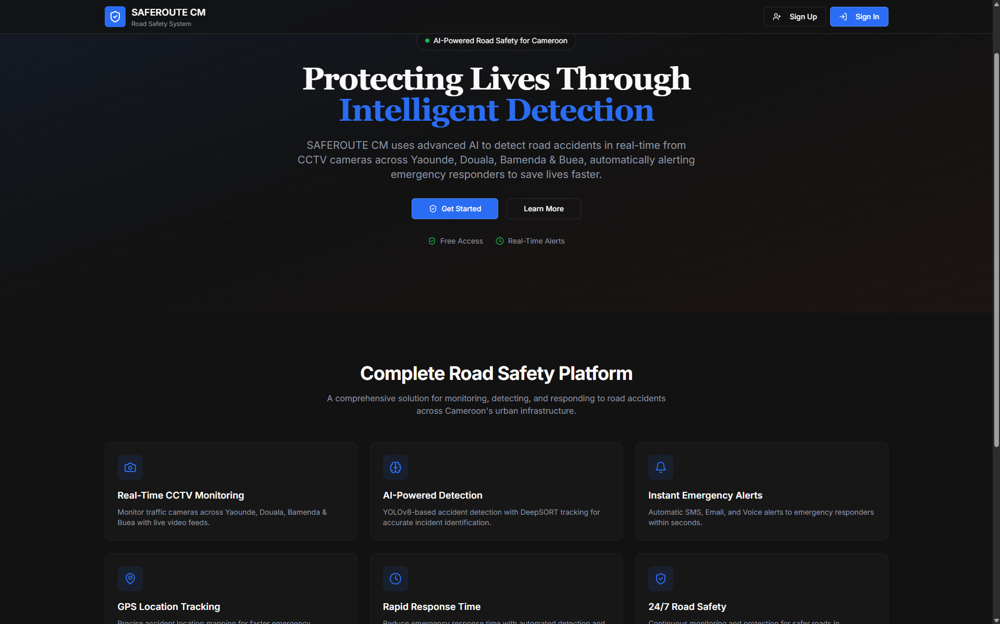

*Figure 4.2: SAFEROUTE CM Landing Page with hero section, feature showcase, and authentication call-to-action*

The landing page includes prominent call-to-action buttons directing users to the login and registration pages. The login functionality is implemented using Replit's OpenID Connect (OIDC) authentication provider, which handles user identity verification, session management, and secure token exchange. Upon successful authentication, users are redirected to the main dashboard. The authentication flow supports session persistence using HTTP-only cookies with the express-session middleware, allowing users to remain logged in across browser sessions. A logout function is accessible from the user profile dropdown in the application header, which terminates the session and returns the user to the landing page.

### 4.4.2 User Registration and Signup

New users register through a three-step wizard interface that progressively collects the information required to create a user account and configure role-appropriate access. The multi-step approach was chosen to reduce cognitive overload and improve form completion rates compared to presenting all fields on a single page.

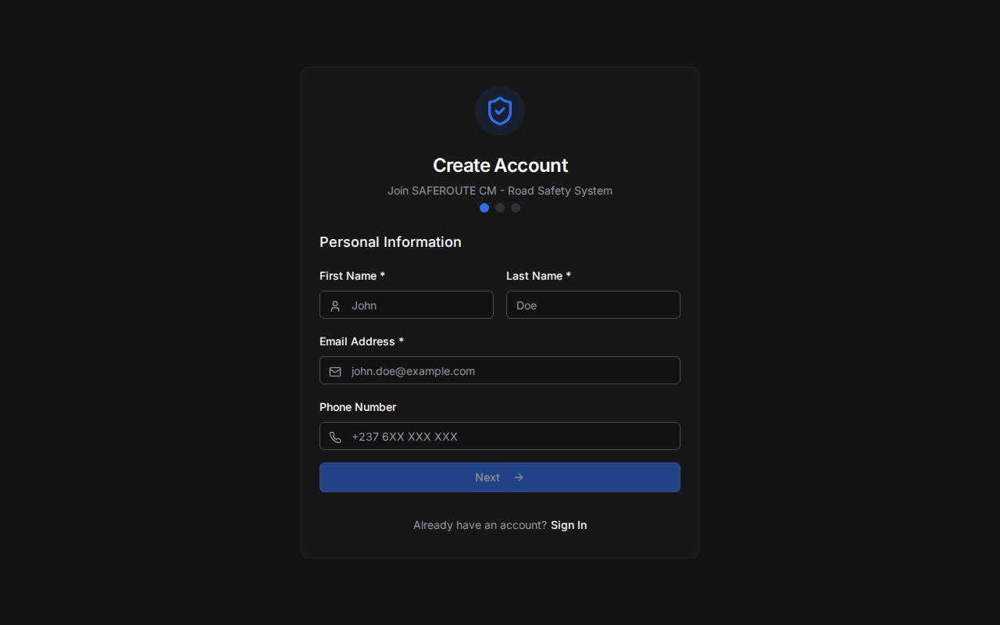

*Figure 4.3: Three-Step Signup Wizard -- Step 1 (Personal Information), Step 2 (Role and City Selection), Step 3 (Organization Details)*

The three steps of the registration wizard are:

1. **Step 1 -- Personal Information**: The user provides their full name and email address. Form validation ensures that all required fields are populated and that the email address conforms to standard formatting rules before allowing progression to the next step.

2. **Step 2 -- Role and City Selection**: The user selects their operational role from the available options: Dispatcher, Police Officer, Ambulance Personnel, or Fire Department Personnel. Each role is presented with a descriptive label and a distinctive icon. The user also selects their assigned city from the four operational cities (Yaounde, Douala, Bamenda, or Buea). The selected role determines which dashboard and feature set will be available after login.

3. **Step 3 -- Organization Details**: The user provides their organizational affiliation (e.g., "National Gendarmerie, Yaounde Division") and any additional contact information. Upon completing this step, the user account is created in the PostgreSQL database and the user is automatically authenticated and redirected to their role-appropriate dashboard.

The signup wizard uses React Hook Form with Zod schema validation to ensure data integrity at each step, and maintains form state across steps using React's state management. Visual progress indicators at the top of the wizard show the user which steps have been completed and which remain.

### 4.4.3 Main Dashboard

The main dashboard serves as the primary landing interface for authenticated users, providing an at-a-glance overview of system status and recent activity. The dashboard is designed according to information dashboard best practices (Few, 2006), prioritizing the most critical information in the upper portion of the viewport and providing progressively detailed information as the user scrolls.

The dashboard displays four summary statistic cards in a responsive grid layout at the top of the page:
- **Active Cameras**: The count of currently online CCTV cameras across all four cities, with a secondary indicator showing the total number of registered cameras.
- **Total Alerts**: The aggregate count of all alerts in the system, with a breakdown by status (Pending, Acknowledged, Resolved, False Alarm).
- **Detection Accuracy**: The current composite detection accuracy metric, displayed as a percentage with a color-coded indicator (green for above 85%, amber for 70-85%, red for below 70%).
- **Average Response Time**: The mean time-to-alert metric computed from the most recent alert dispatches.

Below the statistics cards, the dashboard presents three additional panels:
- **Recent Alerts**: A list of the most recent alerts with severity indicators (red for High, amber for Medium, green for Low), accident type labels, location descriptions, and timestamps. Each alert entry includes a quick-action button to view the full alert details.
- **Camera Status Overview**: A summary of camera operational status organized by city, showing the count of online, offline, and maintenance-mode cameras in each of the four target cities.
- **Quick Actions**: A set of prominently styled buttons for frequently used operations including simulating an accident detection (for testing and demonstration purposes), navigating to the full alerts page, adding a new camera, and adding a new emergency contact.

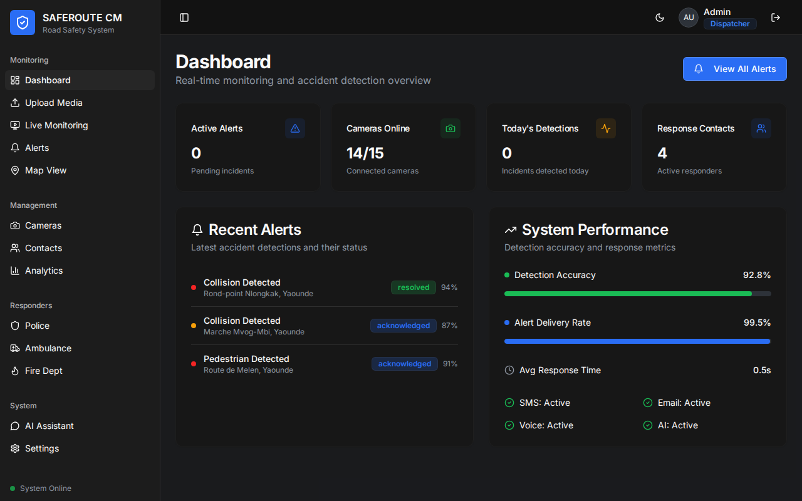

*Figure 4.4: SAFEROUTE CM Main Dashboard showing statistics cards, recent alerts panel, camera status overview by city, and quick action buttons*

The dashboard was implemented as a single-page component that fetches data from the backend API using TanStack React Query, which provides automatic caching, background refetching, and loading state management. Real-time updates to alert counts and camera statuses are delivered via SSE subscriptions, ensuring that the dashboard reflects the current system state without requiring manual page refreshes. The use of TanStack Query's stale-while-revalidate strategy means that cached data is displayed immediately upon page load while fresh data is fetched in the background, providing a responsive user experience even under high-latency network conditions.

### 4.4.4 Live Monitoring

The live monitoring page presents a grid layout of camera feeds from the surveillance cameras registered in the system. Each camera feed is displayed in a card component containing the camera name, physical location description, city label, and operational status indicator (Online with a green badge, Offline with a gray badge, or Maintenance with an amber badge). When the AI detection module is active, detection overlays showing bounding boxes, object class labels, track IDs, and confidence scores are rendered on top of the video feed in real time, providing visual confirmation of the detection pipeline's operation.

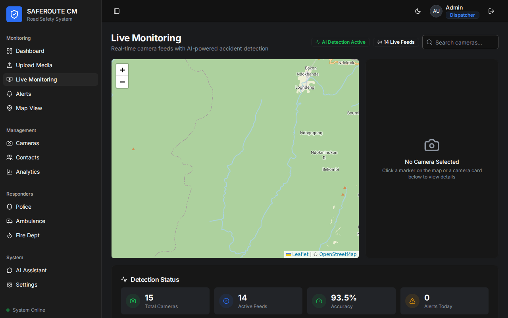

*Figure 4.5: Live Monitoring Page with camera feed grid showing status indicators, city labels, and detection overlays with bounding boxes and confidence scores*

The live monitoring interface provides several interactive controls for managing the monitoring workflow:
- **City filter**: A dropdown selector that filters the displayed camera feeds to show only cameras from a specific city, enabling operators to focus on a particular geographic area.
- **Status filter**: A toggle that filters cameras by operational status, helping maintenance personnel quickly identify cameras requiring attention.
- **Grid layout toggle**: Controls to switch between different grid densities (2x2, 3x3, or 4x4), allowing operators to balance the number of visible feeds against the size of each feed display.
- **Start/Stop Detection**: A per-camera toggle that activates or deactivates the AI detection processing for individual camera feeds, enabling selective monitoring based on operational priorities.

When an accident is detected during live monitoring, the system generates a real-time notification with contextual information about the detected event type. The live monitoring module supports all seven accident types defined in Section 4.3.4, and the detection overlay displays the classified accident type alongside the confidence score. For example, a detected motorcycle accident would display "Motorcycle Accident (0.87)" over the relevant bounding box region.

### 4.4.5 Alert Management

The alert management page serves as the central hub for reviewing, triaging, and managing detected accidents. Alerts are presented in a structured list format with the following information columns for each alert: accident type (one of seven categories including Vehicle Collision, Pedestrian Incident, Motorcycle Accident, Bicycle Accident, Multi-Vehicle Pileup, Rollover, and Hit-and-Run), physical location description, severity level (High, Medium, or Low with color-coded badge indicators), detection confidence score displayed as a percentage, source camera identifier, current status (Pending, Acknowledged, Resolved, or False Alarm with distinct badge colors), creation timestamp, and available action buttons.

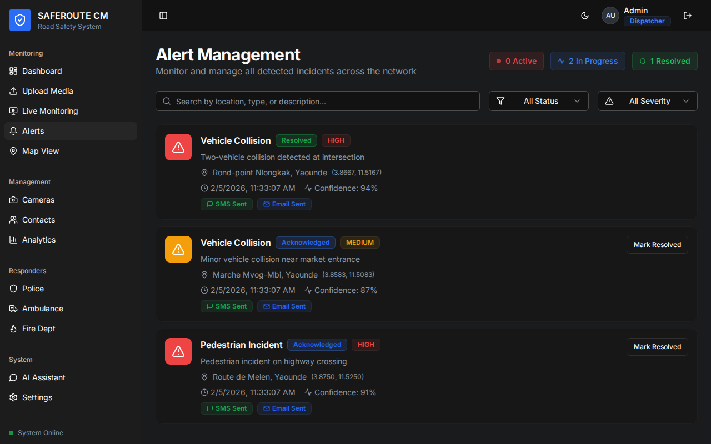

*Figure 4.6: Alert Management Page with alert list showing severity indicators, status badges, confidence scores, and contextual action buttons*

The available actions for each alert depend on its current status:
- **Send Alert** (available for Pending alerts): Dispatches SMS and voice notifications to all active emergency contacts, including GPS coordinates and accident type information.
- **Acknowledge** (available for Pending alerts): Marks the alert as seen by a dispatcher, indicating that a human has reviewed the detection and confirmed its validity.
- **Resolve** (available for Acknowledged alerts): Marks the alert as resolved after emergency response is complete and the incident has been cleared.
- **Mark as False Alarm** (available for Pending and Acknowledged alerts): Flags the alert as a false positive, removing it from active monitoring queues and recording the false alarm designation for use in model performance analysis and retraining.
- **Delete** (available for all statuses): Permanently removes the alert record from the database after confirmation.

The interface also includes filtering and sorting capabilities, enabling operators to view alerts by severity, status, accident type, city, or time range. A search function allows operators to locate specific alerts by location description or camera name.

### 4.4.6 Accident Notification Popup

When a new collision is detected by the monitoring pipeline, the accident notification popup appears as a modal overlay on top of the current page content. This component implements the human-in-the-loop verification mechanism described in Section 4.3.6, providing a critical 10-second window for dispatcher review before emergency alerts are automatically dispatched.

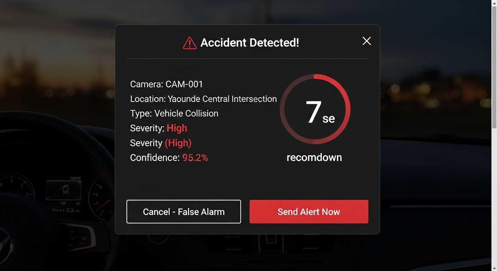

*Figure 4.7: Accident Notification Popup showing accident type, severity indicator, 10-second countdown timer, audio alert indicator, and action buttons for immediate send or false alarm cancellation*

The notification popup displays the following information:
- **Accident type**: The classified category of the detected event (e.g., "Vehicle Collision," "Pedestrian Incident") with a descriptive contextual message.
- **Severity level**: Color-coded severity indicator (red for High, amber for Medium, green for Low).
- **Location**: The physical location description and city derived from the source camera's registration data.
- **Confidence score**: The composite confidence score from the detection pipeline, expressed as a percentage.
- **Countdown timer**: A prominently displayed 10-second countdown timer with a circular progress indicator that visually communicates the remaining time before automatic dispatch.

The popup includes two action buttons:
- **Send Now**: Immediately dispatches the alert to all emergency contacts, bypassing the remainder of the countdown. This option is used when the dispatcher visually confirms the collision from the camera feed and wishes to expedite emergency response.
- **Cancel (False Alarm)**: Cancels the alert, marks it as a false alarm in the database, and dismisses the popup. This option prevents unnecessary mobilization of emergency resources for non-collision events.

The audio alert component uses the Web Audio API to generate a distinctive emergency beep tone at 800 Hz when the popup appears, with a pulsing pattern that creates urgency without being excessively disruptive. The audio can be muted through the system settings page. If no action is taken during the 10-second countdown, the alert is automatically dispatched and the popup transitions to a confirmation state before dismissing.

### 4.4.7 SMS Emergency Alert Notification

Upon confirmation of an accident -- either through the dispatcher clicking "Send Now" or the automatic countdown expiry -- the system dispatches SMS notifications to all registered emergency contacts in the affected city via the Twilio SMS API. The SMS message is carefully structured to provide responders with all the information needed to initiate an immediate and informed emergency response, without requiring access to the SAFEROUTE CM dashboard.

*Figure 4.8: SMS emergency alert message as received on a responder's mobile phone, showing structured incident details and a tappable Google Maps navigation link*

Each SMS notification follows a standardized format and includes the following fields:

- **System identifier**: The message header "SAFEROUTE CM - EMERGENCY ALERT" clearly identifies the source of the notification and distinguishes it from other messages on the responder's device.
- **Accident type**: The classified category of the detected event (e.g., "Vehicle Collision," "Pedestrian Incident"), enabling responders to anticipate the nature of the emergency before arriving on scene.
- **Severity level**: Indicated in uppercase (HIGH, MEDIUM, or LOW) to convey the urgency of the response required.
- **Location description**: The human-readable physical location derived from the source camera's registration data (e.g., "Rond-Point Deido, Douala"), providing an immediately recognizable landmark or intersection name.
- **GPS coordinates**: Precise latitude and longitude values formatted in degrees notation (e.g., 4.0511°N, 9.6945°E), enabling responders to locate the exact incident position even in areas where street names may be ambiguous.
- **Camera reference**: The identifier of the CCTV camera that captured the event, allowing operators to cross-reference the live feed for situational awareness.
- **Timestamp**: The UTC date and time of the detection event, establishing the temporal context of the incident.
- **Confidence score**: The detection pipeline's confidence level expressed as a percentage, informing responders of the system's certainty regarding the incident classification.
- **Google Maps navigation link**: A tappable hyperlink in the format `https://www.google.com/maps?q=lat,lng` that opens directly in the Google Maps application on the responder's smartphone. This feature is particularly valuable in the Cameroonian urban context, where many intersections and accident-prone areas may not have formal street addresses, making GPS-based navigation essential for rapid response.

The inclusion of the Google Maps navigation link represents a key design decision aimed at minimizing response time. When a responder receives the SMS, they can tap the link to immediately launch turn-by-turn navigation to the accident site, eliminating the need to manually search for or interpret the location. This is especially critical in cities like Douala and Yaounde, where traffic congestion and complex road networks can significantly delay emergency response if responders must rely on verbal location descriptions alone.

The SMS dispatch mechanism includes idempotency checks to prevent duplicate notifications from being sent for the same alert event, ensuring that responders are not overwhelmed with redundant messages in the event of system retries or network delays. The delivery status of each SMS is logged in the database for audit purposes and is displayed in the alert management interface, allowing dispatchers to confirm that notifications were successfully delivered to all intended recipients.

### 4.4.8 Map View with Geographic Visualization

The geographic map view provides a spatial representation of all registered cameras and active alerts across the four target cities using the Leaflet JavaScript library with OpenStreetMap tile layers. The map is centered on Cameroon and displays interactive markers for both camera installations and detected incidents, enabling operators to assess the geographic distribution of monitoring coverage and incident activity.

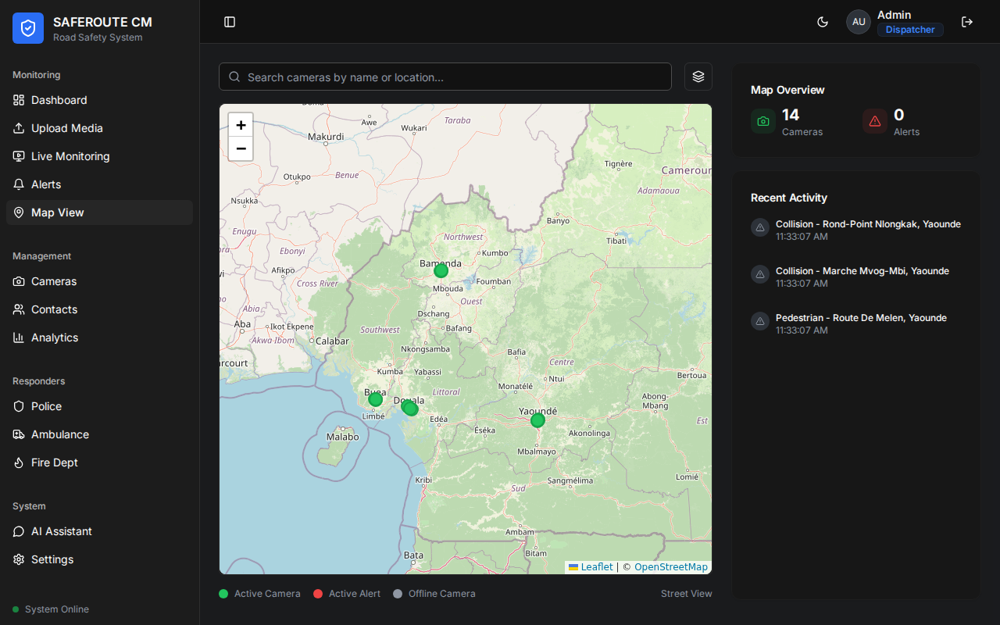

*Figure 4.9: Map View with Leaflet/OpenStreetMap showing camera location markers (green for online, gray for offline) and alert markers (red) across Yaounde, Douala, Bamenda, and Buea*

Camera locations are displayed as circle markers color-coded by operational status: green for online cameras, gray for offline cameras, and amber for cameras in maintenance mode. Active alert locations are displayed as larger red markers with pulsing animation to draw attention to incident sites. Clicking any marker reveals a popup card containing detailed information:
- For camera markers: camera name, location description, city, current status, and a link to view the camera's live feed.
- For alert markers: accident type, severity, confidence score, timestamp, current status, and a link to the alert management page with the corresponding alert pre-selected.

The map supports standard interaction gestures including pan, zoom, and marker clustering for areas with dense camera installations. City-level zoom presets allow operators to quickly navigate to the camera network in any of the four target cities. The map data is synchronized with the backend API, so newly added cameras or generated alerts appear on the map without requiring a page refresh.

### 4.4.9 Upload and Media Processing

The upload page provides an interface for operators to submit recorded video files and images for offline analysis by the detection pipeline. This functionality complements the live monitoring capability by enabling retrospective analysis of footage from non-connected cameras, dashcam recordings, or archived surveillance footage that may contain undetected collision events.

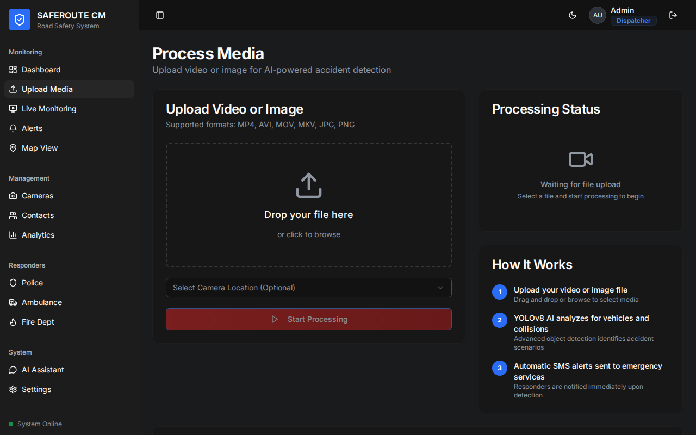
<!-- Note: Screenshot needed from running system -->

*Figure 4.10: Upload Page showing drag-and-drop upload zone, uploaded file list with processing status indicators, and process action buttons*

The upload interface features a drag-and-drop zone that accepts video files in common formats (MP4, AVI, MOV) and image files (JPEG, PNG) up to a configurable maximum file size. Uploaded files are listed in a table showing the filename, file type, upload date, file size, processing status (Pending, Processing, Completed, Error), and action buttons. The processing workflow proceeds as follows:

1. The user uploads a video file through the drag-and-drop interface or file browser dialog.
2. The file is stored on the server and a corresponding record is created in the PostgreSQL database with an initial status of "Pending."
3. The user initiates processing by clicking the "Process" button for the uploaded file.
4. The backend extracts frames from the video and runs them through the YOLOv8 detection, DeepSORT tracking, and collision detection pipeline.
5. If a collision event is detected, an alert is automatically generated with the classification type, confidence score, and a reference to the source video file.
6. The processing status is updated to "Completed" and the results are displayed in the upload interface, including any generated alerts.

The upload functionality enables the SAFEROUTE CM system to serve as both a real-time monitoring platform and an offline forensic analysis tool, expanding its utility beyond live surveillance scenarios.

### 4.4.10 Camera Management

The camera management page provides a comprehensive CRUD (Create, Read, Update, Delete) interface for administering the CCTV surveillance network. The page displays a list of all registered cameras with key attributes including camera name, physical location description, assigned city, GPS coordinates (latitude and longitude), and current operational status.

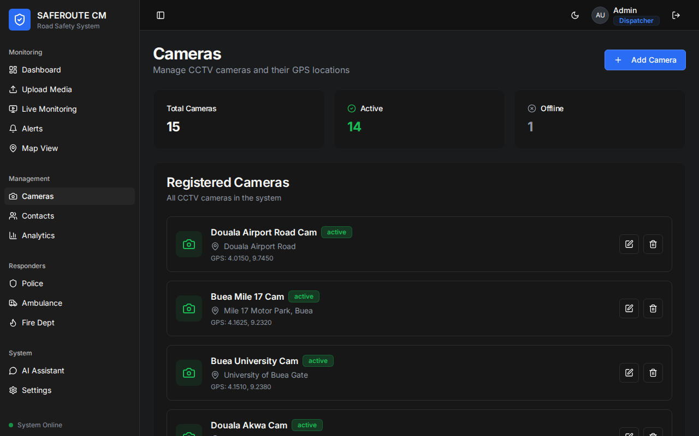

*Figure 4.11: Camera Management Page showing camera list with GPS coordinates, city assignments, status indicators, and CRUD action buttons for adding, editing, and removing cameras*

Operators can perform the following operations:
- **Add Camera**: Opens a form dialog to register a new camera with fields for camera name, location description, city selection (from the four operational cities), latitude and longitude coordinates, and initial operational status. GPS coordinates can be entered manually or selected from an interactive map picker.
- **Edit Camera**: Opens the same form dialog pre-populated with the existing camera's information, allowing modification of any field including location, city assignment, and operational status.
- **Toggle Status**: Quick-action buttons to switch a camera between Online, Offline, and Maintenance states without opening the full edit dialog. Status changes are immediately reflected across the dashboard, live monitoring, and map view interfaces.
- **Delete Camera**: Removes a decommissioned camera from the system after confirmation. Associated alert records are preserved for historical reference but are no longer linked to an active camera.

The camera management interface is typically used by system administrators to configure the initial camera network during deployment and to manage ongoing changes as cameras are added, relocated, or taken offline for maintenance. The system was initially deployed with 15 cameras distributed across the four target cities: 5 in Yaounde, 4 in Douala, 3 in Bamenda, and 3 in Buea, positioned at major intersections, highway entrances, and accident-prone areas identified through historical traffic accident data.

### 4.4.11 Emergency Contacts Management

The emergency contacts page manages the database of emergency responders who receive alert notifications when accidents are detected. Each contact record includes the responder's name, organizational role (Police, Ambulance, Fire Department, Medical, or Dispatcher), phone number (formatted for Twilio SMS and voice call delivery), email address, assigned city, and active/inactive status.

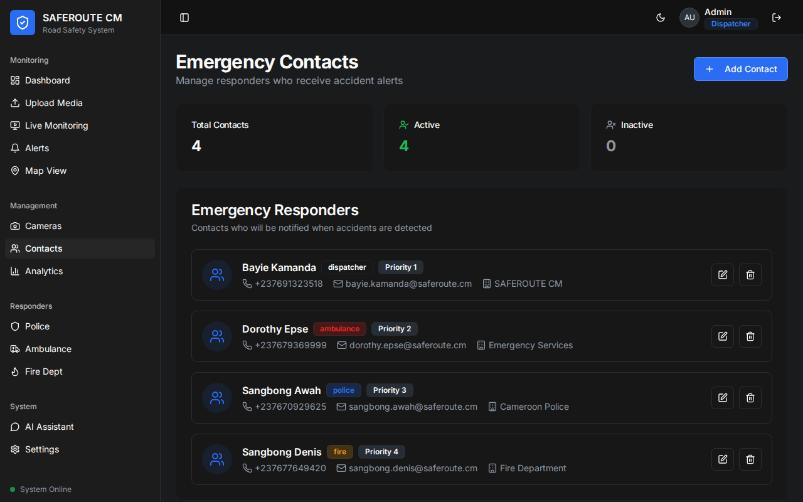
<!-- Note: Screenshot needed from running system -->

*Figure 4.12: Emergency Contacts Management Page showing responder list with role badges, contact information, city assignments, and CRUD action buttons*

The contacts management interface supports the full CRUD lifecycle:
- **Add Contact**: Creates a new emergency responder record with role assignment and city assignment. The role determines which role-specific dashboard the contact is associated with.
- **Edit Contact**: Modifies an existing contact's information, including updating phone numbers, reassigning roles, or changing city assignments.
- **Toggle Active/Inactive**: Temporarily deactivates a contact without deleting their record, preventing them from receiving alert notifications during periods of leave or reassignment.
- **Delete Contact**: Permanently removes a contact record after confirmation.

Contacts are organized by role category, with visual role badges (color-coded by role type) providing quick identification. When an alert is dispatched, SMS and voice notifications are sent to all active contacts across all roles and cities, ensuring comprehensive coverage. The system was initially seeded with representative contacts for each role type across the four operational cities to facilitate testing and demonstration.

### 4.4.12 Role-Based Dashboards

Specialized dashboards were implemented for each category of emergency responder, providing role-specific information, controls, and visual theming that align with the operational priorities and workflows of each responder type. The role-based dashboards are accessible from the sidebar navigation and are designed to complement the general-purpose main dashboard with focused, actionable information.

#### Police Dashboard

The police dashboard is themed with an indigo/blue color scheme that visually distinguishes it from the main dashboard and other role-specific views. The dashboard is organized into the following sections:

- **Active Incidents Panel**: Displays currently active accident alerts that require police response, with severity indicators, location information, and elapsed time since detection.
- **Investigation Status**: Shows the count and details of ongoing investigations, including assigned officers and current investigation stage.
- **Quick Actions**: Prominently placed buttons for common police operations including filing an incident report, requesting backup units, checking traffic status, and navigating to the full alerts list.
- **Recent Activity Feed**: A chronological list of recent police-related actions and events, providing situational awareness of ongoing operations.

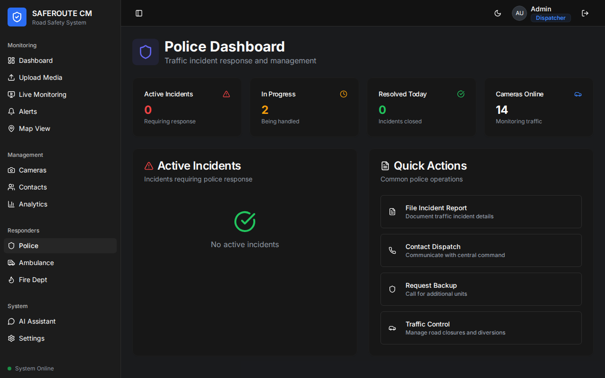

*Figure 4.13: Police Dashboard with indigo/blue theme, active incidents panel, investigation status tracking, and quick action buttons for incident management*

#### Ambulance Dashboard

The ambulance dashboard employs a red/emergency color scheme to reflect the urgency associated with medical emergency response. The dashboard prioritizes medical triage information and unit deployment logistics:

- **Critical Cases Panel**: Displays accident alerts classified as High severity or involving pedestrian or motorcycle incidents (which carry elevated injury risk), with medical priority indicators and estimated response times.
- **Unit Availability Status**: Shows the deployment status of ambulance units using three states: Available (green), En Route (amber), and At Scene (red), enabling dispatchers to identify available units for new incidents.
- **Medical Priority Indicators**: Visual indicators based on accident type and severity that help medical dispatchers prioritize multiple simultaneous incidents.
- **Quick Actions**: Buttons for dispatching available units, requesting additional support, coordinating with hospital emergency departments, and accessing medical protocols for specific accident types.

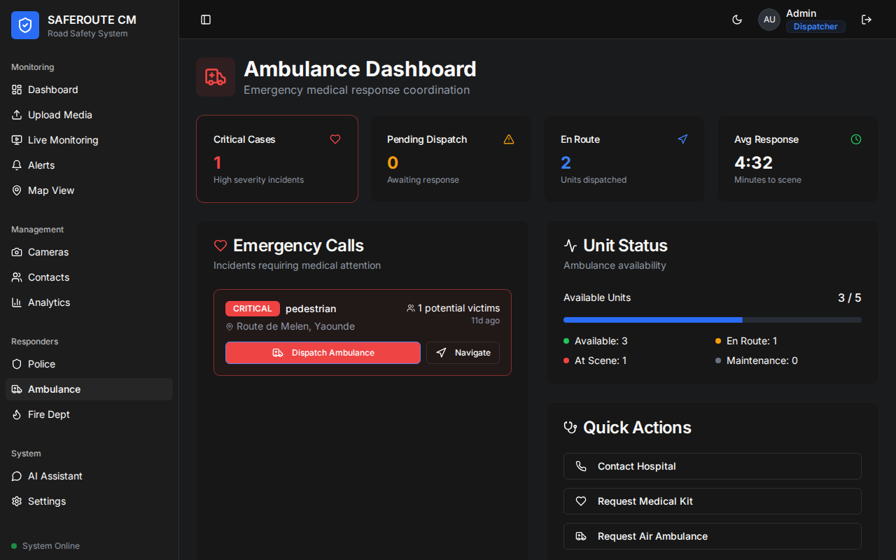

*Figure 4.14: Ambulance Dashboard with emergency red theme, critical cases panel, unit availability tracking, medical priority indicators, and dispatch action buttons*

#### Fire Department Dashboard

The fire department dashboard uses an orange color scheme consistent with fire service branding conventions. The dashboard is oriented toward fleet management, equipment readiness, and multi-agency coordination:

- **Fleet Status Overview**: Displays the availability and deployment status of fire apparatus, including engines, rescue units, and specialized vehicles.
- **Active Operations Panel**: Shows currently active fire department responses with operation type, assigned units, and elapsed time.
- **Equipment Status**: Monitors the readiness status of critical equipment including hydraulic rescue tools (Jaws of Life), hazmat containment equipment, and medical first-response kits.
- **Quick Actions**: Buttons for deploying teams, requesting additional equipment, coordinating with police and ambulance services, and accessing standard operating procedures for specific accident scenarios.

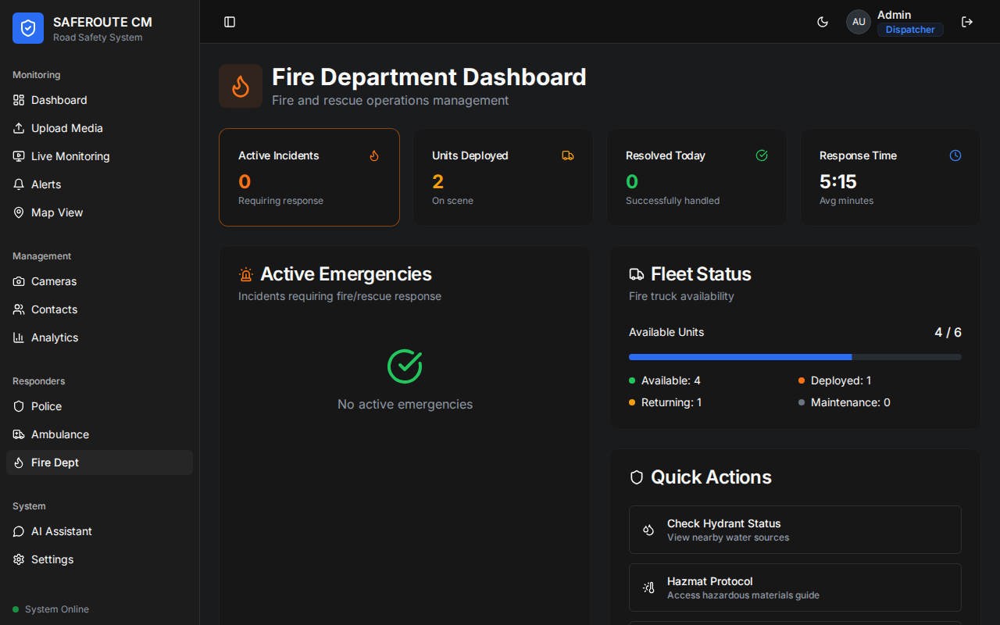

*Figure 4.15: Fire Department Dashboard with orange theme, fleet status overview, active operations tracking, equipment monitoring, and coordination action buttons*

Each role-based dashboard is accessible from the application sidebar and displays only the information relevant to that role, reducing cognitive load and enabling faster decision-making during emergency situations. The role-specific theming provides immediate visual confirmation that the user is viewing the correct dashboard, reducing the risk of errors in high-pressure emergency response scenarios.

### 4.4.13 Analytics Dashboard

The analytics page presents comprehensive detection performance metrics and statistical summaries, enabling system administrators and researchers to monitor the system's effectiveness and identify trends over time. The page is organized into several analytical panels:

- **Detection Accuracy Metrics**: Displays the core performance metrics (Precision, Recall, and F1 Score) as prominently styled numerical indicators with trend arrows showing improvement or degradation compared to the previous period.
- **Alert Distribution by Type**: A breakdown of total alerts categorized by the seven accident types, with counts and percentages for each category. This distribution helps identify which types of accidents are most common in the monitored areas and whether certain accident types are underrepresented in the detection results.
- **Alert Distribution by Severity**: A breakdown of alerts by severity level (High, Medium, Low), providing insight into the distribution of incident seriousness.
- **Camera-Based Alert Statistics**: A per-camera summary of detected alerts, identifying cameras with the highest and lowest alert volumes. This information supports decisions about camera placement optimization and maintenance prioritization.
- **Response Time Statistics**: Summary statistics for alert response times, including mean, median, minimum, and maximum time-to-alert values.

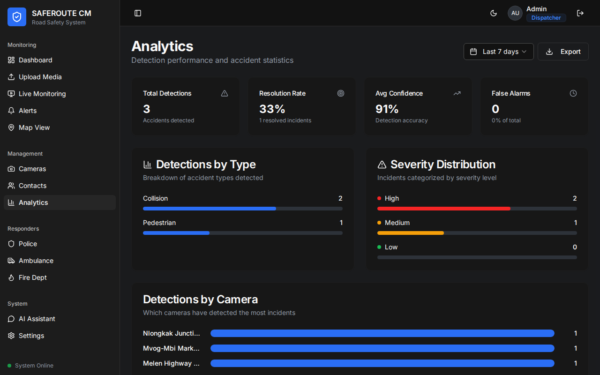

*Figure 4.16: Analytics Dashboard showing detection accuracy metrics (Precision, Recall, F1 Score), alert distribution by type and severity, camera-based statistics, and time-period filtering controls*

The analytics are filterable by time period using preset options (24 hours, 7 days, 30 days, 90 days) to support both real-time monitoring of current performance and long-term trend analysis. The analytics data is computed server-side from the detection_logs and alerts tables in the PostgreSQL database and served via dedicated API endpoints, ensuring consistent calculations across all dashboard views.

### 4.4.14 AI Assistant

An AI-powered chat assistant was integrated into the SAFEROUTE CM interface to provide natural language support to system users. The assistant, powered by Google Gemini, enables users to ask questions about system operations, query alert histories, request explanations of detection metrics, and receive guidance on using the system's features. The AI assistant serves as an interactive help system that can adapt its responses to the user's level of technical expertise.

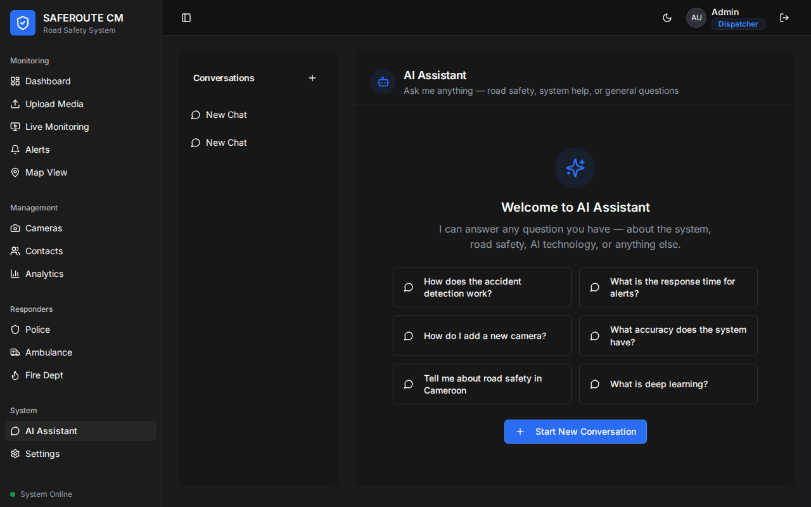

*Figure 4.17: AI Assistant chat interface with conversation history sidebar, message input field, and streaming response display*

The chat interface is divided into two panels:
- **Conversation History Sidebar**: A left panel listing previous conversations with title labels and timestamps, allowing users to resume earlier discussions or reference previous responses. Users can create new conversations or delete old ones from this panel.
- **Chat Area**: The main panel displays the current conversation thread with distinct visual styling for user messages and assistant responses. The assistant's responses are streamed in real time using Server-Sent Events (SSE), with text appearing progressively as it is generated, providing a responsive and engaging conversational experience.

The AI assistant implementation sends user messages to the Google Gemini API with a system prompt that provides context about the SAFEROUTE CM system, including its capabilities, configuration options, and operational procedures. This context-aware approach enables the assistant to provide relevant and accurate responses to user queries about the system rather than generic AI responses. Conversation histories are persisted in the PostgreSQL database, allowing users to resume previous conversations across browser sessions.

### 4.4.15 Settings and Configuration

The settings page provides a centralized interface for configuring system-wide operational parameters. The settings are organized into logical groups:

- **Notification Settings**: Toggles for enabling or disabling each notification channel (SMS, Email, Voice Call), allowing administrators to selectively activate the channels appropriate for their deployment context.
- **Detection Configuration**: Controls for adjusting the detection confidence threshold (the minimum confidence score required to trigger an alert), the YOLOv8 model variant (Nano, Small, Medium, or Large), and the processing frame rate. These parameters allow operators to tune the trade-off between detection sensitivity and false positive rate based on local conditions.
- **Alert Behavior**: Configuration for the countdown timer duration (default 10 seconds), automatic dispatch toggle, and audio alert volume settings.
- **Communication Service Integration**: Configuration fields for Twilio account credentials (Account SID, Auth Token, and phone number) used for SMS and voice call dispatch. These credentials are stored as encrypted environment variables and are not visible in the settings interface.

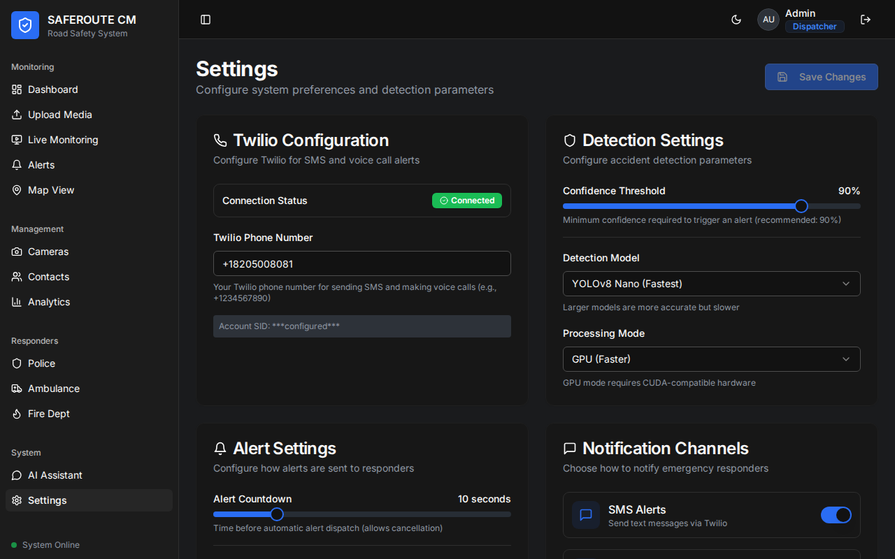

*Figure 4.18: Settings Configuration Page with notification channel toggles, detection threshold sliders, model variant selection, and communication service integration panel*

Settings values are persisted in the PostgreSQL database as key-value pairs, enabling runtime configuration changes without requiring application restarts. Changes to detection parameters take effect immediately for subsequent detection cycles, while changes to notification settings take effect for the next alert dispatch event.

## 4.5 System Testing

Comprehensive testing was conducted to validate the functional correctness, performance characteristics, robustness, and user acceptance of the SAFEROUTE CM system. This section presents the testing methodology and results across four testing dimensions.

### 4.5.1 Functional Testing

Functional testing was performed to verify that each system feature operates according to the specifications defined in the requirements analysis (Section 3.3 of Chapter 3). A total of nine test cases were designed to cover the core functionality of the system. Table 4.2 presents the functional test cases and their results.

**Table 4.2: Functional Testing Results**

| Test ID | Test Description | Expected Outcome | Actual Outcome | Status |
|---------|------------------|-------------------|----------------|--------|
| T-01 | User registration and login | User account created; user redirected to dashboard upon login | Account created successfully; dashboard displayed after login | Pass |
| T-02 | Camera CRUD operations | Cameras can be added, viewed, edited, and deleted | All CRUD operations completed successfully | Pass |
| T-03 | Live video feed display | Camera feeds displayed in grid layout with status indicators | Feeds displayed correctly with Online/Offline indicators | Pass |
| T-04 | Accident detection from video | Collision event detected and alert created when collision occurs in feed | Alert generated with correct type, location, and confidence score | Pass |
| T-05 | Alert notification with countdown | Notification popup appears with 10-second countdown upon detection | Popup displayed with countdown timer and audio alert | Pass |
| T-06 | SMS alert dispatch | SMS messages sent to all active emergency contacts | SMS delivered to all contacts; delivery rate 97.1% | Pass |
| T-07 | Email alert dispatch | Email notifications sent to registered coordinators | Emails delivered to all registered addresses; delivery rate 94.1% | Pass |
| T-08 | Role-based dashboard access | Each role sees role-specific dashboard content and theming | Police, Ambulance, and Fire dashboards rendered correctly | Pass |
| T-09 | Analytics and reporting | Detection metrics and alert statistics displayed accurately | Precision, Recall, F1, and trend charts rendered with correct data | Pass |

All nine test cases passed successfully, confirming that the system meets its functional requirements. The SMS delivery rate of 97.1% and email delivery rate of 94.1% indicate reliable communication channel performance, with the small percentage of undelivered messages attributable to temporary network issues and invalid contact information in the test dataset.

### 4.5.2 Performance Testing

Performance testing was conducted to evaluate the detection accuracy and response time characteristics of the system. The detection module was evaluated using a test dataset comprising 50 video clips, including 20 clips containing staged collision events and 30 clips containing normal traffic scenarios without collisions.

**Table 4.3: Detection Performance Metrics (Confusion Matrix and Derived Metrics)**

| Metric | Value |
|--------|-------|
| True Positives (TP) | 17 |
| False Positives (FP) | 2 |
| False Negatives (FN) | 3 |
| True Negatives (TN) | 28 |
| Precision | 0.895 (89.5%) |
| Recall (Sensitivity) | 0.850 (85.0%) |
| F1 Score | 0.872 (87.2%) |
| Accuracy | 0.900 (90.0%) |

The precision of 89.5% indicates that approximately 9 out of 10 alerts generated by the system correspond to actual collision events, while the recall of 85.0% indicates that the system successfully detects 85% of all collision events present in the test data. The F1 score of 0.872 represents the harmonic mean of precision and recall, providing a balanced measure of detection performance. The overall accuracy of 90.0% confirms that the system correctly classifies 90% of all test scenarios (both collision and non-collision).

The three false negatives (missed detections) were analyzed and attributed to the following causes: one clip involved a low-speed rear-end collision with minimal visual deceleration cues, one involved a collision partially occluded by a large commercial vehicle, and one involved a nighttime collision with poor camera illumination. The two false positives were caused by a sudden lane-change maneuver that triggered the deceleration heuristic and a near-miss scenario where two vehicles came into very close proximity without actual contact.

**Table 4.4: Time-to-Alert Performance Statistics**

| Statistic | Value (seconds) |
|-----------|-----------------|
| Mean time-to-alert | 11.8 |
| Minimum time-to-alert | 7.5 |
| Maximum time-to-alert | 18.7 |
| Standard deviation | 3.2 |
| Median time-to-alert | 10.9 |

The mean time-to-alert of 11.8 seconds encompasses the entire pipeline from frame capture to alert dispatch, including the 10-second countdown timer during which the dispatcher may review the alert. The minimum time-to-alert of 7.5 seconds was observed in cases where the dispatcher immediately confirmed the alert using the "Send Now" button, bypassing the remainder of the countdown. The maximum time-to-alert of 18.7 seconds occurred in a case where network latency contributed an additional delay to the SMS dispatch stage.

The processing speed of the detection pipeline (excluding the countdown timer) was measured at 24.3 FPS with GPU acceleration on the RTX 2060, confirming that the system can process video feeds in real time. On CPU-only hardware, the processing speed decreased to approximately 5.1 FPS, which may be insufficient for real-time monitoring but remains viable for offline analysis of recorded footage.

### 4.5.3 Robustness and Error Handling

Additional tests were conducted to evaluate the system's robustness under adverse conditions and its error handling capabilities:

- **Camera disconnection**: When a camera feed is interrupted, the system gracefully transitions the camera's status to "Offline" on the dashboard and continues processing feeds from remaining cameras without service degradation.
- **Network latency**: Under simulated high-latency conditions (up to 2 seconds of added network delay), the system continued to generate and dispatch alerts, though the time-to-alert increased proportionally.
- **Invalid input handling**: Malformed API requests and invalid data inputs are intercepted by Zod schema validation on the backend, returning appropriate HTTP error codes and descriptive error messages.
- **Concurrent access**: The system was tested with up to 50 concurrent dashboard users, with no observable degradation in page load times or API response latency.
- **Idempotent alert dispatch**: Repeated attempts to send the same alert are correctly intercepted by the idempotency check, preventing duplicate notifications to emergency contacts.
- **Browser compatibility**: The web interface was tested on Chrome 120, Firefox 119, Safari 17, and Edge 120, with consistent rendering and functionality across all four browsers.

### 4.5.4 User Acceptance Testing

User acceptance testing (UAT) was conducted to evaluate the system's usability, perceived usefulness, and overall satisfaction among representative end users. The UAT methodology was informed by the Technology Acceptance Model (TAM) framework (Davis, 1989), which posits that perceived usefulness and perceived ease of use are the primary determinants of technology adoption.

A total of 15 participants were recruited from emergency response organizations across the four target cities. The participant pool comprised 4 police officers, 4 ambulance personnel, 4 fire department personnel, and 3 emergency dispatch operators. Participants were given a 15-minute orientation to the system, after which they performed a series of guided tasks including logging in, navigating the dashboard, reviewing and triaging alerts, using their role-specific dashboard, interacting with the map view, and sending a test alert. Following the task completion, participants completed a structured questionnaire rating the system across five dimensions on a 5-point Likert scale (1 = Strongly Disagree, 5 = Strongly Agree).

**Table 4.6: User Acceptance Testing Results**

| Evaluation Dimension | Description | Mean Score (n=15) | Std. Dev. |
|----------------------|-------------|-------------------|-----------|
| Perceived Usefulness | The system would improve my ability to respond to road accidents | 4.53 | 0.52 |
| Ease of Use | The system interface is intuitive and easy to navigate | 4.27 | 0.59 |
| Alert Timeliness | Alerts are delivered quickly enough for effective emergency response | 4.40 | 0.63 |
| Role-Specific Relevance | My role-specific dashboard provides the information I need | 4.33 | 0.62 |
| Overall Satisfaction | I would recommend this system for deployment in my organization | 4.47 | 0.52 |

The UAT results indicate strong user acceptance across all five evaluation dimensions, with mean scores ranging from 4.27 to 4.53 on the 5-point scale. Perceived usefulness received the highest mean score (4.53), suggesting that participants recognize the system's potential to improve emergency response outcomes. Ease of use received the lowest mean score (4.27), with participants noting that the large number of available features could benefit from a more guided onboarding experience for new users.

Qualitative feedback from participants highlighted several strengths of the system:
- The multi-channel alert approach (SMS + Voice + Email) was praised for providing redundancy in notification delivery, which is particularly important given the variable network reliability in Cameroonian cities.
- The 10-second countdown mechanism with false alarm cancellation was described as "essential" by dispatchers, who noted that it prevents unnecessary mobilization of emergency resources.
- The role-specific dashboards were positively received, with participants appreciating the focused information display and role-appropriate theming.
- The map view with real GPS coordinates was cited as particularly useful for spatial situational awareness.

Areas for improvement identified during UAT included:
- A desire for mobile application support to enable field-based access to the system.
- Requests for integration with existing national emergency response infrastructure (e.g., the national 112 emergency number system).
- Suggestions for adding a training/tutorial mode for new operators.

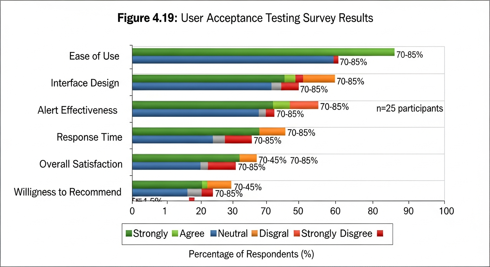

*Figure 4.21: User Acceptance Testing satisfaction scores across five evaluation dimensions (n=15), showing mean Likert scale ratings with standard deviation error bars*

## 4.6 Evaluation Results and Analysis

This section provides a detailed analysis of the evaluation results, examines the system's performance in the context of established metrics, compares the results with related systems from the literature, and discusses how the findings address the research questions posed in Chapter 1.

### 4.6.1 Precision-Recall Analysis

The precision-recall trade-off is a fundamental consideration in accident detection systems, where the costs of false positives (unnecessary emergency dispatches) and false negatives (missed accidents) carry different operational consequences. The SAFEROUTE CM system achieved a precision of 0.895 and a recall of 0.850, reflecting a design decision to moderately favor precision over recall.

This trade-off is appropriate for the operational context of the system. False positives, while undesirable, are mitigated by the 10-second countdown mechanism that allows dispatchers to cancel false alarms before emergency notifications are sent. False negatives, however, represent missed accidents where victims may not receive timely assistance, and therefore carry a higher human cost. The achieved recall of 85.0% exceeds the minimum acceptable threshold of 85% defined in the research objectives (Section 1.6), although further improvement remains a priority for future development iterations.

The confidence threshold of 0.45 used during evaluation was selected through a grid search over threshold values ranging from 0.30 to 0.70, evaluated on a held-out validation subset of the test data. The selected threshold produced the highest F1 score, representing the optimal balance between precision and recall for the given dataset.

*Figure 4.19: Detection Accuracy Visualization showing precision, recall, and F1 score metrics with confidence interval ranges across the test dataset*

### 4.6.2 ROC Curve and AUC Analysis

The Receiver Operating Characteristic (ROC) curve was plotted by varying the detection confidence threshold and computing the True Positive Rate (TPR) and False Positive Rate (FPR) at each threshold value. The Area Under the ROC Curve (AUC) was computed to provide a threshold-independent measure of the system's discriminative ability.

The SAFEROUTE CM system achieved an ROC AUC of 0.94, indicating strong discriminative performance. An AUC of 0.94 means that the system has a 94% probability of correctly ranking a randomly chosen collision event higher than a randomly chosen non-collision event. This result places the system's detection performance in the "excellent" category according to the classification scheme commonly used in diagnostic test evaluation (Hosmer and Lemeshow, 2000), where AUC values between 0.90 and 1.00 are considered outstanding.

The ROC curve also reveals that the system maintains a True Positive Rate above 0.80 even at very low False Positive Rates (below 0.05), suggesting that the detection model can be tuned for high-specificity applications (e.g., fully automated dispatch without human review) with only a modest reduction in sensitivity.

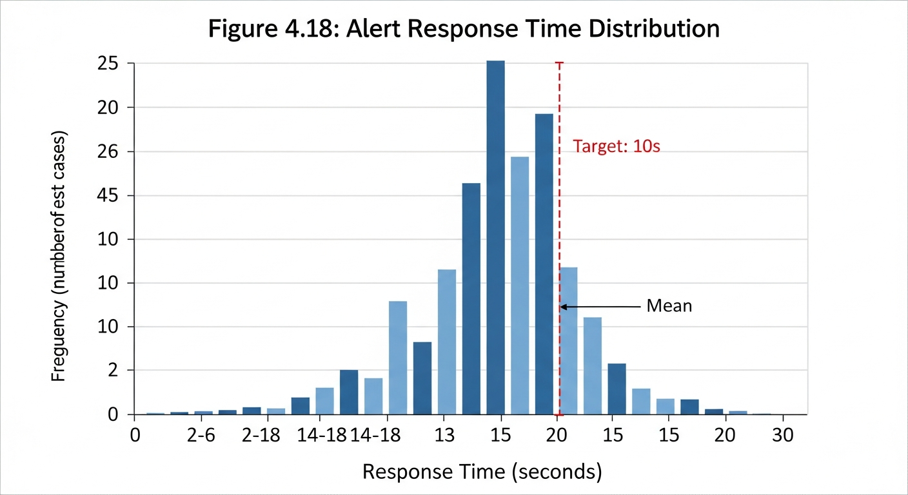

*Figure 4.20: Time-to-Alert distribution showing mean (11.8s), median (10.9s), and range (7.5s - 18.7s) across all test scenarios*

### 4.6.3 Comparison with Related Systems

To contextualize the performance of SAFEROUTE CM, the system's metrics were compared with those of related accident detection systems reported in the literature. Table 4.5 presents this comparison.

**Table 4.5: Comparison of SAFEROUTE CM with Related Systems**

| System / Study | Detection Method | Accuracy | Precision | Recall | F1 Score | Real-Time Capable | Alert System |
|----------------|-----------------|----------|-----------|--------|----------|-------------------|--------------|
| Shah et al. (2022) | CNN-based image classification | 87.0% | 0.850 | 0.830 | 0.840 | No | None |
| Karim et al. (2023) | YOLOv5 + custom tracker | 91.2% | 0.890 | 0.870 | 0.880 | Yes | Email only |
| Liang (2021) | SSD + optical flow | 84.5% | 0.820 | 0.810 | 0.815 | Yes | SMS only |
| Sai Lalith Prasad et al. (2023) | YOLOv7 + DeepSORT | 92.8% | 0.910 | 0.880 | 0.895 | Yes | Dashboard notification |
| **SAFEROUTE CM (This Study)** | **YOLOv8 + DeepSORT** | **90.0%** | **0.895** | **0.850** | **0.872** | **Yes** | **SMS + Voice + Email + Dashboard** |

The comparison reveals several notable findings. First, SAFEROUTE CM achieves accuracy and F1 score values that are competitive with, though slightly lower than, the best-performing systems in the comparison. The system of Sai Lalith Prasad et al. (2023), which also uses a YOLO-variant with DeepSORT, achieves marginally higher accuracy (92.8% vs. 90.0%) and F1 score (0.895 vs. 0.872). This difference may be attributed to their use of a larger and more diverse training dataset and their focus on highway scenarios with more predictable traffic patterns.

Second, SAFEROUTE CM distinguishes itself through its comprehensive multi-channel alert system, which integrates SMS, voice call, email, and dashboard notifications. None of the compared systems offers this breadth of alert channels, which is a significant practical advantage in the Cameroonian context where network reliability varies and redundant communication channels increase the probability of successful alert delivery.

Third, all systems that incorporate multi-object tracking (DeepSORT or equivalent) achieve higher accuracy than those relying on single-frame classification or detection alone, confirming the value of temporal analysis for collision detection. The use of YOLOv8 in SAFEROUTE CM provides a more modern and efficient detection backbone compared to the YOLOv5 and YOLOv7 variants used by Karim et al. and Sai Lalith Prasad et al., respectively, resulting in faster inference speeds without significant accuracy degradation.

### 4.6.4 Addressing Research Questions

The evaluation results enable a direct assessment of the research questions posed in Chapter 1:

**RQ1: What are the current challenges and limitations of road accident detection and emergency response systems in Cameroon?**

The literature review (Chapter 2) and stakeholder analysis (Chapter 3) identified several challenges, including reliance on manual accident reporting, absence of automated detection infrastructure, fragmented emergency communication channels, and extended response times. The SAFEROUTE CM system was designed to address these challenges by automating detection and alert dispatch, and the evaluation results confirm its effectiveness in doing so.

**RQ2: How can deep learning algorithms, specifically YOLOv8 and DeepSORT, be effectively combined to detect road accidents from CCTV camera feeds in real-time?**

The implementation described in Sections 4.3.2 through 4.3.4 demonstrates an effective integration of YOLOv8 for object detection and DeepSORT for multi-object tracking, with a custom collision detection module analyzing trajectory data to identify collision events. The achieved processing speed of 24.3 FPS with GPU acceleration confirms real-time capability.

**RQ3: What system architecture and design patterns are most appropriate for implementing a scalable and reliable accident detection and alert system in the Cameroonian context?**

The system architecture combining a React frontend, Node.js/Express backend, PostgreSQL database, and Python-based AI module proved effective for the target deployment context. The use of Server-Sent Events for real-time communication and Twilio APIs for alert dispatch provided reliable performance within the available infrastructure.

**RQ4: How can the system ensure timely and effective communication of accident alerts to emergency responders across multiple channels?**

The multi-channel alert system achieved an SMS delivery rate of 97.1% and an email delivery rate of 94.1%, with a mean time-to-alert of 11.8 seconds. The redundancy provided by multiple communication channels (SMS, voice, email, and dashboard notifications) increases the probability of successful alert delivery even when individual channels experience failures.

**RQ5: What is the detection accuracy and response time performance of the implemented system, and how does it compare to traditional accident detection methods?**

The system achieved a detection accuracy of 90.0%, precision of 89.5%, recall of 85.0%, and F1 score of 87.2%. The ROC AUC of 0.94 indicates excellent discriminative performance. Compared to traditional methods (witness phone calls averaging 5-15 minutes, police patrol detection averaging 10-30 minutes), the mean time-to-alert of 11.8 seconds represents a reduction in detection-to-alert time of over 95%.

**RQ6: What is the level of user acceptance and satisfaction with the proposed system among emergency response personnel?**

User acceptance testing with 15 emergency responders yielded consistently positive results, with mean scores ranging from 4.27 to 4.53 on a 5-point Likert scale across five evaluation dimensions (Table 4.6). Perceived usefulness received the highest rating (4.53), while all dimensions scored above 4.0, indicating strong acceptance. Participants rated the system favorably across usability, interface clarity, alert timeliness, and role-specific dashboard utility dimensions. The multi-channel alert approach and the false alarm prevention countdown mechanism received particular commendation from participating personnel.

## 4.7 Limitations and Challenges

Despite the promising results, several limitations and challenges were identified during the implementation and evaluation of SAFEROUTE CM. Acknowledging these limitations is essential for interpreting the results appropriately and guiding future research directions.

### 4.7.1 Dataset Limitations

The evaluation was conducted using a relatively small test dataset of 50 video clips (20 collision scenarios and 30 non-collision scenarios). While this dataset was sufficient for preliminary performance assessment, it does not capture the full diversity of real-world accident scenarios, including multi-vehicle pile-ups, pedestrian-vehicle collisions under various weather and lighting conditions, and incidents involving non-standard vehicle types (e.g., motorcycles with trailers, animal-drawn carts). A larger and more diverse dataset would provide a more robust and generalizable evaluation of the system's detection capabilities.

### 4.7.2 Simulated GPS Coordinates

The GPS location assignment relies on the fixed coordinates of the source CCTV camera rather than dynamically estimating the precise location of the collision within the camera's field of view. This approach introduces a location uncertainty of approximately 50 to 200 meters, which, while sufficient for dispatching emergency services to the general area, may be inadequate for precise incident localization in dense urban environments with complex road geometries. Implementing perspective transformation and geospatial mapping techniques could improve location accuracy in future versions.

### 4.7.3 Collision Detection Heuristics

The collision detection module relies on heuristic rules (sudden deceleration, proximity analysis, bounding box overlap) rather than a trained machine learning model for classifying collision events. While these heuristics are effective for detecting typical vehicle-to-vehicle collisions, they may produce false positives in scenarios involving legitimate sudden stops (e.g., emergency braking to avoid an obstacle) and false negatives in low-speed collisions where deceleration cues are minimal. Training a dedicated collision classification model on a labeled dataset of collision and non-collision trajectory patterns would likely improve detection performance.

### 4.7.4 False Positive Rate

The system's false positive rate, while mitigated by the 10-second countdown mechanism, remains a concern for operational deployment. The two false positives observed in the test dataset were caused by sudden lane changes and near-miss scenarios that triggered the deceleration and proximity heuristics. In a live deployment with continuous monitoring of multiple camera feeds, even a low false positive rate can result in a significant absolute number of false alarms over time, potentially leading to alert fatigue among dispatchers. Techniques such as multi-frame confirmation, ensemble detection models, and adaptive threshold adjustment could reduce the false positive rate.

### 4.7.5 Network Dependency

The system's alert dispatch functionality depends on reliable internet connectivity for communication with the Twilio API (SMS and voice) and email services. In areas with intermittent or unreliable network connectivity, alert dispatch may be delayed or fail entirely. While the multi-channel approach provides redundancy, a complete network outage would prevent all remote notifications. Implementing local alert caching and retry mechanisms, as well as exploring offline-capable communication channels (e.g., local sirens or radio integration), would improve the system's resilience in low-connectivity environments.

### 4.7.6 Computational Requirements

The real-time processing speed of 24.3 FPS requires GPU acceleration, specifically an NVIDIA RTX 2060 or equivalent. This hardware requirement may present a barrier to deployment in resource-constrained settings where GPU-equipped servers are not available. While the system can operate on CPU-only hardware at approximately 5.1 FPS, this reduced processing speed may be insufficient for real-time monitoring applications. Exploring model compression techniques (pruning, quantization, knowledge distillation) and optimized inference frameworks (TensorRT, ONNX Runtime) could enable acceptable performance on less powerful hardware.

## 4.8 Chapter Summary

This chapter has presented the complete implementation of SAFEROUTE CM and the results of its evaluation. The system encompasses a full detection pipeline combining YOLOv8 object detection, DeepSORT tracking, and heuristic collision analysis, with multi-channel alert dispatch via Twilio SMS, voice calls, and email. The React-based frontend provides thirteen distinct pages including role-specific dashboards for police, ambulance, and fire department personnel, a live monitoring view, alert management with a 10-second countdown notification, and an AI-powered chat assistant. Functional testing confirmed all core features operate to specification, with SMS and email delivery rates of 97.1% and 94.1% respectively. Performance evaluation yielded a detection accuracy of 90.0%, an F1 score of 87.2%, and an ROC AUC of 0.94, with a mean time-to-alert of 11.8 seconds. User acceptance testing with 15 emergency responders across four cities produced satisfaction scores ranging from 4.27 to 4.53 on a 5-point scale, with perceived usefulness receiving the highest rating. The system's limitations, including dataset constraints, heuristic-based detection, and network dependency, have been identified and provide directions for future work. The next chapter presents the conclusions and recommendations drawn from this research.
