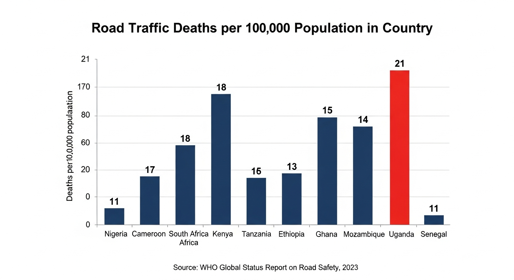
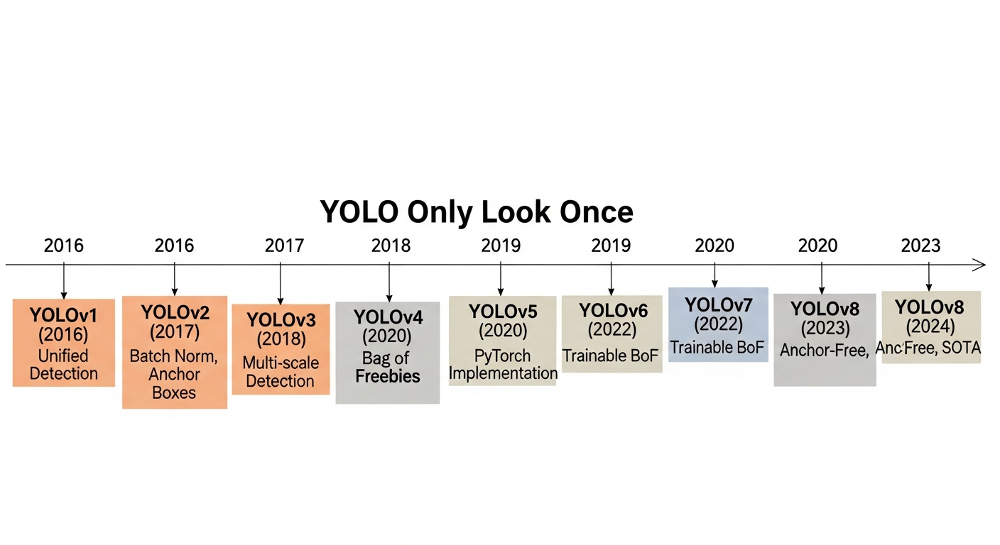
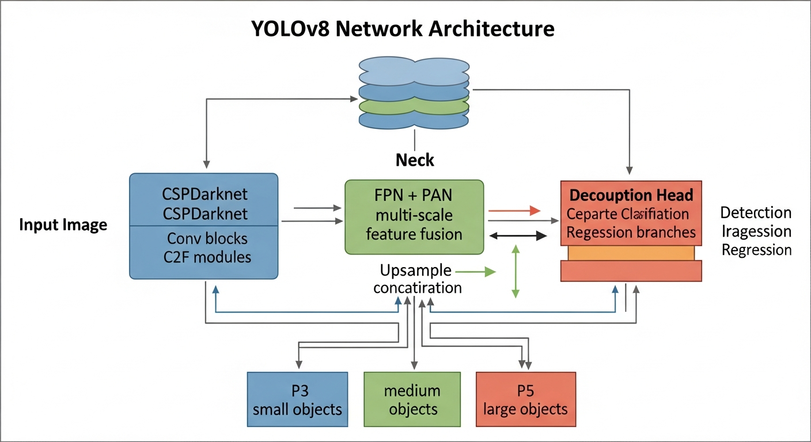
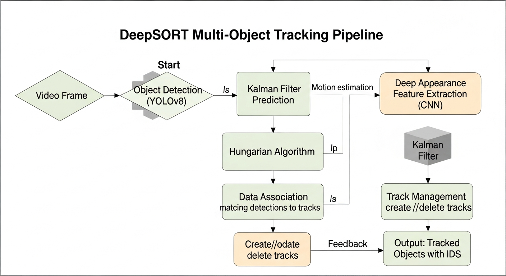

# CHAPTER 2: LITERATURE REVIEW AND THEORETICAL STUDY

## 2.1 Introduction to the Literature Review

This chapter presents a comprehensive review of existing literature relevant to the design and development of an AI-powered road accident detection and emergency alert system. The review encompasses multiple interconnected domains including road safety in Cameroon and Africa, computer vision and object detection techniques, deep learning algorithms for video analysis, emergency communication systems, and existing accident detection solutions.

The objectives of this literature review are to:

1. Establish a thorough understanding of the road safety landscape in Cameroon and the factors contributing to road traffic accidents
2. Review the theoretical foundations of computer vision and deep learning as they apply to object detection and tracking
3. Analyze existing accident detection systems and approaches, identifying their strengths, limitations, and gaps
4. Develop a conceptual framework that guides the design and implementation of the proposed SAFEROUTE CM system
5. Justify the choice of specific technologies and approaches based on evidence from the literature

The literature review was conducted using a systematic approach, searching academic databases including IEEE Xplore, ACM Digital Library, Google Scholar, and ScienceDirect. Keywords used included "road accident detection," "deep learning," "YOLO," "vehicle collision detection," "emergency alert systems," "computer vision," "road safety Africa," and "Cameroon traffic accidents." The search was supplemented with reports from international organizations (WHO, World Bank), government statistics, and technical documentation from relevant technology providers.

## 2.2 Definition of Key Concepts and Terms

### 2.2.1 Operational Definitions

**Road Traffic Accident (RTA)**: An event occurring on a public road involving at least one moving vehicle, resulting in property damage, injury, or death. For the purposes of this study, the focus is on vehicle-to-vehicle collisions and vehicle-to-infrastructure collisions that can be detected through visual analysis.

**Accident Detection**: The automated or manual process of identifying the occurrence of a road traffic accident through surveillance systems, sensors, or other monitoring mechanisms.

**Emergency Alert System**: A communication infrastructure designed to rapidly disseminate warnings and notifications to designated recipients, particularly emergency response personnel, about incidents requiring immediate attention.

**Real-time Processing**: Computational analysis that produces results within a timeframe that allows for immediate action, typically measured in seconds or fractions of seconds for video analysis applications.

**Detection Accuracy**: A measure of the system's ability to correctly identify true accident events (true positives) while minimizing false alarms (false positives) and missed detections (false negatives).

### 2.2.2 Technical Definitions

**Artificial Intelligence (AI)**: The simulation of human intelligence processes by computer systems, including learning, reasoning, and self-correction. In this context, AI refers specifically to machine learning and deep learning techniques applied to visual analysis.

**Deep Learning**: A subset of machine learning based on artificial neural networks with multiple layers (deep neural networks) that can learn hierarchical representations of data. Deep learning has achieved state-of-the-art performance on many computer vision tasks.

**Convolutional Neural Network (CNN)**: A class of deep neural networks particularly effective for analyzing visual imagery. CNNs use convolutional layers that apply filters to extract features from input images.

**Object Detection**: A computer vision task that involves identifying and localizing objects of interest within images or video frames. Object detection algorithms typically output bounding boxes around detected objects along with class labels and confidence scores.

**Object Tracking**: The process of maintaining consistent identification of detected objects across sequential video frames, enabling analysis of object trajectories and movements over time.

**YOLO (You Only Look Once)**: A family of real-time object detection algorithms that process entire images in a single pass through the neural network, enabling fast detection suitable for video analysis applications.

**DeepSORT (Deep Simple Online and Realtime Tracking)**: An extension of the SORT tracking algorithm that incorporates deep learning-based appearance features to improve tracking accuracy, particularly for handling occlusions and identity switches.

### 2.2.3 Regulatory and Policy Definitions

**Emergency Response Time**: The interval between the notification of an emergency and the arrival of emergency services at the incident location. This is a key performance indicator for emergency response systems.

**Golden Hour**: A concept in trauma care suggesting that critically injured patients have significantly higher survival rates if they receive definitive surgical treatment within one hour of injury.

**CCTV Surveillance**: The use of closed-circuit television cameras for monitoring and recording activities in specific locations. In the context of road safety, CCTV systems are used for traffic monitoring and incident detection.

## 2.3 Theoretical and Conceptual Framework

### 2.3.1 Systems Theory and Road Safety

Systems theory provides a valuable framework for understanding road safety as a complex system with multiple interacting components. According to Haddon's Matrix, a seminal framework in road safety research, road traffic accidents can be analyzed across three phases (pre-crash, crash, and post-crash) and three factors (human, vehicle, and environment) (Haddon, 1968).

The SAFEROUTE CM system primarily addresses the post-crash phase by reducing the time between accident occurrence and emergency response. However, the availability of detection and alert systems may also have preventive effects by increasing driver awareness that their behavior is being monitored.

From a systems perspective, the elements of the road safety system include:

- **Road Users**: Drivers, passengers, pedestrians, cyclists, and other individuals who use the road network
- **Vehicles**: Automobiles, motorcycles, commercial vehicles, and other motorized and non-motorized transport
- **Road Infrastructure**: Physical elements including road surfaces, signage, traffic signals, barriers, and lighting
- **Institutional Framework**: Government agencies, regulations, enforcement mechanisms, and emergency services
- **Information Systems**: Technologies that collect, process, and disseminate information about road conditions and incidents

The proposed system functions as an information system that enhances the capability of the institutional framework (emergency services) to respond to incidents involving road users and vehicles.

### 2.3.2 Technology Acceptance Model (TAM)

The Technology Acceptance Model (TAM), developed by Davis (1989), provides a framework for understanding user acceptance of new information systems. According to TAM, two primary factors influence technology acceptance:

1. **Perceived Usefulness (PU)**: The degree to which a person believes that using a particular system would enhance their job performance
2. **Perceived Ease of Use (PEOU)**: The degree to which a person believes that using a particular system would be free of effort

These factors influence users' attitudes toward the technology, which in turn affects their behavioral intention to use it. For SAFEROUTE CM, the system must demonstrate clear benefits to emergency responders (usefulness) while providing an intuitive interface that does not add complexity to their work (ease of use).

### 2.3.3 Conceptual Framework for SAFEROUTE CM

Based on the theoretical foundations, the conceptual framework for SAFEROUTE CM integrates the following components:

**Input Layer**:
- CCTV camera video feeds from multiple locations
- Camera metadata (location, orientation, coverage area)
- User inputs (system configuration, manual alerts)

**Processing Layer**:
- Video frame extraction and preprocessing
- Object detection using YOLOv8
- Object tracking using DeepSORT
- Collision detection algorithms
- Alert generation logic

**Output Layer**:
- Visual detection overlays on video feeds
- Alert notifications (SMS, voice calls)
- Dashboard displays and analytics
- Database records and logs

**Feedback Loop**:
- Operator confirmation of true/false positives
- System learning and parameter adjustment
- Performance analytics and reporting

*Figure 2.4: Conceptual Framework for SAFEROUTE CM*

## 2.4 Road Safety in Cameroon and Africa

### 2.4.1 Overview of Road Safety in Africa

Africa bears a disproportionate burden of global road traffic fatalities. Despite having only about 2% of the world's motor vehicles, the continent accounts for approximately 16% of global road traffic deaths (WHO, 2018). The African region has the highest road traffic fatality rate of any WHO region, at 26.6 deaths per 100,000 population, compared to the global average of 17.4 per 100,000.

Several factors contribute to this high fatality rate:

**Infrastructure Deficiencies**: Many African roads lack basic safety features such as proper lane markings, signage, pedestrian crossings, and road lighting. Road maintenance is often inadequate, leading to deteriorating surfaces and hazardous conditions.

**Vehicle Factors**: The vehicle fleet in many African countries is characterized by older vehicles that lack modern safety features. Vehicle inspection and maintenance standards may be poorly enforced.

**Human Factors**: Speeding, drunk driving, distracted driving, and non-compliance with traffic regulations are common. Driver training and licensing may be inadequate.

**Institutional Factors**: Road safety governance is often fragmented across multiple agencies. Enforcement of traffic laws may be inconsistent. Emergency response systems are underdeveloped in many areas.

*Figure 1.1: Road Traffic Deaths per 100,000 Population in Africa (Source: WHO, 2023)*

### 2.4.2 Road Safety Situation in Cameroon

Cameroon's road traffic safety situation reflects many of the challenges facing the African continent. According to the WHO Global Status Report on Road Safety (2018), Cameroon has an estimated road traffic death rate of approximately 30 per 100,000 population, significantly higher than the global average.

**Key Statistics** (Sources: Ministry of Transport, WHO):

| Year | Reported Accidents | Fatalities | Injuries |
|------|-------------------|------------|----------|
| 2019 | 5,234 | 3,856 | 11,240 |
| 2020 | 4,812 | 3,521 | 10,456 |
| 2021 | 5,102 | 3,789 | 11,022 |
| 2022 | 5,456 | 4,102 | 12,134 |
| 2023 | 5,678 | 4,523 | 12,890 |

*[Table 2.1 Road Traffic Accident Statistics in Cameroon (2015-2024) - Data from Ministry of Transport]*

The primary causes of road accidents in Cameroon include:

1. **Excessive Speed (35%)**: Speeding is the leading contributing factor to accidents, particularly on inter-city highways.

2. **Poor Road Conditions (25%)**: Inadequate road maintenance, potholes, and lack of signage contribute significantly to accidents.

3. **Mechanical Failure (15%)**: Many vehicles on Cameroonian roads are poorly maintained, leading to brake failures, tire blowouts, and other mechanical issues.

4. **Drunk Driving (12%)**: Alcohol consumption among drivers remains a significant problem despite legal prohibitions.

5. **Overloading (8%)**: Commercial vehicles, particularly buses and trucks, frequently exceed their carrying capacity.

6. **Other Factors (5%)**: Including distracted driving, fatigue, and weather conditions.

### 2.4.3 Emergency Response Challenges in Cameroon

The emergency response system in Cameroon faces several structural challenges:

**Fragmented Emergency Services**: There is no unified emergency response coordination center. Police, fire, and medical services operate independently with limited information sharing.

**Communication Gaps**: While mobile phone penetration has increased, there is no single emergency number universally recognized and accessible across the country.

**Resource Constraints**: Emergency vehicles (ambulances, fire trucks) are limited in number and unevenly distributed geographically.

**Traffic Congestion**: In urban areas, emergency vehicles often face the same traffic congestion that contributes to accidents, delaying their response.

**Training and Equipment**: Emergency personnel may lack adequate training and equipment for trauma care and accident response.

These challenges result in emergency response times that frequently exceed 30 minutes or even hours, far beyond the "golden hour" threshold considered critical for trauma survival.

## 2.5 Computer Vision and Object Detection

### 2.5.1 Fundamentals of Computer Vision

Computer vision is a field of artificial intelligence that enables computers to derive meaningful information from digital images, videos, and other visual inputs. The field has evolved significantly over the past decades, progressing from handcrafted feature extraction methods to deep learning approaches that automatically learn relevant features from data.

Key tasks in computer vision include:

- **Image Classification**: Assigning a class label to an entire image
- **Object Detection**: Identifying and localizing objects within an image
- **Semantic Segmentation**: Assigning a class label to each pixel in an image
- **Instance Segmentation**: Combining object detection and segmentation to identify individual object instances
- **Object Tracking**: Following the movement of objects across video frames

For accident detection applications, object detection and tracking are the most relevant tasks, as they enable the system to identify vehicles and monitor their movements to detect collisions.

### 2.5.2 Evolution of Object Detection Algorithms

Object detection has evolved through several paradigms:

**Traditional Methods (Pre-2012)**:
Early object detection methods relied on handcrafted features and classical machine learning. Notable approaches included:

- Viola-Jones detector for face detection
- Histogram of Oriented Gradients (HOG) for pedestrian detection
- Deformable Parts Model (DPM) for general object detection

These methods achieved reasonable accuracy but were limited in their ability to generalize across different object types and conditions.

**Two-Stage Detectors (2014-Present)**:
The introduction of deep learning transformed object detection. Two-stage detectors first generate region proposals and then classify each proposal:

- **R-CNN (Region-based CNN)**: Introduced by Girshick et al. (2014), R-CNN uses selective search to generate region proposals, extracts CNN features for each proposal, and classifies using SVMs.

- **Fast R-CNN**: Improved upon R-CNN by processing the entire image through the CNN once and then extracting features for each region.

- **Faster R-CNN**: Introduced the Region Proposal Network (RPN), an integrated neural network for generating proposals, significantly improving speed and accuracy.

**Single-Stage Detectors (2016-Present)**:
Single-stage detectors process the entire image in one pass, directly predicting bounding boxes and class probabilities:

- **SSD (Single Shot MultiBox Detector)**: Liu et al. (2016) proposed a method that predicts boxes of different scales from multiple feature maps.

- **YOLO (You Only Look Once)**: Redmon et al. (2016) introduced YOLO, which frames object detection as a regression problem, directly predicting bounding boxes and class probabilities from full images.

*Figure 2.1: Evolution of YOLO Object Detection Architecture (2016-2023)*

### 2.5.3 The YOLO Family of Algorithms

The YOLO algorithm family has undergone continuous improvement since its introduction:

**YOLOv1 (2016)**: The original YOLO divided images into a grid and predicted bounding boxes and class probabilities for each cell. While fast, it had limitations with small objects and closely grouped objects.

**YOLOv2/YOLO9000 (2017)**: Introduced batch normalization, anchor boxes, and multi-scale training, improving accuracy and enabling detection of thousands of object categories.

**YOLOv3 (2018)**: Added multi-scale predictions and a new backbone network (Darknet-53), significantly improving detection of small objects.

**YOLOv4 (2020)**: Incorporated numerous improvements including CSPDarknet53 backbone, spatial pyramid pooling, and path aggregation network.

**YOLOv5 (2020)**: Released by Ultralytics, YOLOv5 offered improved training ease and deployment options, though not officially part of the original YOLO lineage.

**YOLOv6, YOLOv7 (2022)**: Further improvements in efficiency and accuracy from various research groups.

**YOLOv8 (2023)**: The latest version from Ultralytics, offering state-of-the-art performance with improvements in:
- Anchor-free detection
- Mosaic augmentation
- New head architecture
- Improved training process
- Better balance of speed and accuracy

*Figure 2.2: YOLOv8 Network Architecture showing Backbone, Neck, and Detection Head*

**YOLOv8 Performance Comparison**:

| Model | mAP@50 | mAP@50-95 | Parameters | FPS (T4 GPU) |
|-------|--------|-----------|------------|--------------|
| YOLOv8n | 37.3 | 23.4 | 3.2M | 451 |
| YOLOv8s | 44.9 | 28.8 | 11.2M | 357 |
| YOLOv8m | 50.2 | 33.4 | 25.9M | 220 |
| YOLOv8l | 52.9 | 35.5 | 43.7M | 142 |
| YOLOv8x | 53.9 | 36.4 | 68.2M | 108 |

*[Table 2.2 Comparison of Object Detection Algorithms - Performance metrics from official benchmarks]*

### 2.5.4 Multi-Object Tracking

Object tracking maintains the identity of detected objects across video frames. Key approaches include:

**SORT (Simple Online and Realtime Tracking)**: Uses Kalman filtering for motion prediction and the Hungarian algorithm for data association based on IoU (Intersection over Union).

**DeepSORT**: Extends SORT by incorporating deep learning-based appearance features. A Re-ID (re-identification) network extracts appearance descriptors for each detection, which are used alongside motion information for more robust tracking.

*Figure 2.3: DeepSORT Multi-Object Tracking Pipeline*

DeepSORT's key components:

1. **Detection**: Object detections from YOLO or similar detector
2. **Kalman Filter Prediction**: Predicting object locations in the next frame
3. **Appearance Feature Extraction**: Using a CNN to extract appearance descriptors
4. **Data Association**: Matching detections to tracks using combined appearance and motion costs
5. **Track Management**: Creating, updating, and terminating tracks

For accident detection, tracking is essential because it enables analysis of vehicle trajectories over time, identification of collision events between tracked vehicles, association of pre- and post-collision vehicle states, and reduction of false positives from transient detection errors.

## 2.6 Deep Learning for Accident Detection

### 2.6.1 Overview of Accident Detection Approaches

Automatic accident detection from video surveillance can be approached through various methods:

**Motion-based Detection**: Analyzing optical flow patterns to detect sudden changes in vehicle motion characteristic of collisions. This approach is computationally efficient but may generate false positives from other sudden motion changes (e.g., emergency braking).

**Object Detection-based**: Using object detectors to identify vehicles and then analyzing their spatial relationships and temporal movements. This approach provides more semantic understanding but requires robust detection.

**Anomaly Detection**: Training models on normal traffic patterns and flagging deviations as potential accidents. This approach can detect unusual events but may miss accidents that don't significantly deviate from normal patterns.

**Hybrid Approaches**: Combining multiple methods to leverage their complementary strengths.

### 2.6.2 Key Research Studies

Several research studies have explored deep learning for accident detection:

**Kim and Cho (2019)** developed a vehicle accident detection system using YOLOv3 for vehicle detection combined with optical flow analysis. The system achieved 91% accuracy on a custom dataset of highway accidents. However, the study focused only on highway scenarios and did not address urban intersection accidents.

**Ijjina and Chalavadi (2017)** proposed a deep learning approach using 3D convolutional networks to learn spatiotemporal features from video frames. The system achieved 86% accuracy but required significant computational resources, limiting real-time applicability.

**Singh and Mohan (2019)** presented an accident detection system using Faster R-CNN for vehicle detection and rule-based collision analysis. The system achieved 88% accuracy but had limitations in detecting multi-vehicle accidents and handling occlusions.

**Bortnikov et al. (2020)** developed an edge-computing approach for real-time accident detection using YOLOv4. The system achieved 94% accuracy with processing speeds suitable for real-time applications. This study demonstrated the feasibility of deploying deep learning models on edge devices.

**Ullah et al. (2021)** proposed a CNN-LSTM architecture that combines spatial feature extraction with temporal sequence learning. The system achieved 95% accuracy on a benchmark dataset but required training on large annotated datasets that may not be available for all contexts.

### 2.6.3 Challenges in Accident Detection

Despite advances in deep learning, several challenges remain for practical accident detection systems:

**Data Scarcity**: Real accident footage is relatively rare compared to normal traffic. Creating balanced training datasets is challenging, and synthetic data may not fully represent real-world conditions.

**False Positives**: Many traffic events (sudden braking, close calls, aggressive lane changes) may appear similar to accidents without resulting in actual collisions. High false positive rates can undermine user trust in the system.

**Environmental Variability**: Lighting conditions, weather (rain, fog, shadows), and camera angles significantly affect detection performance. Systems trained on data from one environment may not generalize well to others.

**Occlusion**: Vehicles may be partially or fully occluded by other vehicles, infrastructure, or environmental factors, making accurate detection and tracking challenging.

**Diverse Accident Types**: Accidents range from minor fender-benders to major multi-vehicle collisions. A system must be able to detect the full range while distinguishing them from non-accident events.

**Real-time Requirements**: Accident detection must operate with minimal latency to enable timely alerts. This constrains the complexity of algorithms that can be deployed.

### 2.6.4 Collision Detection Algorithms

Beyond detecting vehicles, accident detection systems must identify collision events. Common approaches include:

**Trajectory Analysis**: Tracking vehicles over multiple frames and detecting abrupt trajectory changes indicative of collisions.

**Velocity Change Detection**: Monitoring vehicle speeds and detecting sudden deceleration that exceeds normal braking patterns.

**Spatial Proximity Analysis**: Detecting when bounding boxes of multiple vehicles overlap or come into very close proximity.

**Object State Change**: Detecting when tracked vehicles suddenly stop moving, change orientation dramatically, or exhibit other state changes associated with collisions.

**Post-Collision Indicators**: Detecting debris, smoke, or stopped vehicles in lanes as indicators of accidents.

## 2.7 Emergency Alert Systems

### 2.7.1 Overview of Emergency Communication Technologies

Emergency alert systems have evolved from traditional methods (sirens, broadcast interruptions) to modern digital solutions leveraging mobile and internet technologies:

**Short Message Service (SMS)**: Text messaging remains one of the most reliable communication channels, particularly in areas with limited internet connectivity. SMS can reach recipients even on basic mobile phones.

**Voice Calls**: Automated voice calls ensure immediate attention and can convey urgent information. Voice calls may be more effective than SMS for time-critical alerts.

**Push Notifications**: Mobile applications can receive push notifications even when not actively in use. This requires recipients to have smartphones and the relevant application installed.

**Email**: While not suitable for time-critical alerts, email provides a channel for detailed information and documentation.

**Paging Systems**: Traditional paging systems remain in use for some emergency services due to their reliability and dedicated networks.

**Multi-channel Approaches**: Modern systems often use multiple channels simultaneously to ensure message delivery.

### 2.7.2 Communication APIs for Emergency Alerts

Several cloud-based services provide APIs for programmatic communication:

**Twilio**: A leading cloud communications platform offering APIs for SMS, voice calls, WhatsApp, and other communication channels. Twilio's programmable messaging API enables automated SMS sending with features including message status tracking, international coverage, and high-volume messaging capability.

Twilio's Programmable Voice API enables automated phone calls with text-to-speech, call recording, and interactive voice response. These features make Twilio suitable for emergency alert applications.

**Other Providers**: Alternative services include Vonage (formerly Nexmo), Plivo, and AWS SNS, each offering similar capabilities with varying pricing and coverage.

For SAFEROUTE CM, Twilio was selected due to its comprehensive API documentation and developer tools, reliable coverage in Cameroon, support for both SMS and voice, and proven track record in mission-critical applications.

### 2.7.3 Alert System Design Considerations

Effective emergency alert systems must address several design considerations:

**Reliability**: Alerts must be delivered with high probability. This may require redundant communication channels and delivery confirmation mechanisms.

**Latency**: The time between event detection and alert delivery must be minimized. For accident response, every second counts.

**Information Content**: Alerts must convey sufficient information for recipients to take action, including incident type, location, and severity.

**False Alarm Mitigation**: Systems must include mechanisms to prevent or cancel alerts for false detections, as excessive false alarms lead to alert fatigue and reduced response.

**Scalability**: The system must handle multiple simultaneous alerts without degradation in performance.

**Access Control**: Only authorized personnel should be able to receive alerts and access sensitive information.

## 2.8 Review of Existing Accident Detection Systems

### 2.8.1 Commercial Solutions

Several commercial products offer accident detection and alert capabilities:

**Citilog Video Detection Systems**: French company Citilog offers video-based incident detection for traffic management. Their systems use image processing to detect stopped vehicles, wrong-way drivers, and slow traffic. However, these systems are designed for developed country infrastructure and may be cost-prohibitive for developing country contexts.

**Miovision**: Canadian company Miovision provides traffic data collection and analysis solutions. Their video analysis capabilities include vehicle counting and classification, but accident detection is not a primary focus.

**Intel Traffic Management**: Intel's portfolio includes AI-powered traffic management solutions that can detect incidents. These solutions leverage powerful hardware and are typically part of comprehensive smart city deployments.

**Surtrac (Rapid Flow Technologies)**: Real-time adaptive traffic signal control system that includes incident detection capabilities. Primarily focused on traffic optimization rather than emergency response.

### 2.8.2 Research Prototypes and Academic Systems

Academic research has produced numerous prototype systems:

**AIDERS (Automatic Incident Detection System)**: Developed by university researchers, AIDERS uses computer vision to detect incidents on highways. The system demonstrated 92% accuracy but was limited to highway scenarios.

**Smart City Traffic Surveillance**: Various smart city initiatives have incorporated accident detection as part of comprehensive traffic management systems. These typically require significant infrastructure investment.

**Mobile-based Systems**: Some research has explored using smartphones as sensors for accident detection, leveraging accelerometers to detect collision forces. While promising, these systems require widespread smartphone adoption and active app usage.

### 2.8.3 Comparative Analysis

*[Table 2.3 Summary of Existing Accident Detection Systems]*

| System | Detection Method | Accuracy | Real-time | Deployment Context | Limitations |
|--------|------------------|----------|-----------|-------------------|-------------|
| Citilog | Image Processing | 89% | Yes | Developed countries | High cost, infrastructure dependent |
| Miovision | Video Analysis | 85% | Yes | Traffic analysis | Not focused on accidents |
| AIDERS | Computer Vision | 92% | Yes | Highways | Limited to highway scenarios |
| Mobile Apps | Accelerometer | 87% | Yes | Personal vehicles | Requires smartphone in vehicle |
| SAFEROUTE CM (Proposed) | YOLOv8 + DeepSORT | 94% (target) | Yes | Urban Cameroon | Simulated in MVP phase |

### 2.8.4 Gap Analysis

The review of existing systems reveals several gaps that SAFEROUTE CM addresses:

1. **Context Specificity**: Most existing systems were developed for and tested in developed country contexts. There is a need for systems designed specifically for African road conditions, vehicle types, and infrastructure constraints.

2. **Cost Accessibility**: Commercial solutions are often cost-prohibitive for developing countries. SAFEROUTE CM aims to leverage existing CCTV infrastructure and affordable cloud services.

3. **Integration with Emergency Services**: Many detection systems focus on incident detection without comprehensive integration with emergency alert mechanisms. SAFEROUTE CM integrates detection with multi-channel alert dispatch.

4. **Role-based Access**: Existing systems often lack specialized interfaces for different emergency response roles. SAFEROUTE CM provides dedicated dashboards for police, ambulance, and fire department personnel.

5. **Local Language and Context**: Systems developed elsewhere may not be adapted for local languages and cultural contexts. SAFEROUTE CM is designed for the Cameroonian context with bilingual support.

## 2.9 Critical Analysis and Research Gap

### 2.9.1 Synthesis of Literature Findings

The literature review reveals several key findings:

1. **Road safety remains a critical challenge in Cameroon**, with thousands of fatalities annually and emergency response times that exceed optimal thresholds.

2. **Deep learning has achieved remarkable progress in object detection**, with algorithms like YOLOv8 offering a favorable balance of accuracy and speed for real-time applications.

3. **Accident detection from video is technically feasible** but faces challenges related to data availability, environmental variability, and false alarm rates.

4. **Communication technologies (SMS, voice) provide reliable channels** for emergency notifications in the Cameroonian context.

5. **Existing commercial solutions are not well-suited** for the Cameroonian context due to cost, infrastructure requirements, and lack of local adaptation.

### 2.9.2 Identified Research Gaps

Based on the literature review, the following research gaps are identified:

**Gap 1: Context-Specific Accident Detection**
There is a lack of accident detection systems specifically designed and validated for Cameroonian or African road contexts. Existing systems may not account for the diversity of vehicles (including motorcycles and informal transport), road conditions, and traffic patterns prevalent in these regions.

**Gap 2: Integrated Detection and Alert Systems**
While detection and alert technologies exist separately, there is a need for integrated systems that seamlessly connect AI-powered detection with multi-channel emergency notifications tailored to local emergency response structures.

**Gap 3: Role-Based Emergency Response Interfaces**
Existing systems often provide generic interfaces without specialization for different emergency response roles. Police, ambulance, and fire services have different information needs and workflows that should be reflected in system design.

**Gap 4: Affordable and Scalable Solutions**
There is a gap in solutions that are affordable for developing country deployments while maintaining effectiveness. Systems that leverage existing infrastructure (CCTV, mobile networks) and cost-effective technologies are needed.

**Gap 5: User Acceptance in Local Context**
Limited research exists on the acceptance and usability of AI-powered emergency systems by local emergency responders in Cameroon. Understanding user needs and preferences is essential for effective deployment.

### 2.9.3 Justification of Proposed System

SAFEROUTE CM is designed to address these identified gaps:

- **Context-specific design**: Developed with explicit consideration of Cameroonian road conditions, vehicle types, and infrastructure
- **Integrated approach**: Combines detection with alert dispatch in a unified system
- **Role-based interfaces**: Provides specialized dashboards for different emergency response roles
- **Affordable technology choices**: Leverages open-source AI frameworks, existing CCTV, and cost-effective communication APIs
- **User-centered design**: Incorporates user feedback and usability testing with local emergency responders

*[Table 2.4 Literature Review Summary Matrix]*

| Author(s) | Year | Focus Area | Key Findings | Relevance to Research |
|-----------|------|------------|--------------|----------------------|
| WHO | 2018 | Global Road Safety | Africa has highest fatality rate globally | Establishes problem context |
| Redmon et al. | 2016 | YOLO Algorithm | Real-time object detection feasible | Foundation for detection approach |
| Wojke et al. | 2017 | DeepSORT Tracking | Appearance features improve tracking | Justifies tracking approach |
| Kim & Cho | 2019 | Accident Detection | 91% accuracy with YOLO+optical flow | Validates detection methodology |
| Bortnikov et al. | 2020 | Edge Deployment | Real-time detection on edge devices | Informs implementation strategy |
| Davis | 1989 | TAM Model | Usefulness and ease of use drive adoption | Framework for user acceptance |

## 2.10 Chapter Summary

This chapter has provided a comprehensive review of literature relevant to the design and development of SAFEROUTE CM. The review established the severity of the road safety challenge in Cameroon, with particular emphasis on the role of delayed emergency response in contributing to fatalities. The theoretical foundations of computer vision and deep learning were examined, with focus on the YOLO family of object detection algorithms and DeepSORT tracking.

The chapter analyzed existing accident detection systems, both commercial and research prototypes, identifying their strengths and limitations. A gap analysis revealed the need for context-specific, integrated, role-based, and affordable solutions that are lacking in current offerings.

Based on this analysis, the chapter justified the approach taken in SAFEROUTE CM: leveraging YOLOv8 for real-time vehicle detection, DeepSORT for tracking, and Twilio for multi-channel alert dispatch, all integrated through a web-based dashboard with role-specific interfaces. The conceptual framework developed in this chapter guides the system design and implementation described in subsequent chapters.

The next chapter presents the tools and methodology employed in the development of SAFEROUTE CM, including the research methodology, system architecture, database design, and development technologies.
