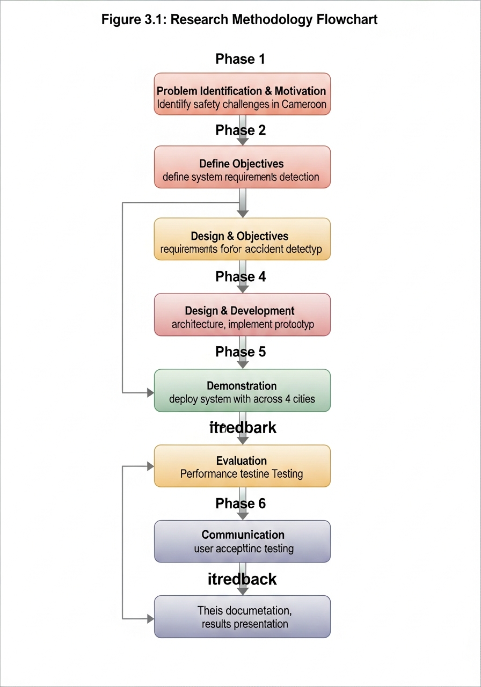
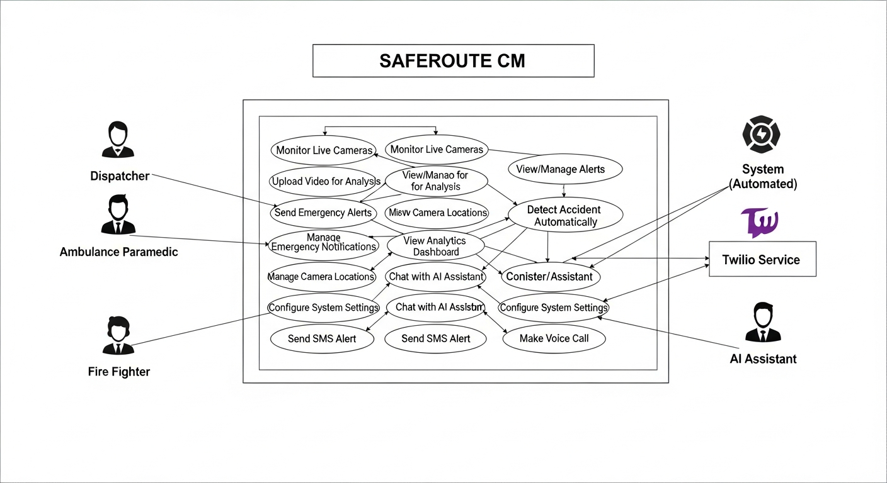

# CHAPTER 3: TOOLS AND METHODOLOGY FOR SYSTEM DEVELOPMENT

## 3.1 Introduction

This chapter presents the research methodology and tools employed in the design and development of SAFEROUTE CM. It details the systematic approach followed to translate the research objectives into a functional system, from requirements gathering through implementation and testing.

The chapter is organized as follows: Section 3.2 describes the research methodology and approach. Section 3.3 presents the system requirements analysis. Section 3.4 details the system architecture and design. Section 3.5 covers database design. Section 3.6 presents the development tools and technologies. Section 3.7 explains the model formulation and design principles. Section 3.8 describes the implementation approach. Section 3.9 outlines the testing strategy. Section 3.10 provides a chapter summary.

## 3.2 Research Methodology

### 3.2.1 Research Type

This research adopts an **Applied Research** approach, focusing on the practical application of scientific knowledge to solve a real-world problem. Applied research is characterized by its orientation toward solving specific practical problems and developing solutions that can be implemented and evaluated in real contexts.

The research also incorporates elements of **Design Science Research (DSR)**, a methodology commonly used in information systems research. DSR focuses on the creation and evaluation of artifacts (in this case, the SAFEROUTE CM system) that address identified problems. The DSR framework, as outlined by Hevner et al. (2004), emphasizes the iterative nature of design and evaluation in developing effective solutions.

### 3.2.2 Research Approach

The research employs a **Mixed Methods** approach, combining both qualitative and quantitative elements:

**Qualitative Components**:
- Analysis of road safety challenges in Cameroon through document review
- Requirements gathering through stakeholder consultations
- Evaluation of user experience through observation and interviews

**Quantitative Components**:
- Measurement of detection accuracy through controlled experiments
- Analysis of response time metrics
- Statistical analysis of user satisfaction surveys

### 3.2.3 Research Design

The research follows an **Experimental Design** with the following phases:

1. **Problem Identification and Requirements Analysis**: Understanding the current state of road safety and emergency response in Cameroon, identifying stakeholder needs, and defining system requirements.

2. **System Design**: Developing the architecture, data models, and interface designs for SAFEROUTE CM.

3. **Implementation**: Building the system components according to the design specifications.

4. **Testing and Evaluation**: Validating the system through functional testing, performance evaluation, and user acceptance testing.

5. **Documentation and Reflection**: Documenting the research process, findings, and lessons learned.



*Figure 3.1: Design Science Research Methodology Flowchart*

### 3.2.4 Justification of Methodology

The chosen methodology is appropriate for this research for several reasons:

1. **Practical Focus**: Applied research and DSR are well-suited for developing solutions to real-world problems, which aligns with the objective of creating a functional system.

2. **Iterative Development**: DSR's emphasis on iteration allows for continuous refinement based on feedback and testing results.

3. **Comprehensive Evaluation**: The mixed methods approach enables both rigorous measurement of system performance and in-depth understanding of user experiences.

4. **Generalizability**: The systematic documentation of the design process enables knowledge transfer to similar contexts.

## 3.3 System Requirements Analysis

### 3.3.1 Stakeholder Analysis

The primary stakeholders for SAFEROUTE CM were identified through document analysis and consultations:

**Primary Users**:
- System administrators and dispatchers
- Police traffic officers
- Ambulance and emergency medical personnel
- Fire department and rescue personnel

**Secondary Users**:
- Road safety policymakers
- Municipal traffic management authorities
- CCTV system operators

**Beneficiaries**:
- Road users (motorists, passengers, pedestrians)
- Families and communities affected by road accidents
- Healthcare facilities receiving accident victims

### 3.3.2 Functional Requirements

Based on stakeholder analysis and review of similar systems, the following functional requirements were identified:

*[Table 3.1 System Requirements Specification]*

| ID | Requirement | Priority | Category |
|----|-------------|----------|----------|
| FR01 | The system shall detect road accidents from CCTV camera feeds in real-time | High | Detection |
| FR02 | The system shall support multiple camera inputs from different locations | High | Detection |
| FR03 | The system shall generate alerts upon accident detection | High | Alerting |
| FR04 | The system shall support SMS notification to emergency contacts | High | Alerting |
| FR05 | The system shall support voice call notification to emergency contacts | High | Alerting |
| FR06 | The system shall allow users to cancel false alarm alerts within a countdown period | High | Alerting |
| FR07 | The system shall provide a web-based dashboard for monitoring | High | Interface |
| FR08 | The system shall support user authentication and authorization | High | Security |
| FR09 | The system shall provide role-specific dashboards (Police, Ambulance, Fire) | Medium | Interface |
| FR10 | The system shall allow management of cameras (CRUD operations) | Medium | Management |
| FR11 | The system shall allow management of emergency contacts | Medium | Management |
| FR12 | The system shall provide analytics and reporting on detections | Medium | Analytics |
| FR13 | The system shall support an AI chat assistant for user queries | Low | Support |
| FR14 | The system shall allow configuration of detection thresholds | Medium | Settings |
| FR15 | The system shall log all alerts and user actions | Medium | Logging |

### 3.3.3 Non-Functional Requirements

| ID | Requirement | Target | Category |
|----|-------------|--------|----------|
| NFR01 | Detection latency from video frame to detection result | < 500ms | Performance |
| NFR02 | Alert dispatch time from detection to notification sent | < 5 seconds | Performance |
| NFR03 | System availability | > 99% uptime | Reliability |
| NFR04 | Concurrent user support | 50+ users | Scalability |
| NFR05 | Page load time | < 3 seconds | Performance |
| NFR06 | Detection accuracy | > 85% | Accuracy |
| NFR07 | False positive rate | < 15% | Accuracy |
| NFR08 | Data encryption | In transit and at rest | Security |
| NFR09 | Password security | Hashed with strong algorithm | Security |
| NFR10 | Mobile responsiveness | Support for tablets | Usability |

## 3.4 System Architecture and Design

### 3.4.1 High-Level Architecture

SAFEROUTE CM follows a **three-tier architecture** comprising:

1. **Presentation Tier**: React-based web application providing the user interface
2. **Application Tier**: Node.js/Express backend handling business logic and API endpoints
3. **Data Tier**: PostgreSQL database for persistent storage

Additionally, the system integrates with:
- **AI Detection Module**: YOLOv8-based video analysis (simulated in MVP)
- **External Services**: Twilio for SMS/voice notifications


*Figure 3.2: SAFEROUTE CM Three-Tier System Architecture*

### 3.4.2 Component Design

**Frontend Components**:

1. **Landing Page**: Public-facing page for unauthenticated users
2. **Authentication Module**: Login and signup flows with Replit Auth integration
3. **Dashboard**: Main overview with key statistics and recent alerts
4. **Live Monitoring**: Real-time display of camera feeds with detection overlays
5. **Alert Management**: Interface for viewing, acknowledging, and managing alerts
6. **Camera Management**: CRUD interface for camera configuration
7. **Contact Management**: CRUD interface for emergency contacts
8. **Role-Specific Dashboards**: Specialized interfaces for Police, Ambulance, Fire
9. **Analytics**: Statistical visualizations of system performance
10. **Settings**: System configuration interface
11. **AI Assistant**: Chat interface for user support

**Backend Components**:

1. **Authentication Service**: User authentication and session management
2. **Camera Service**: Camera data management
3. **Contact Service**: Emergency contact management
4. **Alert Service**: Alert creation, management, and dispatch
5. **Detection Service**: Interface with AI detection module
6. **Notification Service**: Integration with Twilio for SMS/voice
7. **Analytics Service**: Aggregation and reporting of system data
8. **AI Assistant Service**: Integration with OpenAI for chat functionality

### 3.4.3 Use Case Diagram

The primary use cases for SAFEROUTE CM are illustrated below:



*Figure 3.4: UML Use Case Diagram for SAFEROUTE CM*

**Primary Actors and Use Cases**:

**System Administrator**:
- Manage cameras (Add, Edit, Delete, View)
- Manage contacts (Add, Edit, Delete, View)
- Configure system settings
- View analytics and reports
- Manage user accounts

**Dispatcher**:
- Monitor camera feeds
- Review detected alerts
- Dispatch alerts to responders
- Cancel false alarms
- Acknowledge alerts

**Police Officer**:
- View Police Dashboard
- Receive alert notifications
- Update incident status
- File incident reports

**Ambulance Personnel**:
- View Ambulance Dashboard
- Receive alert notifications
- Update response status
- Record medical information

**Fire Department Personnel**:
- View Fire Dashboard
- Receive alert notifications
- Update response status
- Record rescue operations

### 3.4.4 Sequence Diagrams

**Accident Detection and Alert Sequence**:


*Figure 3.5: UML Sequence Diagram for Accident Detection and Alert Flow*

1. CCTV Camera streams video to Detection Module
2. Detection Module processes frames using YOLOv8
3. Tracked vehicles analyzed for collision
4. If collision detected, Alert created in Database
5. Frontend receives new alert via polling/websocket
6. Accident Notification displayed with countdown
7. If not cancelled, Alert Service triggers notifications
8. Notification Service sends SMS via Twilio
9. Notification Service makes Voice Call via Twilio
10. Alert status updated to "sent"

**Alert Dispatch Sequence**:


*Figure 3.6: UML Sequence Diagram for Emergency Alert Dispatch*

1. User views pending alert on Dashboard
2. User clicks "Send Alert" or countdown expires
3. Frontend calls POST /api/alerts/:id/send
4. Backend validates alert status (idempotency check)
5. Backend retrieves contacts and settings
6. Backend sends SMS to each active contact
7. Backend makes voice call to priority contacts
8. Backend updates alert with send status
9. Frontend displays success confirmation

### 3.4.5 Class Diagram


*Figure 3.7: UML Class Diagram for SAFEROUTE CM*

Key classes and their relationships:

```
Camera
- id: number
- name: string
- location: string
- city: string
- latitude: number
- longitude: number
- status: string
- streamUrl: string
+ getActiveAlerts(): Alert[]

Contact
- id: number
- name: string
- phone: string
- email: string
- type: string
- city: string
- isActive: boolean
+ notify(alert: Alert): void

Alert
- id: number
- type: string
- location: string
- severity: string
- status: string
- confidence: number
- cameraId: number
- smsSent: boolean
- callMade: boolean
- createdAt: Date
+ send(): SendResult
+ cancel(): void
+ acknowledge(): void

User
- id: number
- email: string
- firstName: string
- lastName: string
- role: string
- city: string
- organization: string
+ hasPermission(action: string): boolean

Notification
- to: string
- alertType: string
- location: string
- severity: string
+ sendSMS(): boolean
+ makeCall(): boolean
```

## 3.5 Database Design

### 3.5.1 Database Selection

**PostgreSQL** was selected as the database management system for SAFEROUTE CM based on:

1. **Reliability**: PostgreSQL is known for data integrity and reliability
2. **Feature Set**: Support for advanced data types (JSON, arrays) and indexing
3. **Scalability**: Ability to handle growing data volumes
4. **Open Source**: No licensing costs, active community support
5. **ORM Support**: Excellent integration with Drizzle ORM

### 3.5.2 Entity-Relationship Diagram


*Figure 3.3: Database Entity-Relationship Diagram for SAFEROUTE CM*

The database comprises the following entities:

- **cameras**: CCTV camera configurations and locations
- **contacts**: Emergency responder contact information
- **alerts**: Detected accident records and status
- **videos**: Uploaded video files for analysis
- **settings**: System configuration key-value pairs
- **users**: User accounts and profiles
- **sessions**: Authentication session data
- **conversations**: AI chat sessions
- **messages**: AI chat messages
- **detection_logs**: Detection analytics data

### 3.5.3 Database Schema

*[Table 3.2 Database Schema Design]*

**Table: cameras**
| Column | Type | Constraints | Description |
|--------|------|-------------|-------------|
| id | SERIAL | PRIMARY KEY | Auto-increment ID |
| name | VARCHAR(100) | NOT NULL | Camera name |
| location | VARCHAR(255) | NOT NULL | Physical location |
| city | VARCHAR(50) | NOT NULL | City name |
| latitude | DECIMAL(10,8) | | GPS latitude |
| longitude | DECIMAL(11,8) | | GPS longitude |
| status | VARCHAR(20) | DEFAULT 'active' | Camera status |
| stream_url | VARCHAR(500) | | RTSP stream URL |
| created_at | TIMESTAMP | DEFAULT NOW() | Creation timestamp |

**Table: contacts**
| Column | Type | Constraints | Description |
|--------|------|-------------|-------------|
| id | SERIAL | PRIMARY KEY | Auto-increment ID |
| name | VARCHAR(100) | NOT NULL | Contact name |
| phone | VARCHAR(20) | NOT NULL | Phone number |
| email | VARCHAR(100) | | Email address |
| type | VARCHAR(50) | NOT NULL | Contact type |
| city | VARCHAR(50) | | City assignment |
| is_active | BOOLEAN | DEFAULT TRUE | Active status |
| created_at | TIMESTAMP | DEFAULT NOW() | Creation timestamp |

**Table: alerts**
| Column | Type | Constraints | Description |
|--------|------|-------------|-------------|
| id | SERIAL | PRIMARY KEY | Auto-increment ID |
| type | VARCHAR(50) | NOT NULL | Accident type |
| location | VARCHAR(255) | NOT NULL | Accident location |
| severity | VARCHAR(20) | NOT NULL | Severity level |
| status | VARCHAR(30) | DEFAULT 'pending' | Alert status |
| confidence | INTEGER | | Detection confidence |
| camera_id | INTEGER | FOREIGN KEY | Related camera |
| sms_sent | BOOLEAN | DEFAULT FALSE | SMS sent flag |
| call_made | BOOLEAN | DEFAULT FALSE | Call made flag |
| created_at | TIMESTAMP | DEFAULT NOW() | Creation timestamp |

**Table: users**
| Column | Type | Constraints | Description |
|--------|------|-------------|-------------|
| id | VARCHAR(255) | PRIMARY KEY | User ID from auth |
| email | VARCHAR(255) | UNIQUE | Email address |
| first_name | VARCHAR(100) | | First name |
| last_name | VARCHAR(100) | | Last name |
| role | VARCHAR(50) | | User role |
| city | VARCHAR(50) | | Assigned city |
| organization | VARCHAR(255) | | Organization name |
| created_at | TIMESTAMP | DEFAULT NOW() | Creation timestamp |

## 3.6 Development Tools and Technologies

### 3.6.1 Overview of Technology Stack

*[Table 3.4 Development Tools and Technologies]*

| Category | Technology | Version | Purpose |
|----------|------------|---------|---------|
| Frontend Framework | React | 18.x | UI component library |
| Language | TypeScript | 5.x | Type-safe JavaScript |
| Styling | Tailwind CSS | 3.x | Utility-first CSS |
| UI Components | Shadcn UI | Latest | Pre-built components |
| State Management | TanStack Query | 5.x | Server state management |
| Routing | Wouter | 3.x | Client-side routing |
| Backend Runtime | Node.js | 20.x | JavaScript runtime |
| Backend Framework | Express | 5.x | Web application framework |
| ORM | Drizzle | 0.30.x | Database ORM |
| Database | PostgreSQL | 15.x | Relational database |
| Authentication | Replit Auth | - | OIDC authentication |
| AI Chat | OpenAI GPT-4 | - | Natural language AI |
| SMS/Voice | Twilio | - | Communication APIs |
| IDE | Replit | - | Cloud development |

### 3.6.2 Frontend Technologies

**React**: A JavaScript library for building user interfaces. React's component-based architecture promotes code reuse and maintainability. The virtual DOM ensures efficient rendering of updates.

**TypeScript**: A superset of JavaScript that adds static type checking. TypeScript improves code quality by catching errors at compile time and enhancing IDE support.

**Tailwind CSS**: A utility-first CSS framework that enables rapid UI development through composable utility classes. Tailwind's design tokens ensure visual consistency.

**Shadcn UI**: A collection of re-usable components built with Radix UI and Tailwind CSS. Shadcn provides accessible, customizable components including buttons, cards, forms, and dialogs.

**TanStack Query**: A data-fetching library that handles caching, background updates, and stale data management. TanStack Query simplifies server state management in React applications.

**Wouter**: A minimalist routing library for React. Wouter provides a simple API for navigation without the overhead of larger routing solutions.

### 3.6.3 Backend Technologies

**Node.js**: A JavaScript runtime built on Chrome's V8 engine. Node.js enables JavaScript execution on the server, allowing full-stack development with a single language.

**Express**: A minimal and flexible Node.js web application framework. Express provides robust features for building APIs and web applications.

**Drizzle ORM**: A TypeScript ORM that provides type-safe database queries. Drizzle's schema definition approach ensures database types are enforced at compile time.

**PostgreSQL**: An advanced open-source relational database. PostgreSQL provides reliability, data integrity, and advanced features like JSON support.

### 3.6.4 AI and Detection Technologies

**YOLOv8**: The latest version of the You Only Look Once object detection algorithm. YOLOv8 offers improved accuracy and speed, making it suitable for real-time video analysis.

**DeepSORT**: A multi-object tracking algorithm that combines appearance information with motion prediction. DeepSORT maintains consistent object identities across video frames.

**OpenAI GPT-4**: A large language model used for the AI chat assistant feature. GPT-4 provides natural language understanding and generation capabilities.

### 3.6.5 Communication Technologies

**Twilio**: A cloud communications platform providing APIs for SMS and voice communications. Twilio's programmable APIs enable automated notification dispatch.

## 3.7 Model Formulation and Design Principles

### 3.7.1 Accident Detection Model

The accident detection model is based on the following principles:

**Input**: Sequential video frames from CCTV cameras at time intervals t, t+1, t+2, ...

**Processing Pipeline**:

1. **Frame Extraction**: Extract frames from video stream at 30 FPS
2. **Object Detection**: Apply YOLOv8 to detect vehicles in each frame
   - Output: Bounding boxes B = {(x, y, w, h, class, confidence)}
3. **Object Tracking**: Apply DeepSORT to track vehicles across frames
   - Output: Track IDs and trajectories T = {(id, [positions])}
4. **Collision Analysis**: Analyze tracked vehicles for collision indicators
   - Sudden velocity change: Δv > threshold
   - Trajectory intersection: Trajectories cross within time window
   - Bounding box overlap: IoU(B1, B2) > overlap_threshold
5. **Alert Generation**: If collision detected with confidence > threshold, generate alert

**Mathematical Formulation**:

Velocity at time t for tracked object i:
```
v_i(t) = (position_i(t) - position_i(t-1)) / Δt
```

Velocity change:
```
Δv_i(t) = |v_i(t) - v_i(t-1)|
```

Collision probability:
```
P(collision) = f(Δv, IoU, trajectory_intersection)
```

Where f is a weighted function combining the indicators.

### 3.7.2 Alert Priority Model

Alerts are prioritized based on multiple factors:

**Severity Score** (S): Based on estimated impact
- High severity (S = 3): Multiple vehicles, high speed
- Medium severity (S = 2): Two vehicles, moderate speed
- Low severity (S = 1): Minor collision, low speed

**Confidence Score** (C): Detection confidence from AI model (0-100)

**Location Priority** (L): Based on camera location
- High traffic areas: L = 3
- Moderate traffic areas: L = 2
- Low traffic areas: L = 1

**Overall Priority**:
```
Priority = w1 * S + w2 * (C/100) + w3 * L
```

Where w1, w2, w3 are configurable weights.

### 3.7.3 Design Patterns Employed

**Model-View-Controller (MVC)**: Separation of data (models), user interface (views), and business logic (controllers).

**Repository Pattern**: Abstraction of data access through the IStorage interface, enabling separation of business logic from database operations.

**Observer Pattern**: Used for real-time updates where the frontend observes changes in alert data.

**Singleton Pattern**: Used for database connections and service instances to ensure single point of management.

## 3.8 Implementation Approach

### 3.8.1 Development Methodology

The implementation followed an **Agile Development** approach with iterative cycles:

1. **Sprint 1**: Project setup, database design, basic API structure
2. **Sprint 2**: Camera and contact management, authentication
3. **Sprint 3**: Alert management, notification system
4. **Sprint 4**: Role-specific dashboards, UI enhancements
5. **Sprint 5**: AI assistant, analytics, testing
6. **Sprint 6**: Bug fixes, documentation, deployment

### 3.8.2 Version Control

Git was used for version control with the following branching strategy:
- **main**: Production-ready code
- **develop**: Integration branch for features
- **feature/***: Individual feature branches

### 3.8.3 Code Quality Practices

- TypeScript for type safety
- ESLint for code linting
- Consistent code formatting with Prettier
- Code reviews for all changes
- Unit and integration testing

## 3.9 Testing Strategy

### 3.9.1 Testing Levels

**Unit Testing**: Testing individual components and functions in isolation. Focus on business logic and utility functions.

**Integration Testing**: Testing interactions between components, including API endpoints and database operations.

**System Testing**: End-to-end testing of complete user workflows using Playwright for browser automation.

**User Acceptance Testing**: Testing with actual users (emergency responders) to validate usability and functionality.

### 3.9.2 Test Categories

1. **Functional Tests**: Verify that features work as specified
2. **Performance Tests**: Measure response times and throughput
3. **Security Tests**: Validate authentication and authorization
4. **Usability Tests**: Assess user experience and interface design

### 3.9.3 Test Metrics

- Test coverage percentage
- Pass/fail rates
- Defect density
- Mean time to resolve defects

## 3.10 Chapter Summary

This chapter has presented the comprehensive methodology employed in developing SAFEROUTE CM. The research follows an applied research approach with design science principles, using mixed methods for evaluation.

The system requirements were analyzed through stakeholder identification and requirements gathering, resulting in detailed functional and non-functional requirements. The system architecture follows a three-tier model with clear separation of concerns.

Database design using PostgreSQL provides reliable data persistence, while the technology stack leverages modern web development frameworks (React, Express) and TypeScript for type safety.

The accident detection model combines YOLOv8 object detection with DeepSORT tracking and custom collision analysis algorithms. Design patterns including MVC, Repository, and Observer ensure maintainable and scalable code.

The implementation followed Agile methodology with iterative development cycles, and the testing strategy encompasses multiple levels from unit tests to user acceptance testing.

The next chapter presents the actual implementation of SAFEROUTE CM, including detailed description of system features and evaluation results.
