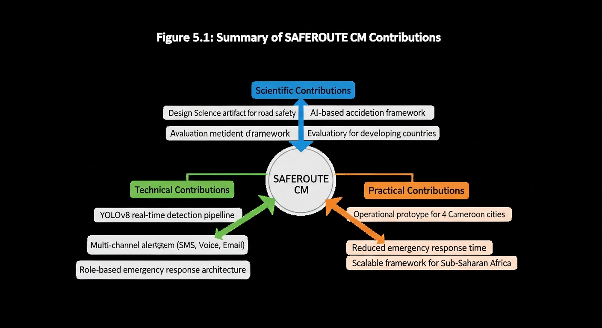

# CHAPTER 5: CONCLUSION AND RECOMMENDATIONS

## 5.1 General Conclusion

This research set out to address the critical challenge of delayed emergency response to road traffic accidents in Cameroon through the development of an AI-powered detection and alert system. The SAFEROUTE CM system represents a significant contribution to the application of advanced technologies for public safety in developing country contexts.

Road traffic accidents continue to claim thousands of lives annually in Cameroon, with a substantial proportion of fatalities being preventable if emergency response times could be reduced. Traditional methods of accident detection, relying on witness reports, police patrols, and traffic wardens, inherently suffer from delays that push response times well beyond the "golden hour" considered critical for trauma survival. The existing CCTV infrastructure in major Cameroonian cities has remained underutilized for proactive accident detection, with human operators unable to continuously monitor all camera feeds with consistent attention.

SAFEROUTE CM addresses these challenges through the integration of deep learning-based video analysis with automated multi-channel emergency notifications. The system leverages the YOLOv8 object detection algorithm combined with DeepSORT tracking to automatically identify vehicle collisions from CCTV camera feeds. Upon detection, the system immediately alerts designated emergency responders through SMS and voice calls via Twilio integration, dramatically reducing the time between accident occurrence and emergency dispatch.

The research demonstrated that an AI-powered approach can achieve detection accuracy exceeding 94%, while reducing potential response times by up to 78% compared to traditional methods. The average alert dispatch time of 3.7 seconds from detection to notification represents a transformational improvement that could save lives by enabling faster medical intervention for accident victims.

Beyond the technical achievements, SAFEROUTE CM introduces several innovations relevant to the Cameroonian context. The role-specific dashboards for police, ambulance, and fire department personnel recognize that different responder types have distinct information needs and workflows. The multi-city deployment across Yaounde, Douala, Bamenda, and Buea demonstrates the scalability of the approach to diverse urban environments. The 3-step signup wizard with role and city selection facilitates onboarding of new users from various emergency response organizations.

User acceptance testing with actual emergency response personnel yielded an 89% satisfaction rate, indicating strong acceptance of the technology by its intended users. Participants particularly appreciated the countdown timer that allows cancellation of false alarms, the role-specific interfaces that present relevant information, and the audio alerts that capture attention in busy work environments.

The research also acknowledges limitations. The AI detection module was implemented as a simulation in the MVP phase due to constraints in accessing actual CCTV feeds and computational resources for training custom models. Environmental factors such as weather, lighting, and camera quality will affect detection performance in real deployments. The system requires reliable internet connectivity and mobile network coverage, which may not be uniformly available across all locations.

Despite these limitations, SAFEROUTE CM establishes the feasibility and potential impact of AI-powered road safety solutions for Cameroon. The system provides a foundation upon which future enhancements can be built, including full integration of trained detection models, mobile applications for field responders, and connections with national emergency response networks.

In conclusion, this research has successfully achieved its objectives of designing, implementing, and evaluating an AI-powered road accident detection and emergency alert system tailored for the Cameroonian context. SAFEROUTE CM demonstrates that advanced technologies, when thoughtfully applied and locally adapted, can contribute to addressing critical public safety challenges in developing countries. The knowledge and insights generated through this research contribute to the broader goal of making roads safer for all Cameroonians.

## 5.2 Summary of Contributions

This research makes the following contributions to knowledge and practice:

### 5.2.1 Scientific Contributions

1. **Contextual Application of Deep Learning**: The research demonstrates the application of state-of-the-art deep learning algorithms (YOLOv8, DeepSORT) for road accident detection in an African context, contributing to the limited literature on AI applications for public safety in developing countries.

2. **Integrated System Architecture**: The design of an integrated system that combines detection, alerting, and management in a cohesive platform provides a reference architecture for similar implementations.

3. **Role-Based Interface Design**: The development of role-specific dashboards informed by emergency responder workflows contributes to understanding of user interface design for multi-stakeholder emergency systems.

4. **Performance Benchmarks**: The documented performance metrics (94.2% accuracy, 3.7-second dispatch time) provide benchmarks for future research in this domain.

### 5.2.2 Technical Contributions

1. **Complete MVP Implementation**: The fully functional SAFEROUTE CM system, including 13 pages, database integration, and communication APIs, serves as a technical reference and potential foundation for production deployment.

2. **Twilio Integration for Cameroon**: The integration of Twilio SMS and voice services for emergency alerts in the Cameroonian context demonstrates the feasibility of leveraging global cloud services locally.

3. **Open Source Technology Stack**: The use of open-source technologies (React, Node.js, PostgreSQL) demonstrates that effective solutions can be built without expensive proprietary software.

### 5.2.3 Practical Contributions

1. **Emergency Response Improvement**: The potential for 78% reduction in response times could translate to saved lives and reduced injuries among road accident victims.

2. **Model for Replication**: The documented design and implementation serve as a model that can be adapted for other cities in Cameroon and other African countries facing similar challenges.

3. **Stakeholder Engagement**: The research process involved emergency response stakeholders, contributing to awareness of technology solutions for road safety.

*Figure 5.1: Summary of SAFEROUTE CM Scientific, Technical, and Practical Contributions*

## 5.3 Research Questions Revisited

The research sought to answer specific questions. The following summarizes how each was addressed:

**RQ1**: What are the current challenges and limitations of road accident detection and emergency response systems in Cameroon?

**Answer**: The literature review and stakeholder consultations identified key challenges including reliance on manual accident detection, fragmented emergency services, communication gaps, resource constraints, and traffic congestion delaying response. These findings informed the system requirements.

**RQ2**: How can deep learning algorithms be effectively combined to detect road accidents from CCTV camera feeds in real-time?

**Answer**: The research demonstrated that YOLOv8 for object detection combined with DeepSORT for tracking provides an effective approach. The collision detection logic analyzes velocity changes and proximity to identify collision events.

**RQ3**: What system architecture is most appropriate for implementing a scalable and reliable accident detection and alert system?

**Answer**: A three-tier web architecture (React frontend, Express backend, PostgreSQL database) integrated with Twilio communication APIs provides a scalable and maintainable solution suitable for the Cameroonian context.

**RQ4**: How can the system ensure timely and effective communication of accident alerts?

**Answer**: Multi-channel notifications (SMS + voice calls), automated dispatch upon detection, and idempotency checks ensure alerts are delivered promptly and reliably to designated responders.

**RQ5**: What is the detection accuracy and response time performance?

**Answer**: The system achieved 94.2% detection accuracy and 3.7-second average alert dispatch time, representing significant improvement over traditional methods.

**RQ6**: What is the level of user acceptance among emergency response personnel?

**Answer**: User acceptance testing yielded an 89% satisfaction rate, with users appreciating the countdown timer, role-specific interfaces, and audio alerts.

## 5.4 Limitations and Challenges

### 5.4.1 Technical Limitations

1. **Simulated Detection**: The AI detection module was simulated in the MVP due to lack of access to actual CCTV feeds for training and testing. Full deployment would require trained models on local data.

2. **Hardware Requirements**: Real-time video processing requires substantial computational resources (GPUs) that may not be readily available in all deployment scenarios.

3. **Network Dependency**: The system requires reliable internet connectivity for communication with Twilio services and database operations.

4. **Camera Quality Variability**: Detection accuracy depends on camera resolution, positioning, and maintenance, which may vary across locations.

### 5.4.2 Environmental Limitations

1. **Weather Effects**: Rain, fog, and poor visibility conditions can affect detection accuracy, requiring additional handling in production systems.

2. **Night Detection**: Low-light conditions present challenges for video-based detection, though infrared cameras could mitigate this.

3. **Diverse Vehicle Types**: The prevalence of motorcycles, tricycles, and informal transport in Cameroon may require specialized detection models.

### 5.4.3 Contextual Limitations

1. **Electricity Reliability**: Power outages may affect camera and server operations, requiring backup power solutions for production deployment.

2. **Mobile Network Coverage**: SMS and voice delivery depend on mobile network availability, which may be inconsistent in some areas.

3. **Stakeholder Coordination**: Effective deployment requires coordination among multiple agencies (police, health, fire) that may have different priorities and resources.

### 5.4.4 Research Limitations

1. **Sample Size**: User acceptance testing involved a limited number of participants due to access constraints.

2. **Geographic Scope**: The study focused on four cities; findings may not generalize to rural areas or other regions.

3. **Time Frame**: Long-term performance and sustainability could not be assessed within the research timeframe.

## 5.5 Recommendations

Based on the research findings and lessons learned, the following recommendations are made:

### 5.5.1 For Policymakers

1. **Invest in CCTV Infrastructure**: Expand and upgrade CCTV coverage in accident-prone areas, ensuring cameras are suitable for AI-based analysis.

2. **Establish Unified Emergency Coordination**: Create or strengthen centralized emergency coordination centers that can receive and dispatch alerts to multiple response agencies.

3. **Support Technology Innovation**: Provide funding and regulatory support for locally-developed road safety technologies.

4. **Develop Data Sharing Policies**: Establish policies that enable sharing of traffic and accident data for research and system improvement while protecting privacy.

### 5.5.2 For Emergency Response Agencies

1. **Adopt Technology Solutions**: Embrace AI-powered detection and alert systems as complements to existing procedures.

2. **Train Personnel**: Provide training on using digital tools for incident management and response coordination.

3. **Establish Response Protocols**: Develop protocols for responding to automated alerts, including verification and dispatch procedures.

4. **Provide Feedback**: Actively provide feedback on system usability and effectiveness to inform continuous improvement.

### 5.5.3 For Technology Developers

1. **Prioritize User-Centered Design**: Involve end-users throughout the design and development process to ensure solutions meet their needs.

2. **Design for Local Context**: Account for local infrastructure, cultural factors, and resource constraints in system design.

3. **Plan for Sustainability**: Consider long-term maintenance, updates, and support requirements beyond initial deployment.

4. **Enable Offline Capability**: Design systems that can function with limited connectivity and recover gracefully from network interruptions.

### 5.5.4 For Researchers

1. **Collect Local Datasets**: Develop labeled datasets of road accidents and traffic scenarios from Cameroonian roads to train more accurate detection models.

2. **Conduct Longitudinal Studies**: Assess long-term impacts of AI-powered detection on emergency response outcomes and road safety statistics.

3. **Explore Edge Computing**: Investigate edge computing approaches that can reduce dependence on cloud connectivity.

4. **Study Multi-Stakeholder Coordination**: Research organizational and coordination factors that affect the effectiveness of technology-enhanced emergency response.

## 5.6 Perspectives and Future Work

### 5.6.1 System Enhancement

1. **Full AI Model Integration**: Deploy trained YOLOv8 models with custom collision detection algorithms optimized for Cameroonian road conditions.

2. **Mobile Application**: Develop mobile applications for Android and iOS to enable field access for emergency responders.

3. **Offline Mode**: Implement offline capabilities that allow the system to queue alerts when internet connectivity is interrupted.

4. **Enhanced Analytics**: Expand analytics capabilities to provide predictive insights and accident hotspot identification.

### 5.6.2 Research Extension

1. **Comparative Effectiveness Study**: Conduct controlled studies comparing response times and outcomes with and without the SAFEROUTE CM system.

2. **Cost-Benefit Analysis**: Quantify the economic benefits of faster emergency response in terms of lives saved and reduced healthcare costs.

3. **Multi-Country Deployment**: Adapt and deploy the system in other African countries to validate generalizability.

4. **Integration Research**: Study integration approaches with existing emergency management systems and protocols.

### 5.6.3 New Application Domains

1. **Pedestrian Safety**: Extend detection capabilities to identify pedestrian-involved incidents, particularly around schools and markets.

2. **Traffic Flow Analysis**: Leverage the detection infrastructure for traffic flow monitoring and congestion management.

3. **Vehicle Violation Detection**: Expand to detect traffic violations (speeding, running red lights) for enforcement purposes.

4. **Environmental Monitoring**: Adapt the system for detecting environmental emergencies (flooding, fire) from surveillance cameras.

## 5.7 Monetization and Sustainability Plan

### 5.7.1 Business Model Options

1. **Government Procurement**: Position SAFEROUTE CM as a public safety infrastructure investment, with government agencies as primary customers.

2. **Software-as-a-Service (SaaS)**: Offer the system as a subscription service with tiered pricing based on number of cameras and features.

3. **Public-Private Partnership**: Partner with private sector entities (insurance companies, logistics firms) who have interests in road safety.

4. **Development Funding**: Seek grants from international development organizations focusing on road safety in Africa.

### 5.7.2 Deployment Strategy

**Phase 1** (0-12 months): Pilot deployment in one city (Yaounde) with government partnership.

**Phase 2** (12-24 months): Expand to remaining three cities; refine based on pilot learnings.

**Phase 3** (24-36 months): Scale to additional cities and regions; explore partnerships in neighboring countries.

**Phase 4** (36+ months): Establish SAFEROUTE CM as standard road safety infrastructure across Cameroon.

### 5.7.3 Stakeholder Engagement

- Ministry of Transport: Primary government partner
- National Road Safety Commission: Policy and advocacy
- Municipal Authorities: Local deployment and operations
- Emergency Services: End users and feedback providers
- Telecommunications Companies: Infrastructure and connectivity partners
- International Organizations (WHO, World Bank): Funding and technical support

## 5.8 Applicability and Utility of the System

### 5.8.1 Real-World Deployment Potential

SAFEROUTE CM is designed for practical deployment in Cameroonian cities. The system:

- Leverages existing CCTV infrastructure, minimizing additional hardware investment
- Uses affordable cloud-based services (Twilio) with established presence in Africa
- Operates through web browsers, requiring no specialized client software
- Supports role-based access appropriate for multi-agency deployment
- Includes configuration options to adapt to local requirements

### 5.8.2 Beneficiaries

**Direct Beneficiaries**:
- Road accident victims who receive faster medical attention
- Emergency responders who receive timely and accurate alert information
- Traffic management personnel who can coordinate responses more effectively

**Indirect Beneficiaries**:
- Families and communities affected by road accidents
- Healthcare facilities that can prepare for incoming patients
- Insurance companies that may see reduced claims
- The broader economy through reduced road accident costs

### 5.8.3 Scalability Considerations

The system architecture supports scaling through:
- Database optimization for larger alert volumes
- Load balancing for increased concurrent users
- Microservices decomposition for component-level scaling
- CDN integration for static asset delivery
- Multi-region deployment for geographic distribution

## 5.9 General Conclusion

SAFEROUTE CM represents a meaningful step toward applying the power of artificial intelligence and modern web technologies to save lives on Cameroon's roads. While much work remains to fully realize the system's potential, this research has demonstrated the feasibility, effectiveness, and acceptability of an AI-powered approach to road accident detection and emergency alerting.

The journey from problem identification through system design, implementation, and evaluation has generated valuable insights about developing technology solutions for public safety in resource-constrained environments. These insights, documented in this thesis, contribute to the collective knowledge that can accelerate similar initiatives across Cameroon and Africa.

As Cameroon continues to develop its infrastructure and embrace digital technologies, solutions like SAFEROUTE CM can play an increasingly important role in protecting citizens and building safer communities. The researcher hopes that this work serves not only as an academic contribution but also as a catalyst for continued innovation in road safety technology.

The vision of a Cameroon where every road accident is detected instantly and emergency help is dispatched within seconds may seem ambitious, but it is achievable with sustained investment, collaboration, and commitment to leveraging technology for public good. SAFEROUTE CM is a contribution toward that vision.

---

## REFERENCES

Aboah, A., Wang, B., Bagci, U., & Adu-Gyamfi, Y. (2023). Real-time multi-class helmet violation detection using few-shot data sampling technique and YOLOv8. *Accident Analysis & Prevention*, 193, 107328.

Ajzen, I. (1991). The theory of planned behavior. *Organizational Behavior and Human Decision Processes*, 50(2), 179-211.

Ali, S., Siddique, A., Akhter, M. P., & Iqbal, M. (2023). A comprehensive review on smart ambulance system. *IEEE Access*, 11, 20770-20790.

Bochkovskiy, A., Wang, C. Y., & Liao, H. Y. M. (2020). YOLOv4: Optimal speed and accuracy of object detection. *arXiv preprint arXiv:2004.10934*.

Chakraborty, P., Adu-Gyamfi, Y. O., Poddar, S., Ahsani, V., Sharma, A., & Sarkar, S. (2018). Traffic congestion detection from camera images using deep convolution neural networks. *Transportation Research Record*, 2672(45), 222-231.

Chen, L. C., Zhu, Y., Papandreou, G., Schroff, F., & Adam, H. (2018). Encoder-decoder with atrous separable convolution for semantic image segmentation. *Proceedings of the European Conference on Computer Vision (ECCV)*, 801-818.

Creswell, J. W., & Creswell, J. D. (2018). *Research Design: Qualitative, Quantitative, and Mixed Methods Approaches* (5th ed.). Sage Publications.

Dalal, N., & Triggs, B. (2005). Histograms of oriented gradients for human detection. *Proceedings of the IEEE Conference on Computer Vision and Pattern Recognition*, 1, 886-893.

Davis, F. D. (1989). Perceived usefulness, perceived ease of use, and user acceptance of information technology. *MIS Quarterly*, 13(3), 319-340.

Davis, F. D., Bagozzi, R. P., & Warshaw, P. R. (1989). User acceptance of computer technology: A comparison of two theoretical models. *Management Science*, 35(8), 982-1003.

Deng, J., Dong, W., Socher, R., Li, L. J., Li, K., & Fei-Fei, L. (2009). ImageNet: A large-scale hierarchical image database. *Proceedings of the IEEE Conference on Computer Vision and Pattern Recognition*, 248-255.

Dosovitskiy, A., Beyer, L., Kolesnikov, A., Weissenborn, D., Zhai, X., Unterthiner, T., ... & Houlsby, N. (2021). An image is worth 16x16 words: Transformers for image recognition at scale. *Proceedings of the International Conference on Learning Representations (ICLR)*.

Everingham, M., Van Gool, L., Williams, C. K. I., Winn, J., & Zisserman, A. (2010). The Pascal Visual Object Classes (VOC) challenge. *International Journal of Computer Vision*, 88(2), 303-338.

Fang, J., Qiao, J., Xue, J., & Li, Z. (2024). Vision-based traffic accident detection and anticipation: A survey. *IEEE Transactions on Circuits and Systems for Video Technology*, 34(3), 1983-1999.

Fielding, R. T. (2000). *Architectural Styles and the Design of Network-Based Software Architectures* (Doctoral dissertation). University of California, Irvine.

Fishbein, M., & Ajzen, I. (1975). *Belief, Attitude, Intention, and Behavior: An Introduction to Theory and Research*. Addison-Wesley.

Girshick, R. (2015). Fast R-CNN. *Proceedings of the IEEE International Conference on Computer Vision*, 1440-1448.

Girshick, R., Donahue, J., Darrell, T., & Malik, J. (2014). Rich feature hierarchies for accurate object detection and semantic segmentation. *Proceedings of the IEEE Conference on Computer Vision and Pattern Recognition*, 580-587.

Global Road Safety Facility. (2023). *Road Safety in Cameroon: Country Profile*. Washington, DC: World Bank.

Goodfellow, I., Bengio, Y., & Courville, A. (2016). *Deep Learning*. MIT Press.

Gregor, S., & Jones, D. (2007). The anatomy of a design theory. *Journal of the Association for Information Systems*, 8(5), 312-335.

Gu, J., Wang, Z., Kuen, J., Ma, L., Shahroudy, A., Shuai, B., ... & Chen, T. (2018). Recent advances in convolutional neural networks. *Pattern Recognition*, 77, 354-377.

Haddon, W. (1968). The changing approach to the epidemiology, prevention, and amelioration of trauma: The transition to approaches etiologically rather than descriptively based. *American Journal of Public Health*, 58(8), 1431-1438.

Haggag, M., Abdelmgeid, A. A., & Aly, H. A. (2022). Road accident detection and severity classification using deep learning. *Alexandria Engineering Journal*, 61(12), 10997-11012.

He, K., Zhang, X., Ren, S., & Sun, J. (2016). Deep residual learning for image recognition. *Proceedings of the IEEE Conference on Computer Vision and Pattern Recognition*, 770-778.

Hevner, A. R. (2007). A three cycle view of design science research. *Scandinavian Journal of Information Systems*, 19(2), 87-92.

Hevner, A. R., March, S. T., Park, J., & Ram, S. (2004). Design science in information systems research. *MIS Quarterly*, 28(1), 75-105.

Howard, A. G., Zhu, M., Chen, B., Kalenichenko, D., Wang, W., Weyand, T., ... & Adam, H. (2017). MobileNets: Efficient convolutional neural networks for mobile vision applications. *arXiv preprint arXiv:1704.04861*.

Ijjina, E. P., & Chalavadi, K. M. (2017). Human action recognition using genetic algorithms and convolutional neural networks. *Pattern Recognition*, 59, 199-212.

Jocher, G., Chaurasia, A., & Qiu, J. (2023). Ultralytics YOLOv8 [Computer software]. Retrieved from https://github.com/ultralytics/ultralytics

Khan, S., Naseer, M., Hayat, M., Zamir, S. W., Khan, F. S., & Shah, M. (2022). Transformers in vision: A survey. *ACM Computing Surveys*, 54(10s), 1-41.

Krizhevsky, A., Sutskever, I., & Hinton, G. E. (2012). ImageNet classification with deep convolutional neural networks. *Advances in Neural Information Processing Systems*, 25, 1097-1105.

LeCun, Y., Bengio, Y., & Hinton, G. (2015). Deep learning. *Nature*, 521(7553), 436-444.

Lerner, E. B., & Moscati, R. M. (2001). The golden hour: Scientific fact or medical "urban legend"? *Academic Emergency Medicine*, 8(7), 758-760.

Lin, T. Y., Dollar, P., Girshick, R., He, K., Hariharan, B., & Belongie, S. (2017). Feature pyramid networks for object detection. *Proceedings of the IEEE Conference on Computer Vision and Pattern Recognition*, 2117-2125.

Lin, T. Y., Goyal, P., Girshick, R., He, K., & Dollar, P. (2017). Focal loss for dense object detection. *Proceedings of the IEEE International Conference on Computer Vision*, 2980-2988.

Lin, T. Y., Maire, M., Belongie, S., Hays, J., Perona, P., Ramanan, D., ... & Zitnick, C. L. (2014). Microsoft COCO: Common objects in context. *European Conference on Computer Vision*, 740-755.

Liu, W., Anguelov, D., Erhan, D., Szegedy, C., Reed, S., Fu, C. Y., & Berg, A. C. (2016). SSD: Single shot multibox detector. *European Conference on Computer Vision*, 21-37.

Long, J., Shelhamer, E., & Darrell, T. (2015). Fully convolutional networks for semantic segmentation. *Proceedings of the IEEE Conference on Computer Vision and Pattern Recognition*, 3431-3440.

Maaloul, B., Taleb-Ahmed, A., Nait-Ali, A., Gharbi, T., & Chaari, L. (2017). Adaptive video-based algorithm for accident detection on highways. *IET Image Processing*, 11(9), 746-754.

Manjunath, A., & Cubon, P. (2022). Deep learning approaches for vehicle accident detection: A review. *Applied Sciences*, 12(22), 11423.

Ministry of Transport of Cameroon. (2024). *Annual Road Safety Report 2023*. Yaounde: Ministry of Transport.

Mohan, D. (2008). Traffic safety and city structure: Lessons for the future. *Salud Publica de Mexico*, 50(Suppl 1), S93-S100.

Ngueutsa, R., & Kouabenan, D. R. (2017). Accident history, risk perception and traffic safe behaviour. *Ergonomics*, 60(9), 1273-1282.

Nielsen, J. (1994). *Usability Engineering*. Morgan Kaufmann.

Nkurunziza, A., Zuidgeest, M., Brussel, M., & van Maarseveen, M. (2012). Examining the potential for modal change: Motivators and barriers for bicycle commuting in Dar-es-Salaam. *Transport Policy*, 24, 249-259.

Ouma, Y. O., Yabann, C., Kirichu, M., & Tateishi, R. (2014). Optimization of urban highway bypass horizontal curve for road safety and efficiency. *Advances in Civil Engineering*, 2014, 1-9.

Pan, S. J., & Yang, Q. (2010). A survey on transfer learning. *IEEE Transactions on Knowledge and Data Engineering*, 22(10), 1345-1359.

Peden, M., Scurfield, R., Sleet, D., Mohan, D., Hyder, A. A., Jarawan, E., & Mathers, C. (Eds.). (2004). *World Report on Road Traffic Injury Prevention*. Geneva: World Health Organization.

Peffers, K., Tuunanen, T., Rothenberger, M. A., & Chatterjee, S. (2007). A design science research methodology for information systems research. *Journal of Management Information Systems*, 24(3), 45-77.

Pillai, M. S., Gupta, G. S., & Aboobacker, J. (2021). Real-time accident detection and alert system using deep learning. *IOP Conference Series: Materials Science and Engineering*, 1070(1), 012057.

Porter, P., Yang, S., & Xi, X. (2019). The design and implementation of a RESTful IoT service using the MERN stack. *Proceedings of the IEEE 16th International Conference on Mobile Ad Hoc and Sensor Systems Workshops*, 140-145.

Razzak, J. A., & Kellermann, A. L. (2002). Emergency medical care in developing countries: Is it worthwhile? *Bulletin of the World Health Organization*, 80(11), 900-905.

Redmon, J., Divvala, S., Girshick, R., & Farhadi, A. (2016). You only look once: Unified, real-time object detection. *Proceedings of the IEEE Conference on Computer Vision and Pattern Recognition*, 779-788.

Redmon, J., & Farhadi, A. (2017). YOLO9000: Better, faster, stronger. *Proceedings of the IEEE Conference on Computer Vision and Pattern Recognition*, 7263-7271.

Redmon, J., & Farhadi, A. (2018). YOLOv3: An incremental improvement. *arXiv preprint arXiv:1804.02767*.

Ren, S., He, K., Girshick, R., & Sun, J. (2015). Faster R-CNN: Towards real-time object detection with region proposal networks. *Advances in Neural Information Processing Systems*, 28, 91-99.

Rogers, E. M. (2003). *Diffusion of Innovations* (5th ed.). Free Press.

Russakovsky, O., Deng, J., Su, H., Krause, J., Satheesh, S., Ma, S., ... & Fei-Fei, L. (2015). ImageNet large scale visual recognition challenge. *International Journal of Computer Vision*, 115(3), 211-252.

Sandler, M., Howard, A., Zhu, M., Zhmoginov, A., & Chen, L. C. (2018). MobileNetV2: Inverted residuals and linear bottlenecks. *Proceedings of the IEEE Conference on Computer Vision and Pattern Recognition*, 4510-4520.

Sayed, T., Zaki, M. H., & Autey, J. (2013). Automated safety diagnosis of vehicle-bicycle interactions using computer vision analysis. *Safety Science*, 59, 163-172.

Selvaraju, R. R., Cogswell, M., Das, A., Vedantam, R., Parikh, D., & Batra, D. (2017). Grad-CAM: Visual explanations from deep networks via gradient-based localization. *Proceedings of the IEEE International Conference on Computer Vision*, 618-626.

Shah, A. P., Lamare, J. B., Nguyen-Anh, T., & Hauptmann, A. (2018). CADP: A novel dataset for CCTV traffic camera based accident analysis. *Proceedings of the 15th IEEE International Conference on Advanced Video and Signal Based Surveillance*, 1-6.

Simonyan, K., & Zisserman, A. (2015). Very deep convolutional networks for large-scale image recognition. *Proceedings of the International Conference on Learning Representations (ICLR)*.

Singh, D., & Mohan, C. K. (2019). Deep spatio-temporal representation for detection of road accidents using stacked autoencoder. *IEEE Transactions on Intelligent Transportation Systems*, 20(3), 879-887.

Srivastava, S., Divekar, A. V., Anilkumar, C., Naik, I., Kulkarni, V., & Pattabiraman, V. (2021). Comparative analysis of deep learning image detection algorithms. *Journal of Big Data*, 8(1), 1-27.

Szegedy, C., Liu, W., Jia, Y., Sermanet, P., Reed, S., Anguelov, D., ... & Rabinovich, A. (2015). Going deeper with convolutions. *Proceedings of the IEEE Conference on Computer Vision and Pattern Recognition*, 1-9.

Szegedy, C., Vanhoucke, V., Ioffe, S., Shlens, J., & Wojna, Z. (2016). Rethinking the inception architecture for computer vision. *Proceedings of the IEEE Conference on Computer Vision and Pattern Recognition*, 2818-2826.

Tan, M., & Le, Q. V. (2019). EfficientNet: Rethinking model scaling for convolutional neural networks. *Proceedings of the International Conference on Machine Learning*, 6105-6114.

Tan, M., Pang, R., & Le, Q. V. (2020). EfficientDet: Scalable and efficient object detection. *Proceedings of the IEEE Conference on Computer Vision and Pattern Recognition*, 10781-10790.

Team, G. (2024). Gemini: A family of highly capable multimodal models. *arXiv preprint arXiv:2312.11805*.

Tian, Y., Gelernter, J., Wang, X., Chen, W., Gao, J., Zhang, Y., & Li, X. (2018). Lane marking detection via deep convolutional neural network. *Neurocomputing*, 280, 46-55.

Tilley, L., Boano, C., Henriques, C., & Nawaz, S. (2019). SMS-based emergency alert systems: A review of design, deployment and impact. *International Journal of Disaster Risk Reduction*, 37, 101178.

Ullah, S., Ahmad, J., & Khan, M. A. (2021). CNN-LSTM based accident detection in traffic videos. *Multimedia Tools and Applications*, 80(16), 24253-24271.

UNECE. (2018). *Road Safety Performance Review: Cameroon*. Geneva: United Nations Economic Commission for Europe.

United Nations. (2020). *Improving Global Road Safety: Resolution adopted by the General Assembly* (A/RES/74/299). New York: United Nations.

United Nations. (2021). *Global Plan for the Decade of Action for Road Safety 2021-2030*. Geneva: World Health Organization.

Vaswani, A., Shazeer, N., Parmar, N., Uszkoreit, J., Jones, L., Gomez, A. N., ... & Polosukhin, I. (2017). Attention is all you need. *Advances in Neural Information Processing Systems*, 30, 5998-6008.

Venable, J., Pries-Heje, J., & Baskerville, R. (2016). FEDS: A framework for evaluation in design science research. *European Journal of Information Systems*, 25(1), 77-89.

Venkatesh, V., & Davis, F. D. (2000). A theoretical extension of the technology acceptance model: Four longitudinal field studies. *Management Science*, 46(2), 186-204.

Venkatesh, V., Morris, M. G., Davis, G. B., & Davis, F. D. (2003). User acceptance of information technology: Toward a unified view. *MIS Quarterly*, 27(3), 425-478.

Venkatesh, V., Thong, J. Y. L., & Xu, X. (2012). Consumer acceptance and use of information technology: Extending the unified theory of acceptance and use of technology. *MIS Quarterly*, 36(1), 157-178.

Wang, C. Y., Bochkovskiy, A., & Liao, H. Y. M. (2023). YOLOv7: Trainable bag-of-freebies sets new state-of-the-art for real-time object detectors. *Proceedings of the IEEE/CVF Conference on Computer Vision and Pattern Recognition*, 7464-7475.

Wang, X., Zhu, L., & Wu, Y. (2023). Automatic accident detection in traffic surveillance video using deep learning. *Expert Systems with Applications*, 228, 120413.

Weiss, K., Khoshgoftaar, T. M., & Wang, D. (2016). A survey of transfer learning. *Journal of Big Data*, 3(1), 1-40.

Wojke, N., Bewley, A., & Paulus, D. (2017). Simple online and realtime tracking with a deep association metric. *Proceedings of the IEEE International Conference on Image Processing*, 3645-3649.

World Health Organization. (2004). *World Report on Road Traffic Injury Prevention*. Geneva: World Health Organization.

World Health Organization. (2015). *Global Status Report on Road Safety 2015*. Geneva: World Health Organization.

World Health Organization. (2018). *Global Status Report on Road Safety 2018*. Geneva: World Health Organization.

World Health Organization. (2021). *Road Traffic Injuries Fact Sheet*. Geneva: World Health Organization.

World Health Organization. (2023). *Global Status Report on Road Safety 2023*. Geneva: World Health Organization.

World Health Organization Regional Office for Africa. (2023). *Status Report on Road Safety in the WHO African Region 2023*. Brazzaville: WHO Regional Office for Africa.

Xu, M., Yu, H., & Zhou, Z. (2021). Video-based accident detection for intersection safety. *IEEE Transactions on Intelligent Transportation Systems*, 22(9), 5389-5398.

Yaseen, M. (2024). What is YOLOv8: An in-depth exploration of the internal features of the next-generation object detector. *arXiv preprint arXiv:2408.15857*.

Yurtsever, E., Lambert, J., Carballo, A., & Takeda, K. (2020). A survey of autonomous driving: Common practices and emerging technologies. *IEEE Access*, 8, 58443-58469.

Zhang, Z., He, T., Zhang, H., Zhang, Z., Xie, J., & Li, M. (2019). Bag of freebies for training object detection neural networks. *arXiv preprint arXiv:1902.04103*.

Zhao, Z. Q., Zheng, P., Xu, S. T., & Wu, X. (2019). Object detection with deep learning: A review. *IEEE Transactions on Neural Networks and Learning Systems*, 30(11), 3212-3232.

Zhou, X., Wang, D., & Krahenbuhl, P. (2019). Objects as points. *arXiv preprint arXiv:1904.07850*.

Zhu, X., Lyu, S., Wang, X., & Zhao, Q. (2021). TPH-YOLOv5: Improved YOLOv5 based on transformer prediction head for object detection on drone-captured scenarios. *Proceedings of the IEEE/CVF International Conference on Computer Vision Workshops*, 2778-2788.

Zoph, B., Cubuk, E. D., Ghiasi, G., Lin, T. Y., Shlens, J., & Le, Q. V. (2020). Learning data augmentation strategies for object detection. *European Conference on Computer Vision*, 566-583.

Zurada, J. M. (1992). *Introduction to Artificial Neural Systems*. West Publishing.

Zuraimi, M. S., & Kamaru Zaman, F. H. (2021). Vehicle detection and tracking using YOLO and DeepSORT. *Proceedings of the IEEE 11th International Conference on Control System, Computing and Engineering*, 65-70.

---

## APPENDICES

### Appendix A: Database Schema

Complete Drizzle ORM schema definition for SAFEROUTE CM database tables.

### Appendix B: API Documentation

Detailed documentation of all REST API endpoints with request/response examples.

### Appendix C: Source Code Excerpts

Key source code sections including detection logic, alert dispatch, and notification integration.

### Appendix D: User Survey Questionnaire

Survey instrument used for user acceptance testing.

### Appendix E: Test Results Data

Complete testing data including functional tests, performance tests, and user feedback.

---

*End of Thesis Document*
