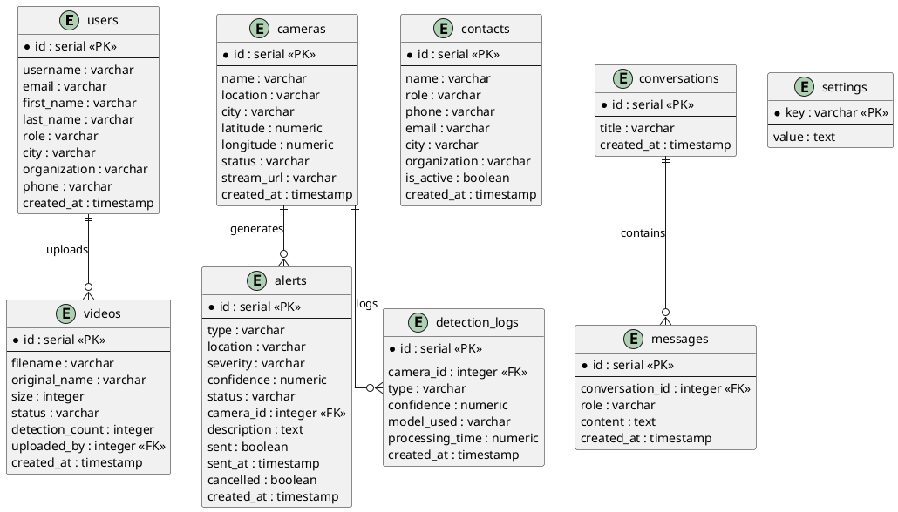
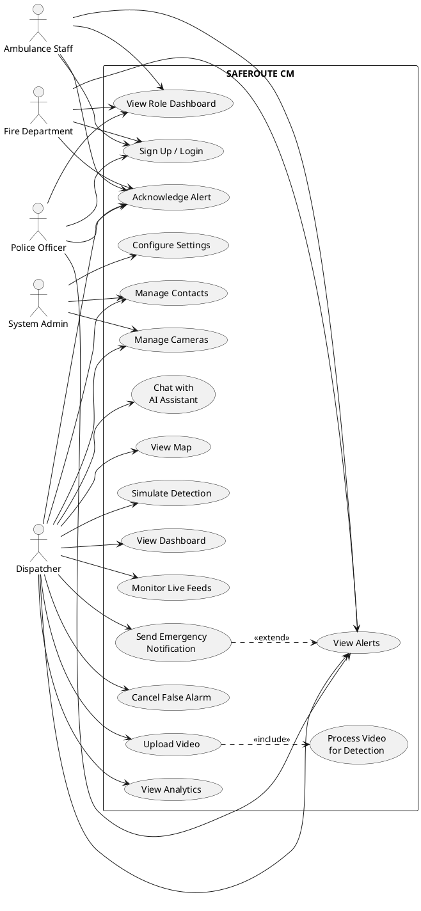
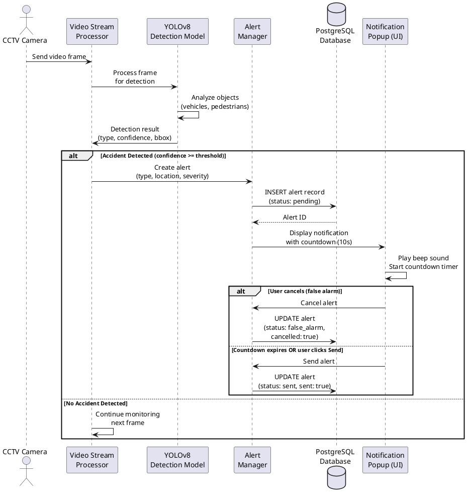
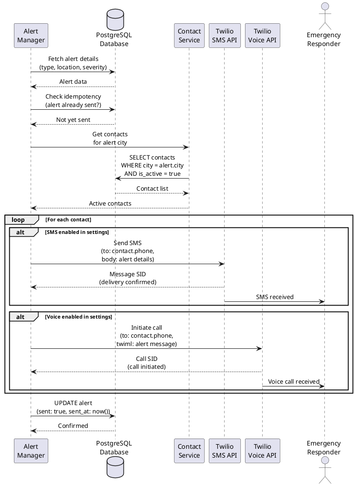
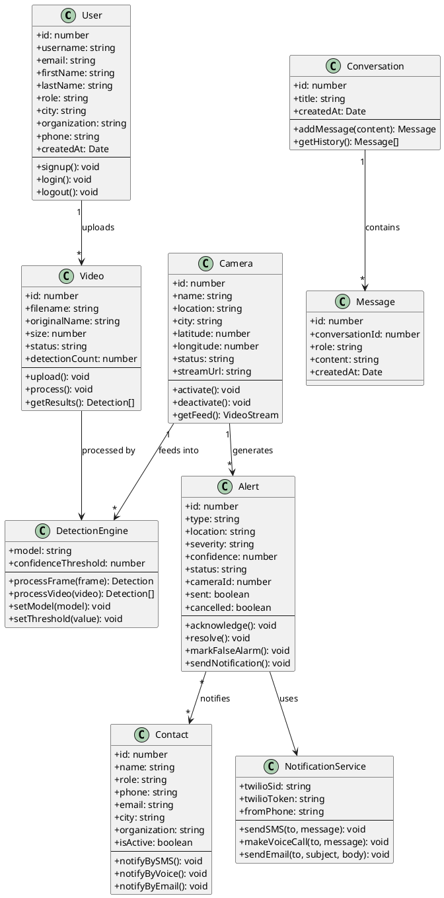
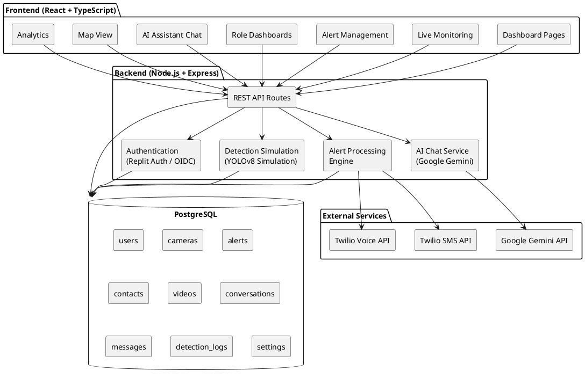
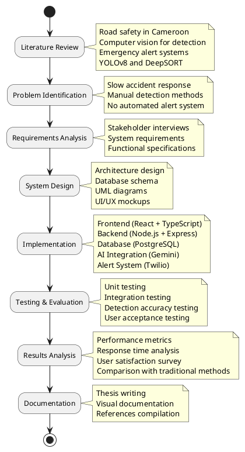

# SAFEROUTE CM - UML Diagram Codes

Use these codes with PlantUML (https://www.plantuml.com/plantuml/uml/) or any PlantUML-compatible tool to generate the diagrams yourself.

---

## 1. ER Diagram (Fig 3.3)



---

## 2. Use Case Diagram (Fig 3.4)



---

## 3. Sequence Diagram - Accident Detection (Fig 3.5)



---

## 4. Sequence Diagram - Alert Dispatch (Fig 3.6)



---

## 5. Class Diagram (Fig 3.7)



---

## 6. System Architecture Diagram (Fig 3.2)



---

## 7. Research Methodology Flowchart (Fig 3.1)



---

## How to Generate These Diagrams

### Option 1: PlantUML Online Server
1. Go to https://www.plantuml.com/plantuml/uml/
2. Paste the code (without the ```plantuml wrapper)
3. Click "Submit" to generate the diagram
4. Right-click the image to save as PNG

### Option 2: VS Code Extension
1. Install "PlantUML" extension in VS Code
2. Create a `.puml` file with the code
3. Press Alt+D to preview
4. Export as PNG/SVG

### Option 3: draw.io / diagrams.net
1. Go to https://app.diagrams.net/
2. Use Extras > PlantUML to import the code
3. Edit and export as needed

### Option 4: IntelliJ / JetBrains IDE
1. Install PlantUML Integration plugin
2. Create `.puml` files
3. Preview and export directly
